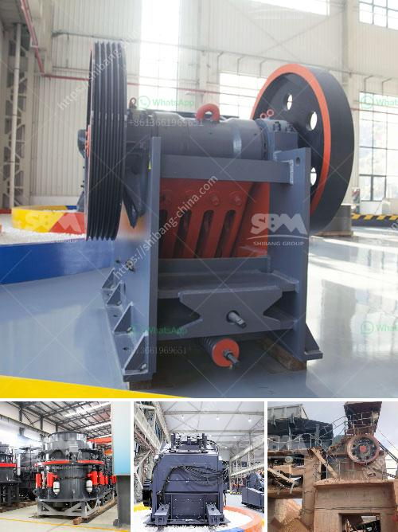

<h3>made for conveyor belts in uae</h3>
The United Arab Emirates (UAE) has witnessed remarkable growth in its industrial sector over the years, with conveyor belts playing a pivotal role in streamlining operations. The introduction of state-of-the-art technologies has revolutionized the manufacturing and distribution processes, boosting efficiency, reducing costs, and ensuring workplace safety.

Conveyor belts have come a long way since their inception in the early 20th century. Traditionally, these belts were made from materials such as leather, canvas, and rubber. However, with advancements in materials engineering and manufacturing techniques, modern conveyor belts are developed with cutting-edge synthetic materials like polyurethane, polyvinyl chloride (PVC), and silicone. These new materials offer enhanced durability, flexibility, and resistance to extreme temperatures, chemicals, and moisture, making them ideal for diverse industrial applications in the UAE.

The integration of conveyor belts in the UAE's industrial sector has significantly improved operational efficiency and productivity. These belts enable the seamless movement of goods, materials, and products within manufacturing plants and warehouses, eliminating the need for manual handling or transportation. This automation not only reduces human error but also enables faster loading and unloading processes. Moreover, conveyor belts can be customized to specific requirements, allowing for easy integration into existing production lines, further enhancing efficiency.

Conveyor belts in the UAE contribute to ensuring workplace safety by minimizing accidents related to manual handling and transportation. By automating material movement, employees are spared from physically taxing tasks, preventing potential injuries. Additionally, modern conveyor belts are equipped with advanced safety features, including emergency stop buttons, sensors, and alarms, designed to prevent accidents and protect workers' well-being. Such technological advancements have made the UAE's industrial sector a safer place to work, improving overall job satisfaction and reducing the number of sick leaves due to occupational injuries.

To meet the growing demands of diverse industries, manufacturers now offer an array of conveyor belt options, including flat belts, modular belts, timing belts, and magnetic belts. The use of robotic technologies in conveyor systems has revolutionized material handling efficiency. Vision systems and artificial intelligence algorithms are integrated, facilitating automatic sorting and quality control processes. Furthermore, conveyor belts equipped with energy-saving features, such as regenerative drives and belts made from sustainable materials, contribute to the UAE's commitment to environmental conservation.

The increasing adoption of technologically advanced conveyor belts in the UAE's industrial sector has undoubtedly revolutionized manufacturing and distribution processes. By enhancing efficiency, productivity, safety, and environmental sustainability, these cutting-edge conveyor belt solutions are propelling the growth of the industrial landscape in the UAE, ensuring a prosperous future for the nation's economy.
<h3>Contact us</h3><ul><li><strong>Whatsapp:&nbsp;<a href="https://wa.me/8613661969651">+8613661969651</a></strong></li><li><a href="https://swt.shibang-china.com/?git&amp;zhl&amp;made for conveyor belts in uae"><strong>Online Service(chat now)</strong></a></li></ul><h3>Related</h3><ul><li><a href='dolomite production plant.md'>dolomite production plant</a></li><li><a href='nigeria mobile vsi crusher.md'>nigeria mobile vsi crusher</a></li><li><a href='washing plant supplier in mozambique.md'>washing plant supplier in mozambique</a></li><li><a href='cement mill motor for sale uk.md'>cement mill motor for sale uk</a></li><li><a href='raymond mill machine upgrades powder mill machine.md'>raymond mill machine upgrades powder mill machine</a></li></ul>