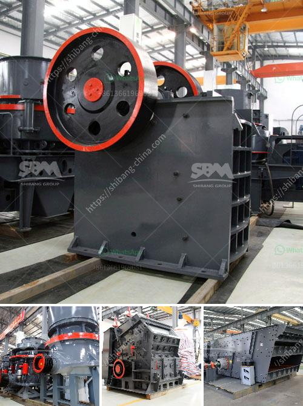

<h3>magnetic enrichment of manganese ore</h3>
Manganese ore is a critical raw material for steel production and plays a key role in the global economy. However, the high-grade manganese ore reserves are becoming depleted, making it essential to find alternative methods for obtaining this valuable mineral. One such method is magnetic enrichment, which has proven to be an efficient and sustainable way to extract manganese from low-grade ore.

Magnetic enrichment of manganese ore involves the use of magnetic separators, which are designed to separate magnetic particles from non-magnetic particles. These separators utilize the magnetic properties of manganese ore to extract the mineral and concentrate it. The process typically involves crushing the ore into smaller particles and then passing it through magnetic separators to separate the magnetic particles from the non-magnetic particles.

The magnetic enrichment process offers several advantages over traditional methods of manganese ore extraction. Firstly, it allows for the extraction of manganese from low-grade ores that would otherwise be uneconomical to mine. This helps to extend the lifespan of existing manganese mines and reduce the need for new mines, which can have significant environmental impacts.

Secondly, magnetic separation is a relatively simple and cost-effective process. It requires minimal energy and does not involve the use of harmful chemicals, making it a more environmentally friendly option compared to other extraction methods. Additionally, magnetic separators are typically compact and have a small footprint, making them suitable for installation in existing processing plants.

Moreover, magnetic enrichment has been shown to produce high-quality manganese concentrates. The magnetic separation process can effectively remove impurities such as iron and silica, which are often present in low-grade manganese ore. This results in a higher grade concentrate that can be directly used in steel production, reducing the need for additional processing steps and improving overall efficiency.

Furthermore, magnetic enrichment can help to reduce dependence on imported manganese ore. Many countries rely on imports to meet their manganese requirements, which poses risks to the stable supply of this critical mineral. By utilizing magnetic enrichment, countries with low-grade manganese ore deposits can reduce their reliance on imports and enhance their self-sufficiency in manganese production.

In conclusion, magnetic enrichment of manganese ore is a promising method for obtaining this valuable mineral from low-grade deposits. It offers several advantages, including the ability to extract manganese from previously uneconomical ores, low environmental impact, high-quality concentrate production, and reduced dependence on imported ore. Going forward, further research and development in magnetic enrichment technologies will be crucial to optimize the process and maximize its benefits for the manganese mining industry.
<h3>Contact us</h3><ul><li><strong>Whatsapp:&nbsp;<a href="https://wa.me/8613661969651">+8613661969651</a></strong></li><li><a href="https://swt.shibang-china.com/?git&amp;zhl&amp;magnetic enrichment of manganese ore"><strong>Online Service(chat now)</strong></a></li></ul><h3>Related</h3><ul><li><a href='limestone grinding systems.md'>limestone grinding systems</a></li><li><a href='rock pulverizer crusher technologies.md'>rock pulverizer crusher technologies</a></li><li><a href='micro powder grinding mill prices.md'>micro powder grinding mill prices</a></li><li><a href='quarry crusher equipment for sale brisbane.md'>quarry crusher equipment for sale brisbane</a></li><li><a href='clay kaolin processing equipment.md'>clay kaolin processing equipment</a></li></ul>