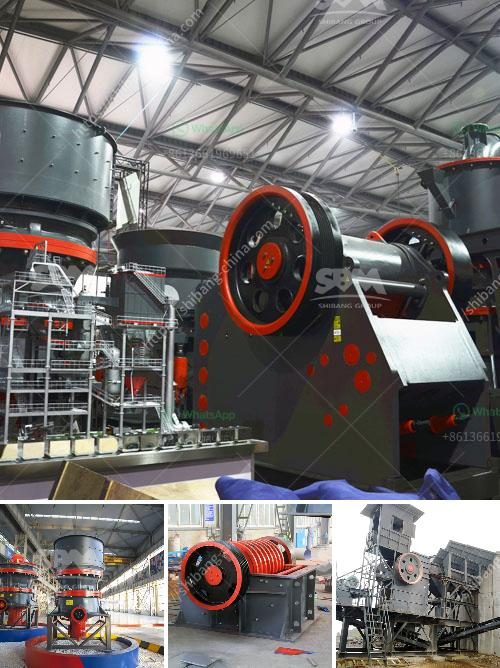

<h3>malaysia memproses peralatan bijih besi</h3>
Malaysia is a country rich in natural resources, with substantial reserves of iron ore, coal, and other minerals. The mining sector plays a crucial role in its economy, contributing significantly to its GDP and providing employment opportunities to many Malaysians. Among the minerals extracted, iron ore is one of the most important commodities, with Malaysia being one of the largest producers in Southeast Asia.

Processing iron ore involves several stages, starting with the extraction of raw ore from the ground. The ore is then crushed into smaller pieces and subjected to various processes to remove impurities and increase its iron content. Malaysia has adopted advanced technologies and investments in infrastructure to ensure efficient processing of iron ore and maximize its economic potential.

One of the key processes in iron ore processing is beneficiation, where the ore is separated into desired iron-rich fractions and waste materials. This helps in improving the quality of the ore and increasing its commercial value. Different techniques such as gravity separation, magnetic separation, and flotation are employed to achieve effective beneficiation.

Gravity separation is a popular technique used to separate iron ore from gangue minerals based on their density differences. The dense iron ore particles settle faster, allowing for easy separation from lighter waste material. Magnetic separation, on the other hand, utilizes the magnetic properties of iron ore, making it possible to remove impurities by attracting them to magnets. This technique is highly effective and widely used in the industry.

Flotation is another common technique used in iron ore beneficiation. It relies on the differences in surface properties between iron ore and gangue minerals. By adding specific reagents, the iron ore particles can be selectively attached to bubbles and lifted to the surface, while the gangue minerals remain in the solution. The resulting concentrate is then further processed to obtain pure iron.

With growing environmental concerns, Malaysia has also made efforts to improve the sustainability of its iron ore processing industry. The government has implemented stringent regulations to ensure responsible mining practices and minimize the environmental impact. Various measures, such as proper waste disposal, reclamation of mined areas, and restoration of biodiversity, are being undertaken to mitigate the effects of mining activities.

Furthermore, Malaysia has invested in research and development to explore new technologies and processes that can further enhance the efficiency and sustainability of iron ore processing. Innovations such as dry magnetic separation, which eliminates the need for water and reduces waste generation, have been adopted to reduce the industry's carbon footprint.

Overall, Malaysia has made significant strides in processing iron ore efficiently and sustainably. With its vast reserves and favorable mining policies, the country has positioned itself as a key player in the global iron ore market. By leveraging advanced technologies and adopting responsible mining practices, Malaysia is maximizing the economic potential of its natural resources while minimizing the environmental impact.
<h3>Contact us</h3><ul><li><strong>Whatsapp:&nbsp;<a href="https://wa.me/8613661969651">+8613661969651</a></strong></li><li><a href="https://swt.shibang-china.com/?git&amp;zhl&amp;malaysia memproses peralatan bijih besi"><strong>Online Service(chat now)</strong></a></li></ul><h3>Related</h3><ul><li><a href='jaw crusher for sale in usa.md'>jaw crusher for sale in usa</a></li><li><a href='clay production process.md'>clay production process</a></li><li><a href='used horizontal impact crusher hazemag.md'>used horizontal impact crusher hazemag</a></li><li><a href='price of world largest stone crushing plant.md'>price of world largest stone crushing plant</a></li><li><a href='crusher machine south africa.md'>crusher machine south africa</a></li></ul>