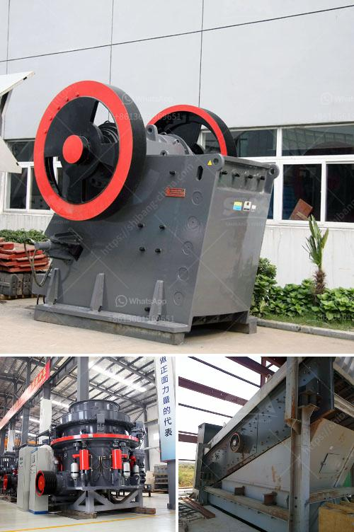

<h3>malaysia quarry crusher peninsula</h3>
Malaysia, a country known for its rich diversity, has always been at the forefront of industrial development in the Southeast Asian region. With its well-established infrastructure and strategic location, Malaysia has become a hub for industries to thrive, one of which is the quarry crusher industry.

Located on the Peninsula, Malaysia's quarry crusher sector plays a vital role in supplying construction materials to support the nation's growing infrastructure needs. Quarry crushers are large-scale machinery designed to crush, grind, or pulverize various types of rocks and minerals into smaller sizes, which are used as building materials, road aggregates, or even raw materials for cement production.

The Peninsula houses numerous quarry crusher sites, strategically positioned near major cities and construction projects. These sites are carefully selected based on the accessibility of natural resources, ensuring that the extraction process is economical and environmentally sustainable. Malaysia has an abundance of granite, limestone, and marble deposits, making it a hub for quarrying activities.

The quarry crusher industry in Malaysia contributes significantly to the country's economic growth and development. It provides employment opportunities for many Malaysians, contributing to the reduction of unemployment rates. Moreover, the revenue generated from quarrying activities is reinvested in the local economy, supporting various sectors.

Quarry crushers in Malaysia are equipped with advanced technologies to enhance productivity and reduce environmental impact. Efforts are continuously made to implement sustainable practices, such as using eco-friendly machinery and optimizing energy consumption. The industry has also adopted stringent measures to mitigate potential environmental hazards and ensure land rehabilitation after quarrying operations.

To further enhance the sector's growth, the Malaysian government has implemented policies and regulations to encourage responsible quarrying practices. Strict compliance with environmental regulations and safety standards is enforced to protect both workers and the surrounding communities. This makes Malaysia an attractive destination for investors seeking to be part of the quarry crusher industry.

In conclusion, Malaysia's quarry crusher sector on the Peninsula is an integral part of the nation's development, providing essential construction materials for infrastructure projects. With its vast resources and commitment to sustainable practices, the sector continues to contribute to Malaysia's economic growth while preserving the environment. It serves as a testament to Malaysia's dedication to industrial excellence and its ability to unleash the wealth of its natural resources.
<h3>Contact us</h3><ul><li><strong>Whatsapp:&nbsp;<a href="https://wa.me/8613661969651">+8613661969651</a></strong></li><li><a href="https://swt.shibang-china.com/?git&amp;zhl&amp;malaysia quarry crusher peninsula"><strong>Online Service(chat now)</strong></a></li></ul><h3>Related</h3><ul><li><a href='roll wheel pulverizer.md'>roll wheel pulverizer</a></li><li><a href='ball mill cement plant.md'>ball mill cement plant</a></li><li><a href='bauxite from cement plants in india.md'>bauxite from cement plants in india</a></li><li><a href='crasher sand machine south africa.md'>crasher sand machine south africa</a></li><li><a href='nigeria mobile vsi crusher.md'>nigeria mobile vsi crusher</a></li></ul>