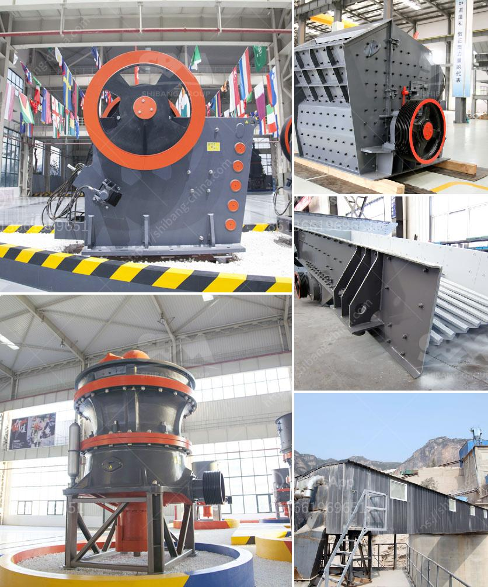

<h3>malaysia used conveyor belt for sale</h3>
Conveyor belts are an efficient and economical option for transporting various types of materials, including industrial products, raw materials, or agricultural commodities. From mining to construction, manufacturing to food processing, industries all over the world rely on conveyor systems to move their goods efficiently from one place to another. With Malaysia being a hotspot for industrial development, it comes as no surprise that the market for used conveyor belts is blooming.

The Malaysian industrial sector has undergone significant growth in recent years, attracting both local and international investors. This influx of investments has led to an increase in the demand for conveyor systems, which subsequently increased the supply of both new and used conveyor belts in the market. The versatility and cost-effectiveness of used conveyor belts have made them an appealing choice for businesses looking to reduce their operational costs.

One of the primary advantages of buying used conveyor belts in Malaysia is the substantial cost savings compared to purchasing brand-new belts. Used belts are priced significantly lower than their new counterparts, making them an attractive option for small and medium-sized enterprises with limited budgets. For businesses that require multiple conveyor belts to cater to their operational needs, the savings from purchasing used belts can be quite substantial.

Additionally, used conveyor belts offer a quicker and more efficient solution for businesses with urgent conveyor system requirements. Rather than waiting for a new conveyor belt to be manufactured and delivered, companies can obtain a used belt almost immediately. As a result, businesses can avoid expensive project delays and keep their operations running smoothly.

Moreover, the availability of used conveyor belts in Malaysia provides an environmentally-friendly alternative to discarding old belts. Instead of adding to landfills, these belts can be repurposed and put back into circulation. Recycling and reusing used conveyor belts reduce the demand for new belts, helping to conserve resources and reduce carbon footprints.

When considering purchasing used conveyor belts in Malaysia, it is important to ensure that the belts meet the quality standards and requirements of the business. While used belts may show signs of previous use, they should still be in good working condition with minimal wear and tear. It is recommended to inspect the belts thoroughly and request detailed information regarding their history and maintenance records before making a purchase.

Furthermore, it is essential to consider the specific needs of the business when purchasing used conveyor belts. Factors such as belt width, length, material, and load capacity should be taken into account to ensure that the purchased belts are suitable for the intended applications. Working closely with a reputable supplier can help businesses find the right used conveyor belts that align with their requirements.

In conclusion, the market for used conveyor belts in Malaysia presents a promising prospect for businesses across various industries. The cost savings, immediate availability, and environmental benefits associated with purchasing used belts make them an attractive option for companies looking to enhance their operational efficiency while minimizing expenses. However, it is crucial to conduct thorough inspections and work with trusted suppliers to ensure the quality and suitability of the used belts. With proper due diligence, businesses can capitalize on the opportunities offered by the Malaysian used conveyor belt market and enjoy the benefits they bring.
<h3>Contact us</h3><ul><li><strong>Whatsapp:&nbsp;<a href="https://wa.me/8613661969651">+8613661969651</a></strong></li><li><a href="https://swt.shibang-china.com/?git&amp;zhl&amp;malaysia used conveyor belt for sale"><strong>Online Service(chat now)</strong></a></li></ul><h3>Related</h3><ul><li><a href='stone crushet 10 tons.md'>stone crushet 10 tons</a></li><li><a href='gold processing methods iron slag.md'>gold processing methods iron slag</a></li><li><a href='crush rock industries nigeria.md'>crush rock industries nigeria</a></li><li><a href='manufacturer of ultrafine machine india.md'>manufacturer of ultrafine machine india</a></li><li><a href='new mobile and fixed rock crushing plant.md'>new mobile and fixed rock crushing plant</a></li></ul>