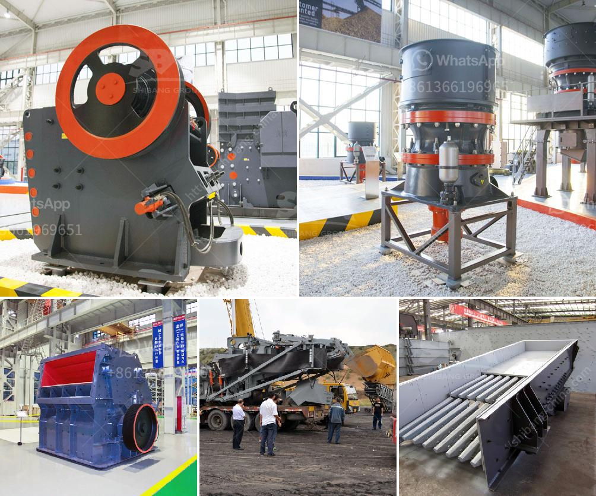

<h3>manganese washing equipment cost</h3>
Manganese is an essential element in various industrial processes and is primarily used in the production of steel and batteries. To obtain high-quality manganese ore, efficient washing equipment is required to clean and separate the manganese particles from impurities.

The cost of manganese washing equipment can vary depending on the size, capacity, and efficiency of the equipment. Different types of washing equipment such as trommel screens, log washers, and spiral classifiers may be used for washing manganese.

Trommel screens are commonly used for manganese ore washing due to their simple design and high efficiency. They consist of a revolving cylindrical screen with small holes that allow the manganese ore to pass through while larger rocks and debris are retained. The cost of trommel screens can range from a few thousand dollars to tens of thousands of dollars, depending on the size and quality of the equipment.

Log washers are another type of manganese washing equipment that effectively cleans and separates the ore. They consist of a horizontal shaft with paddles that agitate and scrub the ore, removing impurities and ensuring a clean final product. The cost of log washers can vary depending on their size and capacity, ranging from a few thousand dollars to tens of thousands of dollars.

Spiral classifiers are also commonly used for manganese ore washing and classification. They utilize a spiral groove to separate the ore particles based on their size and density. The cost of spiral classifiers can range from a few thousand dollars to tens of thousands of dollars, depending on factors such as size, capacity, and material quality.

In conclusion, the cost of manganese washing equipment varies depending on the type, size, and efficiency of the equipment. However, investing in high-quality washing equipment is crucial for obtaining clean and high-grade manganese ore, which can significantly impact the overall production and profitability of manganese-related industries.
<h3>Contact us</h3><ul><li><strong>Whatsapp:&nbsp;<a href="https://wa.me/8613661969651">+8613661969651</a></strong></li><li><a href="https://swt.shibang-china.com/?git&amp;zhl&amp;manganese washing equipment cost"><strong>Online Service(chat now)</strong></a></li></ul><h3>Related</h3><ul><li><a href='diamond river mining equipment in china.md'>diamond river mining equipment in china</a></li><li><a href='coal powder plant.md'>coal powder plant</a></li><li><a href='raymond mill production line.md'>raymond mill production line</a></li><li><a href='slag crusher machine kenya.md'>slag crusher machine kenya</a></li><li><a href='jaw crusher in egypt.md'>jaw crusher in egypt</a></li></ul>