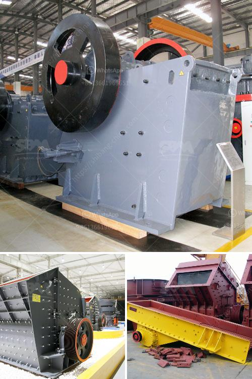

<h3>manufacture of conveyor belts in mexico</h3>
Mexico has emerged as a leading manufacturing hub, attracting global companies with its skilled workforce, strategic location, and favorable business environment. Among the various industries thriving in the country, conveyor belt manufacturing has witnessed significant growth in recent years. This article explores the reasons behind Mexico's success in this industry, the manufacturing process, and its impact on the national economy.

Conveyor belts are essential components used in diverse industries such as mining, agriculture, manufacturing, and logistics. Mexico's proximity to major markets like the United States has positioned the country as an ideal manufacturing base for conveyor belts due to reduced transportation costs and efficient supply chains. Moreover, the availability of highly skilled labor and competitive production costs have further accelerated the growth of this sector.

The manufacturing process of conveyor belts involves several critical steps to ensure their durability, reliability, and adherence to various industry standards. Let's take a brief look at the key stages involved in conveyor belt production:

1. Material Selection: Conveyor belts can be made from numerous materials, including rubber, PVC, polyester, nylon, and steel. The choice of material depends on the application and required strength and flexibility.

2. Fabrication: The selected material is then subjected to fabrication processes, which may include mold pressing, extrusion, or calendaring. These processes aim to shape the material into the desired size and thickness.

3. Reinforcement: To enhance the conveyor belt's strength and stability, reinforcement materials like fabric, steel cords, or synthetic fibers are embedded within the belt structure.

4. Vulcanization: Vulcanization is a crucial step where the conveyor belt undergoes curing in high-pressure and high-temperature environments. This process ensures bonding between different layers and enhances durability.

5. Testing and Quality Control: The finished conveyor belts undergo stringent testing procedures to ensure top-notch quality. Tests typically include assessing tensile strength, elongation, abrasion resistance, and fire resistance.

The growth of conveyor belt manufacturing in Mexico has had a positive impact on the nation's economy. The industry has contributed to job creation, skill development, and technological advances. Leading global companies have set up manufacturing facilities in Mexico, leading to increased foreign direct investments within the country. Additionally, the conveyor belt industry's growth has created a ripple effect, boosting related industries such as mining, agriculture, and logistics, ultimately driving economic growth at the national level.

Mexico has emerged as a key player in the conveyor belt manufacturing industry due to its strategic location, skilled labor force, and favorable business environment. With its proximity to major markets and competitive production costs, Mexico is attracting global manufacturers to establish their production facilities in the country. As conveyor belts continue to play an essential role in various industries, this thriving sector contributes to job creation, skill development, and economic growth in Mexico.
<h3>Contact us</h3><ul><li><strong>Whatsapp:&nbsp;<a href="https://wa.me/8613661969651">+8613661969651</a></strong></li><li><a href="https://swt.shibang-china.com/?git&amp;zhl&amp;manufacture of conveyor belts in mexico"><strong>Online Service(chat now)</strong></a></li></ul><h3>Related</h3><ul><li><a href='stone crusher plant kyc.md'>stone crusher plant kyc</a></li><li><a href='how to improve technology of mining low grade ore.md'>how to improve technology of mining low grade ore</a></li><li><a href='crushed sand manufacturing.md'>crushed sand manufacturing</a></li><li><a href='changing jaw on a crusher.md'>changing jaw on a crusher</a></li><li><a href='used crusher equipment south africa.md'>used crusher equipment south africa</a></li></ul>