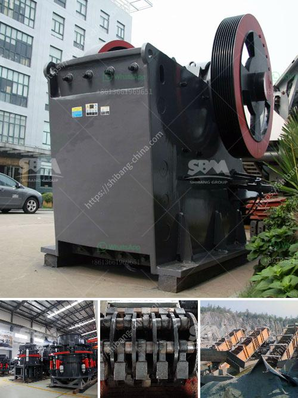

<h3>manufacture of vibrating screens</h3>
Vibrating screens are an integral part of many industrial processes. Their main function is to separate material into different sizes, making them essential for efficient production and screening operations. The manufacture of vibrating screens involves various steps and considerations to ensure the final product meets the desired specifications.

The first step in the manufacture of vibrating screens is the selection of the appropriate materials. Depending on the application and requirements, different materials may be used for different components of the screen. For example, the screen mesh is usually made of stainless steel or polyurethane, while the frame may be made of steel or aluminum. The choice of materials is crucial for the durability and performance of the vibrating screen.

Once the materials are selected, the next step is to design the screen. This involves determining the size and shape of the screen, as well as the number and arrangement of the screening layers. The design is essential to ensure optimal performance and efficient operation. Factors such as the type of material being screened, the desired product size, and the capacity requirements are taken into account during the design process.

After the design is finalized, the manufacturing process begins. One of the main manufacturing techniques used for vibrating screens is welding. Welding is used to join different components of the screen, such as the frame and the screening surface. It provides a strong and durable bond that can withstand the constant vibrating motion of the screen.

Another important aspect of the manufacturing process is the assembly of the screen. This involves fitting and aligning the various components together to create the final product. The assembly process may include attaching the screen mesh to the frame, installing the vibrating motors, and connecting any necessary electrical components. It is crucial to ensure that all components are properly aligned and securely fastened to guarantee the smooth and reliable operation of the vibrating screen.

Quality control is an integral part of the manufacturing process. Every vibrating screen undergoes stringent testing to ensure it meets the required specifications. This may include testing the screen's structural integrity, checking the tension of the screen mesh, and verifying the correct operation of the vibrating motors. By conducting thorough quality control checks, manufacturers can identify and address any potential issues before the product is shipped to customers.

In conclusion, the manufacture of vibrating screens involves careful selection of materials, detailed design, precise welding and assembly, and rigorous quality control. These screens play a crucial role in various industries by separating materials into different sizes and ensuring efficient production processes. By employing best practices in manufacturing, vibrating screen manufacturers can produce high-quality screens that meet the specific needs of their customers, contributing to overall operational efficiency and productivity.
<h3>Contact us</h3><ul><li><strong>Whatsapp:&nbsp;<a href="https://wa.me/8613661969651">+8613661969651</a></strong></li><li><a href="https://swt.shibang-china.com/?git&amp;zhl&amp;manufacture of vibrating screens"><strong>Online Service(chat now)</strong></a></li></ul><h3>Related</h3><ul><li><a href='lime stone crusher machine manufacturing company china.md'>lime stone crusher machine manufacturing company china</a></li><li><a href='rent stone crusher in gresik.md'>rent stone crusher in gresik</a></li><li><a href='transport system in a mineral crusher.md'>transport system in a mineral crusher</a></li><li><a href='artificial stone production line.md'>artificial stone production line</a></li><li><a href='supplier of crusher equipment in ghana.md'>supplier of crusher equipment in ghana</a></li></ul>