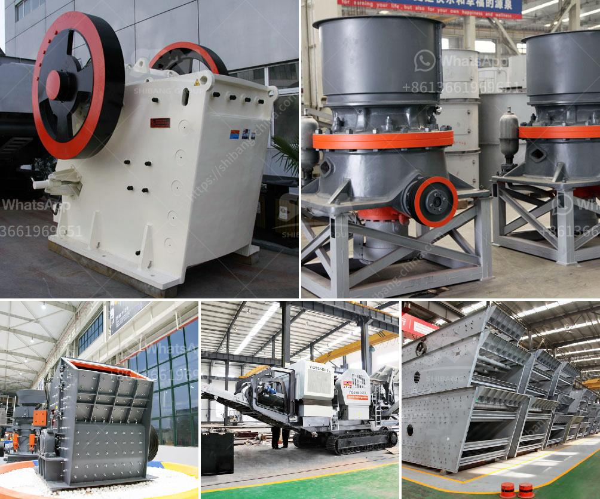

<h3>manufacturer of conveyor belts</h3>
Conveyor belts are an integral part of many manufacturing and industry sectors, serving as a means to transport goods and materials efficiently. Whether in food processing plants, mines, airports, or warehouses, conveyor belts play a crucial role in streamlining operations and ensuring smooth workflows. Therefore, selecting the right manufacturer of conveyor belts becomes essential to ensure reliable performance, durability, and enhanced productivity.

One of the primary considerations when choosing a conveyor belt manufacturer is their experience in the industry. A manufacturer with extensive experience brings with them a wealth of knowledge and expertise, enabling them to understand the unique requirements of different sectors. This experience translates into the production of high-quality conveyor belts that are designed to withstand the demanding conditions of various environments.

Moreover, a reputable manufacturer invests in research and development to create innovative solutions that cater to the evolving needs of industries. They continuously strive to develop conveyor belts that offer increased efficiency, reduced wear and tear, and enhanced safety features. By staying up-to-date with technological advancements, such manufacturers ensure that their products meet the highest standards of performance and reliability.

Another crucial aspect of choosing the right manufacturer is their commitment to quality. Conveyor belts are subjected to significant stresses, such as heavy loads, abrasion, and exposure to harsh chemicals. Therefore, it is essential to select a manufacturer that uses top-grade materials and employs stringent quality control measures throughout the manufacturing process. This ensures that you receive a conveyor belt that is durable, long-lasting, and resistant to damage, thereby reducing maintenance and replacement costs.

Furthermore, an experienced manufacturer understands the importance of customization. Different industries have varying requirements regarding dimensions, load capacity, and types of materials to be conveyed. A reliable manufacturer will work closely with their clients to understand their specific needs and tailor their products accordingly. Whether it is a food-grade conveyor belt or one for heavy-duty mining applications, the ability to customize ensures that the conveyor belt seamlessly integrates into existing systems, promoting efficiency and productivity.

The reputation and customer satisfaction of a conveyor belt manufacturer should be considered as well. Researching customer reviews and testimonials can provide valuable insights into the manufacturer's track record and the quality of their products. Additionally, it is advisable to seek recommendations from industry peers and experts to ensure you make an informed decision. A manufacturer with a solid reputation and positive customer feedback is likely to deliver a superior product and provide excellent customer support.

Lastly, the availability of after-sales services and support should not be overlooked. An established conveyor belt manufacturer understands the importance of ongoing assistance, such as installation, maintenance, and troubleshooting. They will have a dedicated customer service team that is readily available to address any queries or concerns that may arise. Prompt and efficient after-sales service guarantees maximum uptime and minimizes disruptions to your operations.

In conclusion, choosing the right manufacturer of conveyor belts is a critical decision that can significantly impact the efficiency and effectiveness of your operations. By considering factors such as experience, quality, customization, reputation, and customer support, you can ensure that you partner with a manufacturer that delivers high-quality conveyor belts tailored to your specific requirements. Such a partnership will enable your business to optimize its processes, reduce downtime, and achieve greater productivity.
<h3>Contact us</h3><ul><li><strong>Whatsapp:&nbsp;<a href="https://wa.me/8613661969651">+8613661969651</a></strong></li><li><a href="https://swt.shibang-china.com/?git&amp;zhl&amp;manufacturer of conveyor belts"><strong>Online Service(chat now)</strong></a></li></ul><h3>Related</h3><ul><li><a href='list of mineral processing plants in oman.md'>list of mineral processing plants in oman</a></li><li><a href='cement plant cost estimation.md'>cement plant cost estimation</a></li><li><a href='ball mill in zimbabwe for sale.md'>ball mill in zimbabwe for sale</a></li><li><a href='cost cone crusher.md'>cost cone crusher</a></li><li><a href='singapore handheld concrete crusher.md'>singapore handheld concrete crusher</a></li></ul>