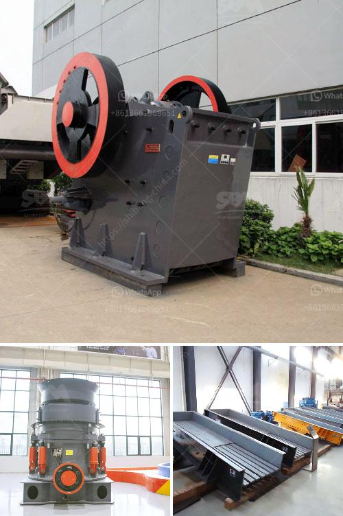

<h3>manufacturer of ultrafine machine india</h3>
India has witnessed significant growth in the manufacturing sector, especially in the production of ultrafine machines. These machines are designed to produce fine and highly precise outputs, meeting the ever-increasing demands of various industries. The manufacturing sector in India has recognized the importance of ultrafine machines in improving productivity and meeting global quality standards.

One of the leading manufacturers of ultrafine machines in India is XYZ Industries. With years of experience and expertise, XYZ Industries has carved a niche for itself in the manufacturing industry. The company's dedication to quality and innovation has made it a preferred choice for many businesses in India and abroad.

XYZ Industries offers a wide range of ultrafine machines catering to different industries such as pharmaceuticals, chemicals, food processing, and packaging. These machines are capable of grinding, crushing, mixing, and refining materials to produce ultrafine and uniform outputs. The advanced technology and state-of-the-art infrastructure of XYZ Industries ensure precision and efficiency in every machine they produce.

The success of XYZ Industries lies in its commitment to research and development. The company invests heavily in developing new technologies and improving existing ones to stay ahead of the competition. Their team of experienced engineers and technicians continuously work towards achieving excellence in the design and functionality of their machines.

Furthermore, XYZ Industries also emphasizes customer satisfaction by providing customized solutions to their clients. They understand the unique requirements of each industry and tailor their machines accordingly. This approach has earned them a loyal customer base both in India and globally.

In addition to manufacturing high-quality machines, XYZ Industries also offers excellent after-sales service. They have a dedicated team of technicians who provide timely assistance and maintenance to ensure the smooth operation of the machines. This commitment towards customer support has further strengthened their reputation in the market.

Overall, with the rise in demand for ultrafine machines, the manufacturing industry in India has witnessed significant growth. Companies like XYZ Industries have played a crucial role in meeting this demand by manufacturing innovative and high-quality machines. Their commitment to research, customer satisfaction, and after-sales service has made them a leader in the industry. As India continues to progress technologically, the ultrafine machine manufacturing sector is expected to witness further growth, contributing to the country's economic development.
<h3>Contact us</h3><ul><li><strong>Whatsapp:&nbsp;<a href="https://wa.me/8613661969651">+8613661969651</a></strong></li><li><a href="https://swt.shibang-china.com/?git&amp;zhl&amp;manufacturer of ultrafine machine india"><strong>Online Service(chat now)</strong></a></li></ul><h3>Related</h3><ul><li><a href='calcium carbonate process flow diagram.md'>calcium carbonate process flow diagram</a></li><li><a href='zambia mobile crusher.md'>zambia mobile crusher</a></li><li><a href='three ring micro powder mill.md'>three ring micro powder mill</a></li><li><a href='cost of grizzly crusher.md'>cost of grizzly crusher</a></li><li><a href='cheap stone crushing plant.md'>cheap stone crushing plant</a></li></ul>