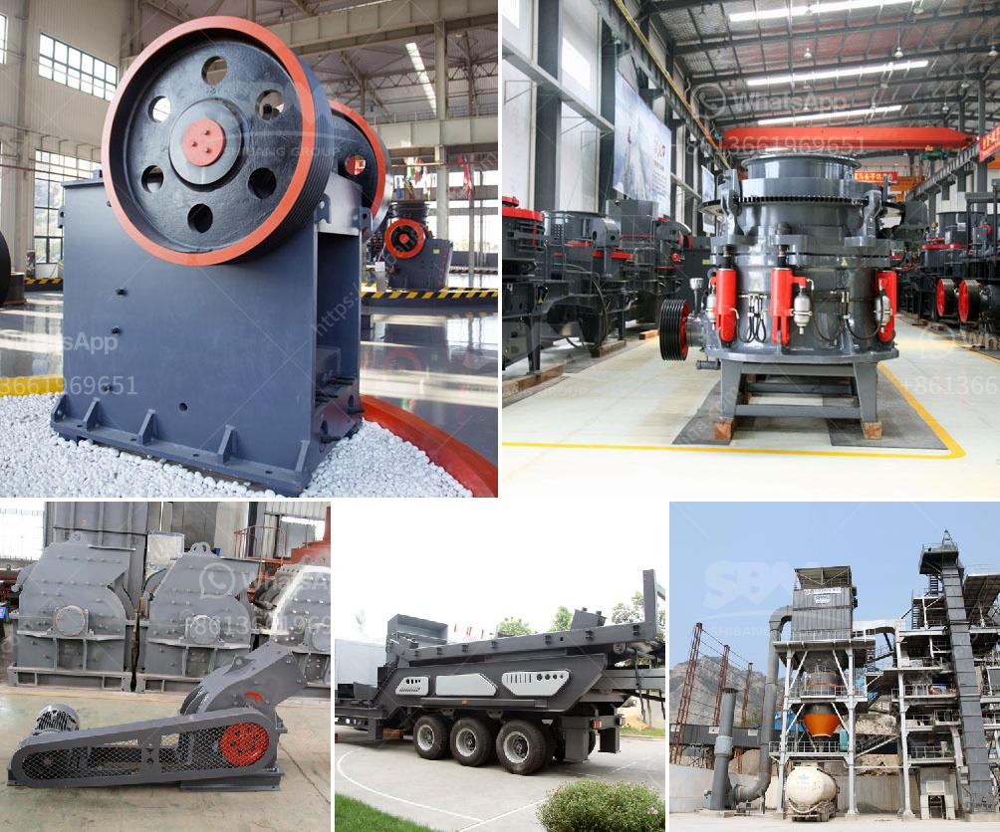

<h3>manufacturers peru hammer mill</h3>
Peru, a country popularly known for its vibrant culture and rich history, is also making great strides in the agricultural industry. Manufacturers in Peru are playing a significant role in enhancing agricultural productivity and efficiency through the development of innovative machinery. One such innovation is the hammer mill, a machine that has revolutionized the way farmers process crops and livestock feed.

A hammer mill is a type of grinding machine that utilizes rotating hammers to crush and grind a variety of materials. It is renowned for its versatility and efficiency, as it can be used for a wide range of applications such as milling grains, shredding biomass, and even grinding minerals. Manufacturers in Peru have recognized the potential of this machine and have been producing high-quality hammer mills to cater to the growing demand.

One of the key benefits of using a hammer mill is its ability to reduce the size of materials. Farmers and agricultural workers can easily process crops, such as corn, wheat, and barley, by feeding them into the machine. The rotating hammers inside the mill quickly smash the grains into smaller particles, making it easier to handle and store. This process also improves the digestibility of the grains for livestock, leading to better animal nutrition.

Additionally, hammer mills are also crucial for shredding biomass materials, such as wood chips, straw, and agricultural residues. These materials can be processed into smaller particles, suitable for energy generation, animal bedding, or even composting. By utilizing hammer mills, farmers and industries can efficiently manage their waste materials and contribute to a more sustainable environment.

Manufacturers in Peru have been producing hammer mills that not only excel in functionality but also in durability. These machines are built to withstand the harsh conditions of the agricultural environment and heavy-duty operations. They are designed with high-quality materials and robust components that ensure long-lasting performance and minimal maintenance requirements.

Furthermore, manufacturers in Peru are also focusing on improving the energy efficiency of hammer mills. Some models now come with advanced features, such as variable speed drives and automatic load control, which optimize the machine's energy consumption. These enhancements not only reduce operational costs but also contribute to a greener and more sustainable agricultural sector.

The availability of hammer mills manufactured in Peru has greatly benefited local farmers and agricultural businesses. They now have access to affordable and reliable machinery that enhances their productivity and helps them maximize their yields. Additionally, manufacturers in Peru have also started exporting their hammer mills to neighboring countries, further boosting Peru's position as a leading agricultural machinery provider in the region.

In conclusion, manufacturers in Peru are making significant contributions to the agricultural industry through the production of high-quality hammer mills. These machines enable farmers and agricultural workers to process crops and biomass materials efficiently, leading to improved productivity and sustainability. With their robust design, durability, and energy efficiency, hammer mills manufactured in Peru are gaining popularity not only domestically but also internationally. As Peru continues to develop its agricultural sector, these innovative machines will play a vital role in shaping the future of farming practices.
<h3>Contact us</h3><ul><li><strong>Whatsapp:&nbsp;<a href="https://wa.me/8613661969651">+8613661969651</a></strong></li><li><a href="https://swt.shibang-china.com/?git&amp;zhl&amp;manufacturers peru hammer mill"><strong>Online Service(chat now)</strong></a></li></ul><h3>Related</h3><ul><li><a href='cost setting up silica sand ball mill.md'>cost setting up silica sand ball mill</a></li><li><a href='price of medium quarry plant.md'>price of medium quarry plant</a></li><li><a href='production of cement in guinee.md'>production of cement in guinee</a></li><li><a href='difference between pulveriser and.md'>difference between pulveriser and</a></li><li><a href='mineral grinding corporation.md'>mineral grinding corporation</a></li></ul>