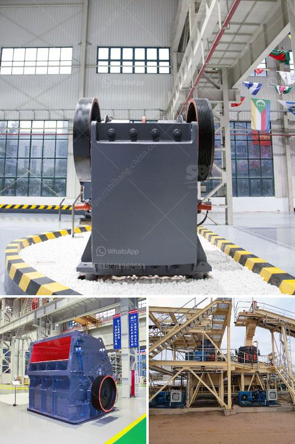

<h3>manufacturing equipments of lime stone milling</h3>
Limestone is a sedimentary rock that is mainly composed of calcium carbonate. It is widely used in various industries, such as construction, agriculture, and manufacturing. To produce limestone powder, the limestone needs to be crushed and ground into powder form.

One important piece of equipment used in limestone milling is the limestone mill. The limestone mill is a type of milling equipment that can help us grind limestone into coarse powder and superfine powder. In this article, we will discuss the manufacturing equipment of limestone milling in detail.

Limestone milling involves several stages. The first stage is the crushing process. The limestone is crushed by a crusher to a proper size that can meet the grinding requirements. The crushed limestone is then sent to a limestone mill, where it is ground into a fine powder.

There are two types of limestone mills that can be used for grinding limestone into powder. The first one is a Raymond mill, which can process materials into 80-400 mesh. The second one is an ultrafine mill, which can process materials into 325-2500 mesh.

In addition to the limestone mill, some auxiliary equipment is also needed in the limestone milling process. For example, a bucket elevator is used to transport the crushed limestone from the crusher to the limestone mill. A vibrating feeder is used to feed the limestone into the mill evenly.

After the limestone is ground into powder, it needs to be classified. A classifier is used to separate the oversized particles from the fine powder. The classified limestone powder is then collected by a dust collector.

The limestone milling process requires specific manufacturing equipment to ensure high efficiency and accuracy. For example, the Raymond mill should use high-quality grinding rings and grinding rollers. The blades of the Raymond mill should also be replaced regularly to avoid the inefficient grinding caused by dull blades.

One important consideration in limestone milling is the moisture content of the limestone. If the limestone has a high moisture content, it needs to be dried before grinding. A dryer can be used to remove the moisture from the limestone.

In conclusion, limestone milling requires several manufacturing equipment to ensure the quality of the final product. The limestone mill is the key equipment for grinding limestone into powder, and it needs to be maintained properly to ensure the efficient operation. Various auxiliary equipment, such as a bucket elevator and a dust collector, is also necessary for the limestone milling process. With the right equipment and proper maintenance, limestone milling can be a highly efficient and cost-effective process in various industries.
<h3>Contact us</h3><ul><li><strong>Whatsapp:&nbsp;<a href="https://wa.me/8613661969651">+8613661969651</a></strong></li><li><a href="https://swt.shibang-china.com/?git&amp;zhl&amp;manufacturing equipments of lime stone milling"><strong>Online Service(chat now)</strong></a></li></ul><h3>Related</h3><ul><li><a href='black stone crusher.md'>black stone crusher</a></li><li><a href='coal mining vibrating screens.md'>coal mining vibrating screens</a></li><li><a href='bentonite granuels machines gujrat.md'>bentonite granuels machines gujrat</a></li><li><a href='mining quarry equipment for sale sri lanka.md'>mining quarry equipment for sale sri lanka</a></li><li><a href='industrial vibrating screen price.md'>industrial vibrating screen price</a></li></ul>