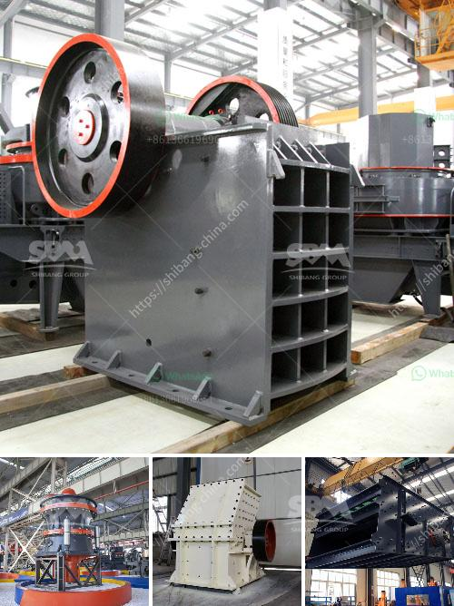

<h3>marble and granite grinder and crusher</h3>
Marble and granite are natural stones that have been used for centuries in various construction and artistic applications. These stones are known for their durability, elegance, and unique beauty. However, working with marble and granite can be a daunting task, especially when it comes to grinding and crushing them for various purposes. This is where marble and granite grinders and crushers play a crucial role.

A marble grinder is a useful tool for basic home maintenance and renovations. It is used to grind away small imperfections and stains on the surface of marble tiles, countertops, or floors. A granite grinder, on the other hand, is specially designed to blend all your grinding needs for granite – whether you are working on a fireplace, countertop, or any other granite surface.

These grinders are essential tools for both homeowners and professionals who work with marble and granite regularly. They are available in various sizes, shapes, and power capacities to cater to different grinding requirements. Typically, a marble or granite grinder consists of a motor, grinding disc, water feed, handle, and a base.

The motor is responsible for powering the grinder and rotating the grinding disc. The disc is usually made of a hard material, such as diamond, to effectively grind away the tough surface of marble and granite. The water feed is attached to the grinder to constantly wet the surface being ground, reducing dust and preventing overheating.

The handle helps in controlling the grinder and applying the desired pressure while grinding. It also provides stability and ease of use. The grinder base supports the entire structure and ensures stability during the grinding process.

In addition to grinders, crushers are another important tool when it comes to processing marble and granite. A crusher is a machine used to reduce large rocks into smaller stones or pebbles that can be used in various construction and landscaping projects. Crushers come in different types, such as jaw crushers, cone crushers, impact crushers, and roll crushers.

Marble and granite crushers are specifically designed to handle the most challenging materials. Their heavy-duty construction and powerful engines enable them to crush even the hardest stones. These crushers are commonly used in quarries and stone processing plants to crush large rocks into smaller sizes for further processing.

Apart from grinding and crushing, these machines also save time and effort. Manual grinding and crushing of marble and granite require significant physical exertion and can be time-consuming. With the help of grinders and crushers, the process becomes more efficient and less labor-intensive.

In conclusion, marble and granite grinders and crushers are indispensable tools in the world of stone processing. They provide a way to transform raw, rough stones into smooth, polished surfaces that can be used in a variety of applications. Whether it is grinding away imperfections or crushing rocks into smaller sizes, these machines perform an essential job. So, if you are considering working with marble and granite, investing in a grinder and crusher will undoubtedly make your tasks easier and more efficient.
<h3>Contact us</h3><ul><li><strong>Whatsapp:&nbsp;<a href="https://wa.me/8613661969651">+8613661969651</a></strong></li><li><a href="https://swt.shibang-china.com/?git&amp;zhl&amp;marble and granite grinder and crusher"><strong>Online Service(chat now)</strong></a></li></ul><h3>Related</h3><ul><li><a href='limestone washing and classifi ion.md'>limestone washing and classifi ion</a></li><li><a href='double jaw crusher.md'>double jaw crusher</a></li><li><a href='equipment required for alluvial gold mining.md'>equipment required for alluvial gold mining</a></li><li><a href='small aggregate washer plants.md'>small aggregate washer plants</a></li><li><a href='set up a quarry business.md'>set up a quarry business</a></li></ul>