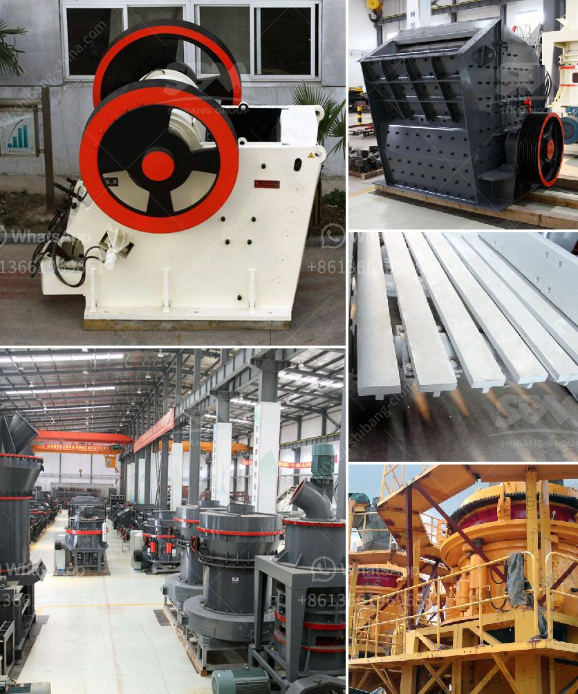

<h3>marble crusher and grinding machinery</h3>
Marble is a natural metamorphic rock formed under heat and pressure that has been used for centuries as a building material. Marble has been a popular choice for construction projects due to its durability, beauty, and versatility. To achieve the desired aesthetic and functionality, marble needs to be processed through various stages, including crushing and grinding. In this article, we will explore the importance of marble crusher and grinding machinery in the marble quarry.

Marble crusher is the stone crusher that can process marble with excellent performance. As a major mining equipment company, we are a world-class mining processing equipment manufacturer, the mining products such as marble crusher is of stable performance, high quality and low price.

Chunks of marble are sent to the jaw crusher evenly through the vibrating feeder for primary crushing. After primary crushing, the marble stones fall into impact crusher or cone crusher for fine crushing. The final materials can be screened out the suitable marble particles using for buiding materials through screening machine. The unsuitable marbles return to the crushing process for re-crushing.

1. Raw marble enters the vibrating feeder. In addition to supplying materials, the equipment can also effectively filter out certain impurities, ensuring the purity of the marble materials.

3. After initial crushing, the marble stones fall into impact crusher or cone crusher for secondary crushing.

4. Fine crushing requires subsequent grinding. The grinding process can be divided into two stages: grinding at the initial stage and fine grinding.

5. In the grinding process, the marble stones can be crushed and ground by the marble crusher and grinding machinery to obtain fine marble powder.

6. Production of marble grinding hammer mill and grinder mill, size range from 80 mesh to 325 mesh and output to 38 tons per hour.

Marble grinding mill, also known as marble powder grinding mill, is a kind of Raymond mill. It is widely used in the grinding process of ore materials in metallurgy, building materials, chemicals, mining minerals areas. As for the type of marble grinding mill, mining investors can choose the ball mill, Raymond mill, and vertical mill, etc. Specialists from SBM suggest the MTW-series Trapezoid mill is the best choice.

In addition, marble grinding machine also should be provided. Besides the crusher machine, it will also need the grinding milling equipment for the production line. SBM's vertical roller mill will grind the marble materials under the grinding roller and grinding ring, and it do not need to be separated. The whole machine sealing structure is also effective to prevent the fine dust from entering. After grinding, the marble powder can be used as raw materials for various purposes.

In conclusion, the marble crusher and grinding machinery designed by SBM has helped many customers from different countries achieve the high-quality marble materials. For further information about SBM's marble crusher and grinding mill machinery, please contact our online service for 24 hours.

Disclaimer: The information provided here is solely based on our personal research and understanding. We do not endorse any specific brand or company mentioned in this article.
<h3>Contact us</h3><ul><li><strong>Whatsapp:&nbsp;<a href="https://wa.me/8613661969651">+8613661969651</a></strong></li><li><a href="https://swt.shibang-china.com/?git&amp;zhl&amp;marble crusher and grinding machinery"><strong>Online Service(chat now)</strong></a></li></ul><h3>Related</h3><ul><li><a href='mobile crusher unit.md'>mobile crusher unit</a></li><li><a href='mica processing plant per ton.md'>mica processing plant per ton</a></li><li><a href='rent stone crusher in gresik.md'>rent stone crusher in gresik</a></li><li><a href='used crusher for sale from iran.md'>used crusher for sale from iran</a></li><li><a href='portable stone crusher machine for sale.md'>portable stone crusher machine for sale</a></li></ul>