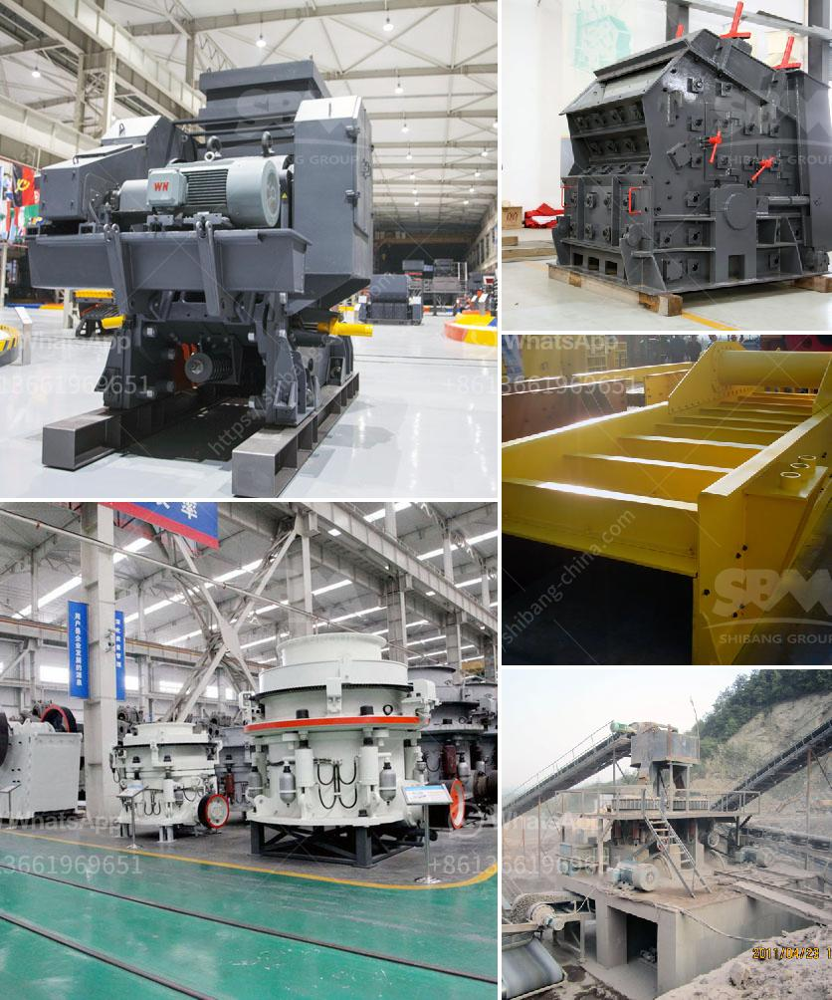

<h3>marble crusher in china</h3>
China has been the source of many innovations, discoveries, and inventions throughout history. Its rich culture and history have permeated every aspect of life, including architecture and art. The use of marble in building monumental structures and creating exquisite sculptures is a testament to China's craftsmanship and artistic prowess. And to facilitate the extraction and processing of this exquisite material, the marble crusher industry in China has thrived, becoming a vital component of the country's economic growth.

Marble, a metamorphic rock, is a popular choice in construction and art due to its aesthetic appeal, durability, and ease of carving. Its natural pattern and color variations have made it a sought-after material for flooring, countertops, and various other applications. According to historical records, China has been producing and using marble as early as the Tang Dynasty (618-907 AD). With the advent of technology, the demand for marble has only increased over time.

With vast marble reserves across the country, China has become a leading global exporter of marble products. This abundance of resources has provided the foundation for the growth of a robust marble crusher industry. Marble crushing machines are used to break large blocks of marble into smaller pieces that can be used in construction, art, and various other industries. These crushers employ heavy machinery to ensure efficient and precise crushing of the marble while minimizing waste.

The Chinese marble crusher industry has not only created numerous employment opportunities but has also contributed significantly to the country's GDP. By supplying marble products to international markets, China has established itself as a reliable source for high-quality marble. This has boosted the country's international trade and fostered economic partnerships with various nations around the world.

Furthermore, the growth of the marble crusher industry has had a positive impact on local businesses and communities. Marble mining and processing require a range of expertise and equipment, leading to the establishment and development of numerous auxiliary industries. These include mining equipment manufacturing, transportation and logistics, and specialized cutting and polishing services. The interconnected nature of these industries has created a ripple effect, generating income and economic growth for both rural and urban areas.

However, like any other industry, the marble crusher industry in China has not been without its challenges. Environmental concerns surrounding mining practices and waste management have been raised. The extraction and processing of marble result in the generation of solid waste, water pollution, and landscape modification. To combat these issues, the Chinese government and industry stakeholders have implemented regulations and technology to minimize the environmental impact and promote sustainable practices.

In conclusion, the marble crusher industry in China has become an integral part of the country's economic growth and cultural heritage. By harnessing its rich marble resources, China has positioned itself as a dominant player in the global marble market. Through advancements in technology and commitment to sustainable practices, the industry has flourished while contributing to employment generation and economic prosperity. As the demand for marble continues to rise, the availability of efficient and environmentally friendly marble crushers will play a crucial role in accelerating China's continued success in this industry.
<h3>Contact us</h3><ul><li><strong>Whatsapp:&nbsp;<a href="https://wa.me/8613661969651">+8613661969651</a></strong></li><li><a href="https://swt.shibang-china.com/?git&amp;zhl&amp;marble crusher in china"><strong>Online Service(chat now)</strong></a></li></ul><h3>Related</h3><ul><li><a href='china gold dry washer manufacturer in philippines.md'>china gold dry washer manufacturer in philippines</a></li><li><a href='purchase of cement crusher machines.md'>purchase of cement crusher machines</a></li><li><a href='rock cutting and grinding machine price.md'>rock cutting and grinding machine price</a></li><li><a href='equipment of gold mining.md'>equipment of gold mining</a></li><li><a href='industrial vibrating screen price.md'>industrial vibrating screen price</a></li></ul>