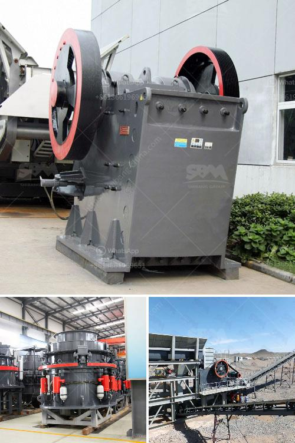

<h3>marble crusher industry philippines</h3>
The marble crusher industry in the Philippines is booming due to the ever-growing construction industry and the increasing demand for marble products. This surge in demand has led to the mushrooming of numerous marble crusher businesses throughout the country.

Marble, a metamorphic rock, is formed from limestone subjected to intense heat and pressure. It has a crystalline structure that allows it to be polished to a high shine, making it an ideal material for various construction and decorative purposes. Marble is widely used as flooring tiles, countertops, wall cladding, and even as sculptures and monuments.

In the Philippines, the construction industry has been experiencing robust growth in recent years, driven by infrastructure projects and the boom in the real estate sector. This has created a significant demand for marble products, leading to the emergence of specialized businesses that focus on crushing and processing marble.

Marble crushers are machines designed to reduce marble rocks into smaller particles for various applications such as construction aggregates, decorative stone, and crafting. These machines come in different sizes and types, depending on the specific requirements of the customers. The crushers utilize powerful gears, belts, and motors to break down the marble rocks into smaller, more manageable sizes.

The Philippines has a rich reserve of marble, with deposits mainly found in the provinces of Romblon, Rizal, and Kalinga. Marble mining and processing has been taking place in these areas for decades, providing local communities with employment opportunities and contributing to the country's economy.

The marble crusher industry in the Philippines has also attracted international players. KonoMarble, for example, is one of the largest marble-processing companies in the country. With exclusive rights to 19 marble quarries in the provinces of Romblon and Kalinga, they have become the leading supplier of high-quality marble products in the Philippines.

However, the growing marble crusher industry also poses some challenges. One major concern is the environmental impact of marble mining and processing. Quarrying for marble can cause deforestation, soil erosion, and the destruction of natural habitats. Efforts are being made by government agencies and industry players to ensure responsible mining practices that minimize the environmental footprint.

Another challenge is the competition from cheaper imported marble products. The Philippines imports marble from countries like China, Italy, and Turkey, which offer lower prices due to economies of scale and cheaper labor. To remain competitive, local marble crusher businesses need to focus on quality, innovation, and customer service.

In conclusion, the marble crusher industry in the Philippines is thriving due to the growth of the construction industry and the increasing demand for marble products. It provides employment opportunities and contributes to the country's economy. However, the industry needs to address environmental concerns and compete with cheaper imports to sustain its growth and success.
<h3>Contact us</h3><ul><li><strong>Whatsapp:&nbsp;<a href="https://wa.me/8613661969651">+8613661969651</a></strong></li><li><a href="https://swt.shibang-china.com/?git&amp;zhl&amp;marble crusher industry philippines"><strong>Online Service(chat now)</strong></a></li></ul><h3>Related</h3><ul><li><a href='costo de instalacion de planta de cemento.md'>costo de instalacion de planta de cemento</a></li><li><a href='gypsum production line in spain for sale.md'>gypsum production line in spain for sale</a></li><li><a href='japan used crushers.md'>japan used crushers</a></li><li><a href='ulltra fine grinding mill.md'>ulltra fine grinding mill</a></li><li><a href='cone crusher for sale in ghana.md'>cone crusher for sale in ghana</a></li></ul>