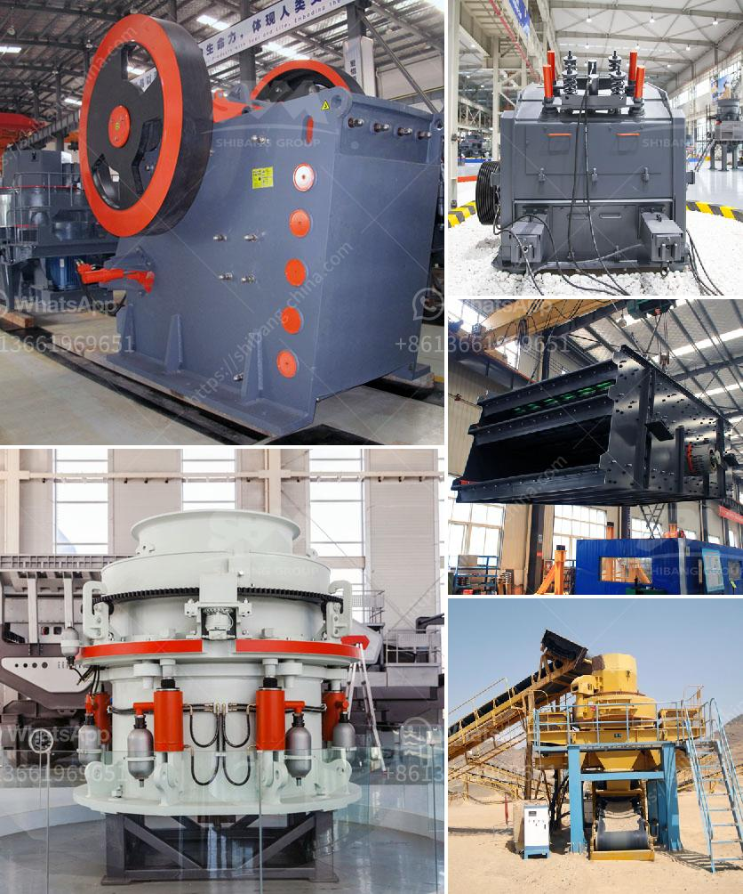

<h3>marble crusher plant</h3>
Marble is a popular natural stone for residential and commercial projects due to its aesthetic appeal and durability. However, to extract and process marble, a large amount of resources and energy are required. That's where marble crusher plants come into play.

Marble crusher plants are necessary equipment for the crushing process, which not only saves raw materials, but also reduces the cost of transportation and production. Marble crusher plant increases the efficiency of the crushing process, which helps to create more value for customers.

1. Reduce the investment cost. It can save a lot of expenses, such as transportation, installation, maintenance, and operation costs after crushing large pieces of marble to the required particle size.

2. High quality of finished products. The impact crusher and jaw crusher are both commonly used marble crushing machines. The impact crusher is suitable for crushing medium hardness materials, such as limestone, while the jaw crusher is ideal for crushing hard limestone. The impact crusher and cone crusher can be used to crush marble secondary and tertiary respectively.

3. Different crushing cavity shapes correspond to different crushing requirements. The cone crusher machine can form a complete crushing production line, which can be configured with different models. The equipment capacity is from 50 to 1000 t/h. In addition, all parts can be disassembled and maintained from the top or side of the device, which is convenient for maintenance.

4. Excellent quality assurance. Impact and jaw crushers are known for their extraordinary performance in reducing hard materials to uniform cubes. In the process of crushing marble, the wear-resisting property of the jaw plate, hammer head, and lining plate of the jaw crusher has obvious advantages.

5. Stable operation and reliable performance. The main equipment of the marble crusher plant is jaw crusher, cone crusher, impact crusher, and circular vibrating screen. The process is generally in stages: primary crushing, secondary crushing and fine crushing.

Due to the above reasons, marble crusher has a wide range of applications in the market, which stimulates the boom of marble crusher plant. For this reason, various marble crusher plants have been invented to maximize the use of marble stone for producing different particle sizes.

In other words, different types of marble crusher machines are varied in its feed size and finished size. To select the right type of crusher, it is important to understand the crushing stages, which are usually primary, secondary, and tertiary stages.

Generally, crushing continues using a cone crusher and an internal sizing screen until the ore is less than 19 mm (3/4 inch). Crushing in spring cone crushers begins when the marble rock passes through the gap between the mantle and the concave. Before closing the gap, the crushing cycle continues, thus giving marble rock the desired size.

Marble crusher plants have become popular in the market to increase the efficiency of the process and save energy consumption. The jaw crusher is ideal for primary crushing with its large output and high efficiency. Secondary crushing and fine crushing are all available.

Crushers play an important role in the production of building materials. The crushing is commonly divided into 4 stages, including primary crushing, secondary crushing, tertiary crushing, and quaternary crushing. Primary crushing is the main process for stone crusher plant. It is strongly recommended to select the primary crusher according to the properties (hardness, size, and moisture etc.) of processed stone, the expected capacity and the type of finished products.

If the raw materials contain much dirt and impurities, a soil-off feeder can be used to pre-screen them. It helps remove the fine materials and significantly improves crusher capacity. The soil-off feeder also eliminates the need for a primary crusher dump hopper and contributes to reducing project costs.

In conclusion, marble crusher plants are essential equipment for marble processing. We, SBM company, warmly invite you to choose our marble crusher plant to create your own business plan. We can provide you with high-quality equipment and sincere services, and our professional installation team can send technicians to guide the installation and commissioning of the machine.
<h3>Contact us</h3><ul><li><strong>Whatsapp:&nbsp;<a href="https://wa.me/8613661969651">+8613661969651</a></strong></li><li><a href="https://swt.shibang-china.com/?git&amp;zhl&amp;marble crusher plant"><strong>Online Service(chat now)</strong></a></li></ul><h3>Related</h3><ul><li><a href='prices of stone crushers.md'>prices of stone crushers</a></li><li><a href='quarry equipment for sale in south africa.md'>quarry equipment for sale in south africa</a></li><li><a href='ball mill steel balls suppliers in kerala.md'>ball mill steel balls suppliers in kerala</a></li><li><a href='how to acid washing silica sand.md'>how to acid washing silica sand</a></li><li><a href='quarry machines for sale in kenya.md'>quarry machines for sale in kenya</a></li></ul>