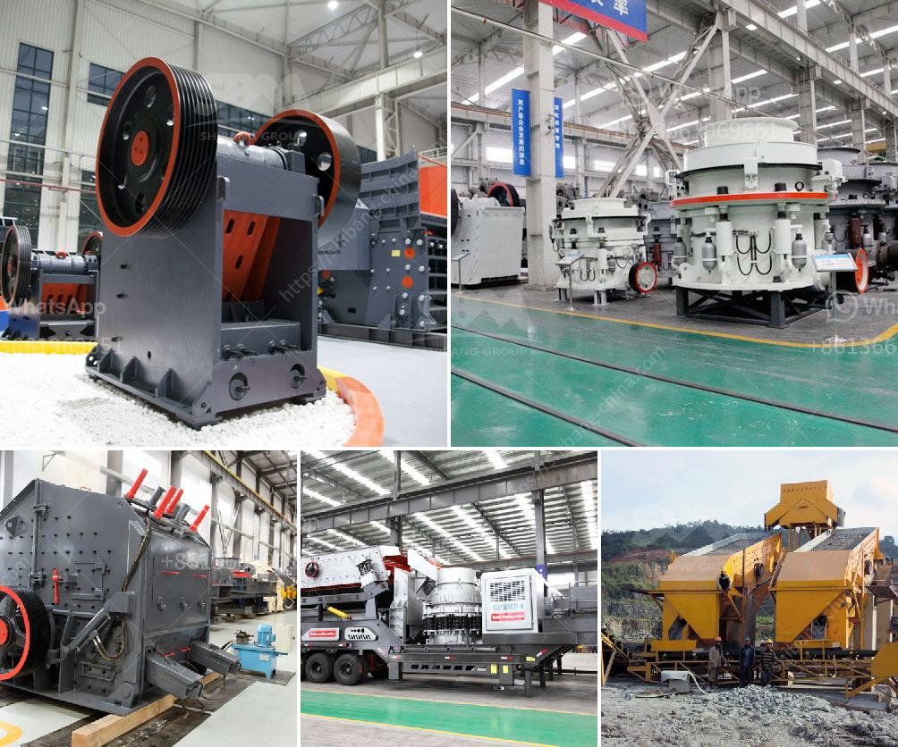

<h3>marble grinding machine price</h3>
Marble is a kind of metamorphic rock formed from limestone. It is often used as a building material and one of the most expensive rocks in the market due to its beauty and durability. However, marble surfaces can become dull and dirty over time, losing their original shine. To restore their beauty, marble grinding machines are used.

Marble grinding machines are designed to grind and polish marble slabs, tiles, and other surfaces. They utilize a rotating abrasive disk infused with diamond particles. These particles help to remove the dull outer layer of the marble, revealing a fresh, shiny surface underneath.

The price of marble grinding machines varies depending on their size, features, and brand. Small, handheld machines can start at around $100, while larger, professional-grade machines can cost several thousand dollars. The price also depends on whether the machine is a standalone unit or a part of a larger marble grinding system.

When considering the price of a marble grinding machine, it is essential to look beyond the initial cost. Factors such as maintenance, warranty, and availability of spare parts should also be taken into account. A machine that requires frequent maintenance or has limited availability of spare parts can add significant costs in the long run.

It is also important to consider the quality and reputation of the brand when selecting a marble grinding machine. Established and reputable brands often offer a higher price tag but also provide better build quality, superior performance, and excellent customer support. Investing in a well-regarded brand can save money and time in the long term, as the machine will last longer and require fewer repairs.

In addition to the machine itself, other expenses should be considered when budgeting for marble grinding. These can include diamond grinding pads, cleaning solutions, protective gear, and transportation costs. These expenses may vary depending on the size and condition of the marble surfaces that need to be ground.

To find the best price for a marble grinding machine, it is recommended to research different suppliers and compare their offers. Online platforms and specialized industry magazines can provide information about different brands and machines available on the market. It is also worth reaching out to fellow professionals or experts in the field for their recommendations and insights.

In conclusion, marble grinding machines are essential tools for maintaining and restoring the beauty of marble surfaces. The price of these machines can range from a few hundred dollars to several thousand dollars, depending on various factors such as size, brand, and features. When considering the price, it is important to look beyond the initial cost and consider factors such as maintenance, warranty, and availability of spare parts. Investing in a reputable brand can ensure better performance, durability, and customer support. By researching different suppliers and comparing offers, it is possible to find the best price for a marble grinding machine.
<h3>Contact us</h3><ul><li><strong>Whatsapp:&nbsp;<a href="https://wa.me/8613661969651">+8613661969651</a></strong></li><li><a href="https://swt.shibang-china.com/?git&amp;zhl&amp;marble grinding machine price"><strong>Online Service(chat now)</strong></a></li></ul><h3>Related</h3><ul><li><a href='kaolin dry beneficiation.md'>kaolin dry beneficiation</a></li><li><a href='river sand washing machine portable india.md'>river sand washing machine portable india</a></li><li><a href='500 ton hour coal crusher and screen.md'>500 ton hour coal crusher and screen</a></li><li><a href='limestone crushers in ghana.md'>limestone crushers in ghana</a></li><li><a href='copper concentrate mobile crusher.md'>copper concentrate mobile crusher</a></li></ul>