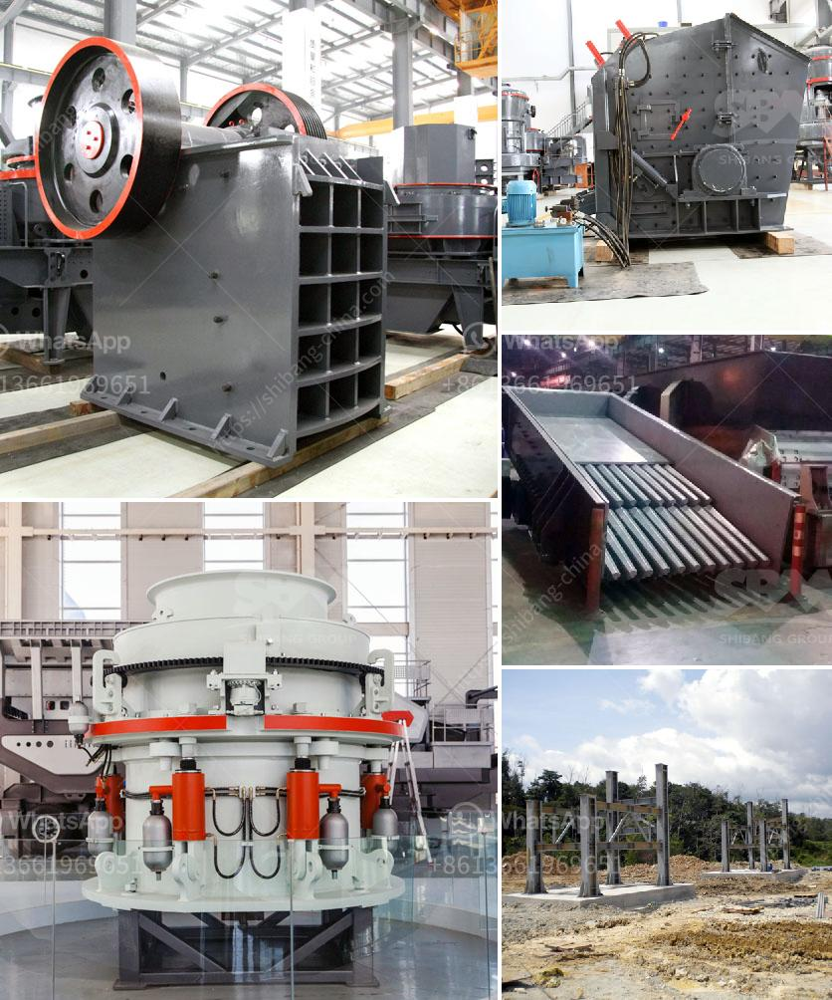

<h3>marble processing machines</h3>
Marble has been used for centuries as a symbol of elegance, luxury, and durability. From ancient art and sculptures to modern architectural marvels, this versatile natural stone continues to be highly prized for its stunning appearance and impressive strength. However, behind the perfectly polished slabs and intricate designs lies a complex process of marble processing that requires precision and efficiency. This is where marble processing machines come into play.

Marble processing machines are specialized equipment used in the production of marble products. These machines enable the transformation of raw marble into meticulously crafted pieces, ranging from tiles and slabs to sculptures and decorative items. By automating various stages of the manufacturing process, marble processing machines significantly enhance productivity and ensure consistently high-quality results.

One vital step in marble processing is cutting the raw marble into precise dimensions. This is achieved through the use of a marble cutting machine, which can be either a traditional saw or a more modern water jet cutter. Traditionally, saws equipped with diamond-coated blades were used to cut marble, but water jet cutters have gained popularity due to their higher accuracy and reduced risk of damage to the stone. These machines use high-pressure water jets mixed with an abrasive material to cut through the marble, creating precise shapes with smooth edges.

After cutting, the marble pieces undergo shaping and refinement through processes such as grinding and polishing. Grinding machines equipped with diamond-embedded grinding plates smooth out irregular surfaces and imperfections on the marble, while polishing machines create the signature glossy finish that enhances the stone's inherent beauty. Modern polishing machines utilize rotating abrasive heads that gradually refine the surface of the marble, resulting in a mirror-like shine.

The advancement of technology has also led to the development of CNC (Computer Numerical Control) machines in marble processing. These machines, operated by computer programs, offer unparalleled precision and repeatability. CNC machines can carve intricate patterns and designs on marble with ease, allowing for the creation of unique and complex artistic pieces. Whether it's a delicate sculpture or an intricately patterned tile, CNC machines ensure that every detail is perfectly executed.

Additionally, marble processing machines also include equipment for handling and transporting the finished products. Cranes and lifting devices are used to move the heavy marble slabs and sculptures safely. These machines not only reduce human effort but also minimize the risk of damage during transportation.

The use of marble processing machines has revolutionized the marble industry by making the production process faster, more efficient, and less labor-intensive. With the help of these machines, marble manufacturers can meet the increasing demand for marble products while maintaining high quality. Furthermore, the automation of various tasks reduces the dependence on skilled artisans, allowing even smaller manufacturers to compete in the market.

In conclusion, marble processing machines are the backbone of the marble industry, enabling the production of exquisite marble products that adorn our homes, public spaces, and architectural wonders. From cutting and shaping to grinding and polishing, these specialized machines ensure accurate dimensions, flawless finishes, and immaculate detailing. By combining technology and craftsmanship, marble processing machines play a vital role in transforming raw marble into magnificent works of art.
<h3>Contact us</h3><ul><li><strong>Whatsapp:&nbsp;<a href="https://wa.me/8613661969651">+8613661969651</a></strong></li><li><a href="https://swt.shibang-china.com/?git&amp;zhl&amp;marble processing machines"><strong>Online Service(chat now)</strong></a></li></ul><h3>Related</h3><ul><li><a href='working cone crushers.md'>working cone crushers</a></li><li><a href='balls for ball mill.md'>balls for ball mill</a></li><li><a href='difference between pulveriser and.md'>difference between pulveriser and</a></li><li><a href='jaw crusher vs gyratory crusher stone crusher quarry.md'>jaw crusher vs gyratory crusher stone crusher quarry</a></li><li><a href='jaw crusher machine for sale.md'>jaw crusher machine for sale</a></li></ul>