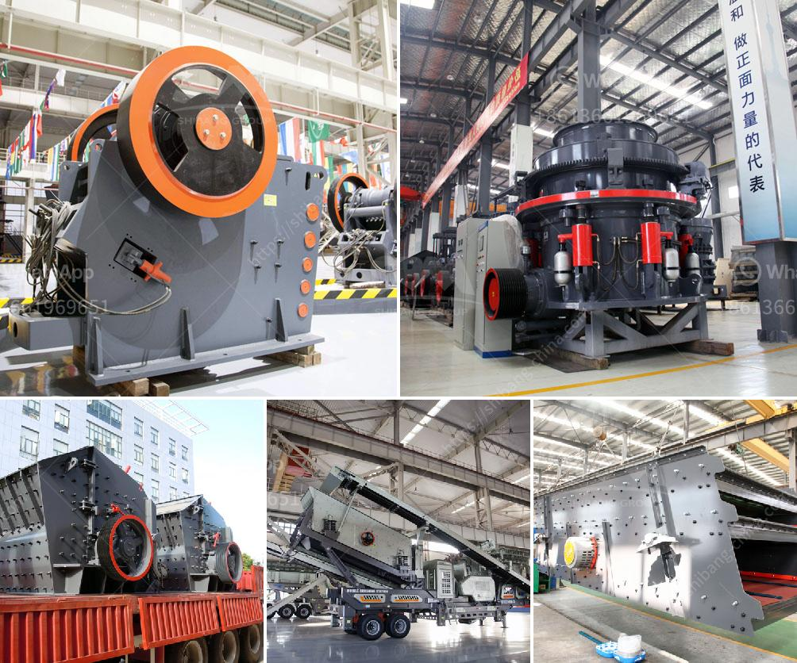

<h3>marble processing plant in uae</h3>
Marble is a naturally occurring stone that has been used for thousands of years in various construction and decorative applications. Its elegance, durability, and versatility have made it a popular choice for countless projects across the globe. With demand for marble on the rise, the United Arab Emirates (UAE) has emerged as a leading destination for marble processing.

One of the prominent marble processing plants in the UAE is located in the Emirate of Ras Al Khaimah. Founded in 1992, this state-of-the-art facility boasts advanced machinery sourced from top manufacturers around the world. The plant is strategically situated in close proximity to the Jebel Jais mountain range, which is renowned for its high-quality marble reserves.

The marble processing plant in Ras Al Khaimah primarily focuses on cutting, polishing, and finishing marble slabs for architectural and interior design projects. The facility is equipped with highly advanced technologies and automated machinery, ensuring precision and efficiency in every process. Skilled artisans, alongside automated robots, work hand-in-hand to deliver finished products of the highest standards and industry demands.

Upon arrival at the plant, raw marble blocks are carefully inspected and selected based on their color, texture, and quality. The blocks then undergo a series of cutting processes, utilizing diamond-tipped saws and water-jet machines. These cutting techniques ensure precision and minimize material wastage. The cut marble slabs are then sent through a series of polishing and finishing processes to enhance their appearance and texture.

In addition to marble slabs, the processing plant also produces customized marble tiles, mosaics, and various other architectural elements. These products can be tailored to customer specifications and are widely used in luxury hotels, residences, and commercial projects across the UAE and beyond.

Aside from its state-of-the-art machinery and skilled workforce, the marble processing plant in UAE prioritizes sustainability and environmental friendliness. The facility strictly abides by international standards and regulations to minimize the impact on the environment. Water recycling systems, dust control mechanisms, and waste management practices are in place to ensure that the operations are conducted responsibly.

Furthermore, the plant actively pursues energy-efficient practices to reduce its carbon footprint. From optimizing the use of electricity to implementing energy-saving measures in machinery, the facility strives to minimize its environmental impact while maximizing productivity and profitability.

The marble processing plant in the UAE plays a crucial role in satisfying the ever-growing demand for marble products in the region and beyond. Its commitment to quality, sustainability, and innovation positions it as a leading player in the global marble industry. With the UAE's vision to become a sustainable and advanced nation, the marble processing plant sets an example of how industrial operations can be conducted responsibly while supporting economic growth and development.

In conclusion, the marble processing plant in the UAE is an impressive testament to the country's commitment to excellence in the field of marble production. With its state-of-the-art machinery, skilled workforce, and dedication to sustainability, it continues to thrive and contribute to the local and global marble market, solidifying the UAE's position as a hub for marble processing.
<h3>Contact us</h3><ul><li><strong>Whatsapp:&nbsp;<a href="https://wa.me/8613661969651">+8613661969651</a></strong></li><li><a href="https://swt.shibang-china.com/?git&amp;zhl&amp;marble processing plant in uae"><strong>Online Service(chat now)</strong></a></li></ul><h3>Related</h3><ul><li><a href='gypsum granules machine in india.md'>gypsum granules machine in india</a></li><li><a href='gold processing equipment.md'>gold processing equipment</a></li><li><a href='stone crusher and quarry plant in galway ireland.md'>stone crusher and quarry plant in galway ireland</a></li><li><a href='small portable concrete crusher.md'>small portable concrete crusher</a></li><li><a href='quarry business cost in india.md'>quarry business cost in india</a></li></ul>