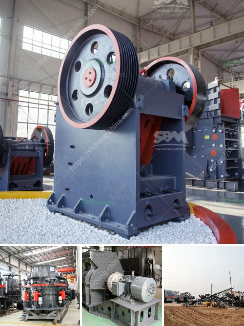

<h3>marble processing plant</h3>
Marble is a beautiful natural stone that has been used for centuries in various forms of architecture and design. From flooring and countertops to sculptures and decorative accents, marble is highly prized for its elegance and durability. However, the journey from a raw marble block to the finished product requires careful processing in a specialized facility known as a marble processing plant.

A marble processing plant is a facility where raw marble blocks are transformed into slabs, tiles, and other marble products. It is a complex process that begins with selecting the right quality of marble blocks and ends with the final polishing and finishing of the products.

The first step in the marble processing plant is the extraction of marble blocks from the quarries. This requires heavy machinery and skilled labor to safely remove the blocks without causing any damage. Once the blocks are extracted, they are transported to the processing plant, where they undergo various stages of processing.

The processing of marble blocks involves cutting the blocks into smaller sizes using diamond wire saws or other cutting equipment. These smaller sizes are then further processed using gang saws or bridge saws to create slabs of uniform thickness. The edges of the slabs are shaped and polished to achieve a smooth and shiny finish.

In addition to slabs, marble processing plants also produce tiles, mosaics, and other decorative products. These products are made by cutting the slabs into smaller pieces of desired shapes and sizes. The cut pieces are then polished, calibrated, and finished to enhance their aesthetics and quality.

Marble processing plants utilize advanced machinery and technology to ensure efficiency and precision throughout the processing stages. CNC machines, waterjet cutting systems, and automated polishing machines are commonly used in these plants.

The final products from a marble processing plant are widely used in residential and commercial projects. They add a touch of luxury and sophistication to interiors and exteriors, enhancing the overall appeal and value of any space.

In conclusion, a marble processing plant plays a crucial role in transforming raw marble blocks into exquisite finished products. The meticulous process involves cutting, shaping, and polishing the marble to produce slabs, tiles, and other decorative items. With the help of advanced technology and skilled craftsmanship, marble processing plants contribute to the timeless beauty and versatility of this remarkable natural stone.
<h3>Contact us</h3><ul><li><strong>Whatsapp:&nbsp;<a href="https://wa.me/8613661969651">+8613661969651</a></strong></li><li><a href="https://swt.shibang-china.com/?git&amp;zhl&amp;marble processing plant"><strong>Online Service(chat now)</strong></a></li></ul><h3>Related</h3><ul><li><a href='roller crusher discount.md'>roller crusher discount</a></li><li><a href='cost to setup cement plant industry.md'>cost to setup cement plant industry</a></li><li><a href='small stone crusher machine.md'>small stone crusher machine</a></li><li><a href='sand crushing and screening hire.md'>sand crushing and screening hire</a></li><li><a href='super fine powder grinder.md'>super fine powder grinder</a></li></ul>