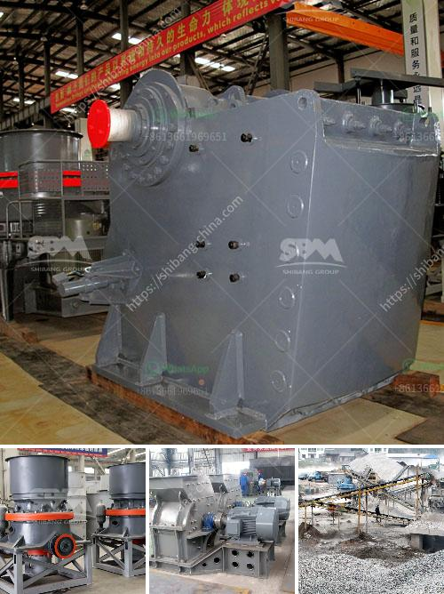

<h3>marble production line</h3>
Marble is a timeless and elegant natural stone that has been used for centuries in various architectural and decorative applications. From ancient sculptures to modern countertops and floorings, marble possesses a unique beauty that has captivated designers, builders, and homeowners alike. But have you ever wondered how marble is produced? In this article, we will explore the fascinating world of marble production lines and discover the intricate process behind this luxurious stone.

The first step in the marble production line is the extraction of marble blocks from the quarries. These quarries, typically located in mountainous regions, house rich deposits of marble, and they vary in size and quality. The extraction process involves using specialized diamond wire saws or explosives to loosen the marble from the quarry walls. Once extracted, the marble blocks are transported to the processing facility for further refinement.

Upon arrival at the processing facility, the marble blocks go through a series of cutting and shaping processes. The most common method is sawing, where the blocks are sliced into slabs of various thicknesses using large, diamond-tipped saws. These slabs are then sent to the polishing line, where they undergo another set of processes to achieve the desired finish.

Polishing is an essential part of the marble production line as it determines the final appearance and shine of the marble. The slabs are initially resined to fill any natural imperfections or pores in the stone. This resin also enhances the structural integrity of the marble. Next, the slabs pass through a series of abrasive grinding and polishing machines. These machines use progressively finer grits of diamond-infused pads to grind and polish the surface of the slabs until they achieve a mirror-like shine.

After the polishing process, the marble slabs are inspected for quality assurance. Skilled craftsmen examine the slabs for any visible defects, such as cracks, fissures, or discolorations. Only the ones that pass the rigorous quality checks are selected for distribution and sale.

Depending on the intended use, the marble slabs might undergo additional processes before reaching their final destinations. For example, if the marble is to be used as countertops or vanity tops, the slabs are cut and shaped into the desired dimensions to fit the specific requirements. This cutting and shaping process can be done using automatic computer-controlled machines or manually by experienced craftsmen.

Finally, the finished marble products are meticulously packaged to protect them during transportation and installation. They are carefully loaded onto trucks or containers and shipped to distributors, suppliers, or directly to customers all around the world.

The marble production line is a meticulous and labor-intensive process that demands patience, skill, and expertise. From the extraction of the raw blocks to the final inspection and packaging, each step is carefully executed to ensure the production of high-quality, flawless marble.

Understanding the intricate process behind marble production can deepen our appreciation for this exquisite natural stone. The fact that it takes so much effort and dedication to transform raw blocks into polished slabs showcases the artistry and craftsmanship involved in creating such stunning pieces. So, the next time you admire a marble sculpture or step foot on a marble floor, take a moment to reflect on the fascinating journey that brought this beautiful stone into existence.
<h3>Contact us</h3><ul><li><strong>Whatsapp:&nbsp;<a href="https://wa.me/8613661969651">+8613661969651</a></strong></li><li><a href="https://swt.shibang-china.com/?git&amp;zhl&amp;marble production line"><strong>Online Service(chat now)</strong></a></li></ul><h3>Related</h3><ul><li><a href='stone crusher installation cost business.md'>stone crusher installation cost business</a></li><li><a href='aggregates crusher philippines.md'>aggregates crusher philippines</a></li><li><a href='cement plant cost estimation.md'>cement plant cost estimation</a></li><li><a href='cost setting up silica sand ball mill.md'>cost setting up silica sand ball mill</a></li><li><a href='sand stone factory equipment.md'>sand stone factory equipment</a></li></ul>