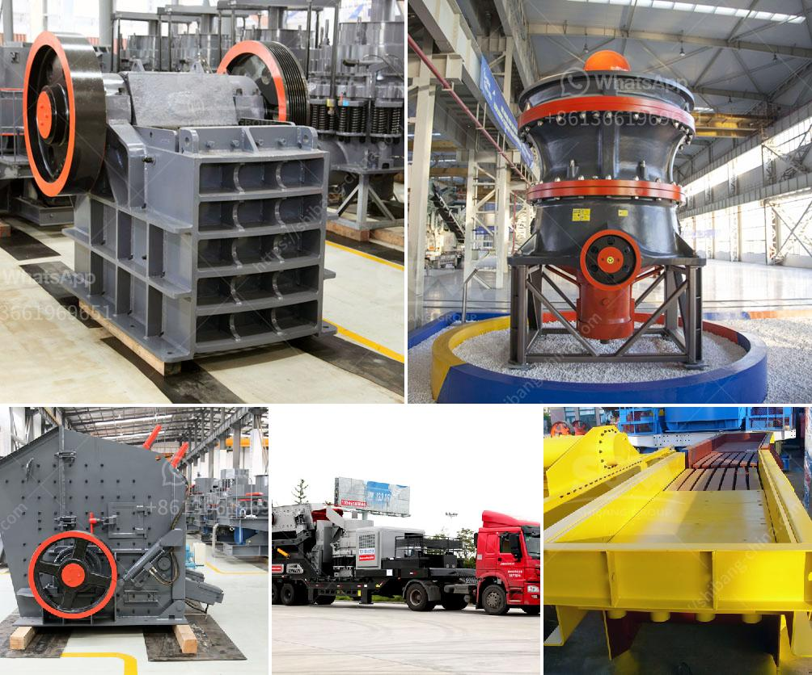

<h3>marble quarry equipment</h3>
Marble has been a popular choice for centuries when it comes to creating awe-inspiring structures and sculptures. Its unique characteristics, such as its natural beauty, durability, and versatility, have made it a preferred material for architects and designers worldwide. However, the process of extracting marble from quarries requires a specialized set of equipment to ensure its safe and efficient extraction. In this article, we will explore the various types of equipment used in marble quarrying.

One of the most important considerations in marble quarrying is the equipment to be used. Equipment such as diamond wire saws, diamond belt saws, hydraulic drilling machines, chain saws, wheel loaders, wire saw machines, and excavators are commonly used in marble quarrying.

Diamond wire saws are one of the most widely used and efficient tools for marble quarrying. These saws consist of a wire with embedded diamonds that can cut through marble with precision and speed. The wire is connected to a machine that applies tension and water to cool the wire and remove the debris. Diamond wire saws are highly flexible and can be easily maneuvered in the quarry to cut large blocks of marble.

Another popular tool used in marble quarrying is the diamond belt saw. This tool consists of a belt embedded with diamonds that can cut through marble quickly and efficiently. The belt is connected to a machine that applies tension and water to cool the belt and remove debris. Diamond belt saws are ideal for cutting large blocks of marble into slabs.

Hydraulic drilling machines are also commonly used in marble quarrying. These machines use a hydraulic system to drill holes into the marble. Hydraulic drilling machines are highly efficient and can be used to create precise holes for the insertion of explosives or other tools.

Chain saws are another type of equipment used in marble quarrying. These saws consist of a chain with embedded diamonds that can cut through marble with ease. Chain saws are commonly used to create precise cuts in marble, such as when removing blocks from the quarry or shaping them into specific sizes and shapes.

Wheel loaders are essential in the process of marble quarrying. These machines are used to transport the marble blocks from the quarry to storage areas or processing facilities. Wheel loaders are highly maneuverable and can handle heavy loads, making them an indispensable tool in marble quarrying.

Wire saw machines are also commonly used in marble quarrying. These machines consist of a wire with embedded diamonds that can be driven by a motor. Wire saw machines are used to cut through marble quickly and efficiently, allowing for the extraction of large blocks of marble from the quarry.

Excavators are another type of equipment used in marble quarrying. These machines are used to remove overburden and extract marble blocks from the quarry. Excavators are highly versatile and can be used to load and transport the marble blocks to processing facilities.

In conclusion, the extraction of marble from quarries requires a specialized set of equipment to ensure its safe and efficient extraction. Tools such as diamond wire saws, diamond belt saws, hydraulic drilling machines, chain saws, wheel loaders, wire saw machines, and excavators are commonly used in marble quarrying. These tools enable the quarrying process to be carried out with precision, speed, and efficiency, ensuring the availability of this beautiful and versatile material for architectural and design purposes.
<h3>Contact us</h3><ul><li><strong>Whatsapp:&nbsp;<a href="https://wa.me/8613661969651">+8613661969651</a></strong></li><li><a href="https://swt.shibang-china.com/?git&amp;zhl&amp;marble quarry equipment"><strong>Online Service(chat now)</strong></a></li></ul><h3>Related</h3><ul><li><a href='diagram of vertical hammer mill.md'>diagram of vertical hammer mill</a></li><li><a href='used cement crushers for sale.md'>used cement crushers for sale</a></li><li><a href='artificial stone production line.md'>artificial stone production line</a></li><li><a href='portable cone crusher.md'>portable cone crusher</a></li><li><a href='feldspar crusher machine.md'>feldspar crusher machine</a></li></ul>