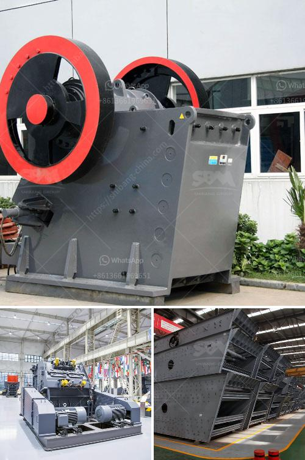

<h3>margalla stone crusher in islamabad</h3>
Islamabad – Margalla Hills are one of the oldest and iconic natural beauty spots in Pakistan, dating back to the arrival of the Mughal Empire in the 16th century. Since then, these hills have been a source of scenic beauty as well as providing essential raw materials for construction needs in the region.

However, in recent years, the iconic Margalla Hills have been threatened by the rapid growth of stone crushing plants. Illegal stone blasting and crushing have been contributing significantly to deforestation, pollution, and noise pollution in the area. One of the primary culprits was identified as the Margalla Stone Crusher, operating illegally.

The Margalla Hills are categorized as a national park, with strict regulations being put in place to preserve the natural beauty and ecology of the area. Stone crushing and quarrying activities within the park boundaries are strictly forbidden. However, despite these rules, numerous stone crushers have been continuing their operations due to weak enforcement of the law.

The negative impacts of stone crushing in the Margalla Hills include the destruction of natural vegetation, deforestation, air and noise pollution, and wildlife disturbance, leading to an overall degradation of the ecology of the area. The stone crushers are not only affecting human health but also endangering various species of plants and animals that are unique to the region.

The stone crushing industry has a significant impact on the health of workers and nearby residents. Dust generated from the stone crushers contributes to air pollution, leading to respiratory ailments, lung diseases, and acute respiratory infections. The noise pollution from stone crushing machinery and blasting operations has affected the mental health and quality of life of the residents living nearby.

Furthermore, the illegal stone crushing activities have left behind scars on the landscape, rendering it unsightly and damaging the natural beauty of the Margalla Hills. The trees and vegetation that once adorned these hills have been replaced with piles of crushed stones and dust.

It is essential for the government and relevant authorities to take immediate action against illegal stone crushers operating within the Margalla Hills. The enforcement of the law should be strict and proactive to curb these environmentally damaging activities.

Additionally, public awareness campaigns should be launched to educate people about the adverse effects of stone crushing and the importance of conserving the natural beauty of the Margalla Hills. It is crucial to involve all stakeholders, including local communities, environmentalists, and stone crushing operators, in finding sustainable and alternative solutions for their livelihoods that do not harm the environment.

An environmental impact assessment should be conducted to evaluate the extent of damage caused by stone crushing operations and to identify appropriate mitigation measures. This would help in the formulation of effective policies and regulations to safeguard the Margalla Hills from further degradation.

In conclusion, the Margalla Stone Crushers operating illegally in Islamabad have been posing a serious threat to the environment and human health. It is high time for the authorities to take immediate and stringent action against these illegal activities to preserve the ecological balance and the natural beauty of the Margalla Hills for future generations.
<h3>Contact us</h3><ul><li><strong>Whatsapp:&nbsp;<a href="https://wa.me/8613661969651">+8613661969651</a></strong></li><li><a href="https://swt.shibang-china.com/?git&amp;zhl&amp;margalla stone crusher in islamabad"><strong>Online Service(chat now)</strong></a></li></ul><h3>Related</h3><ul><li><a href='project feasibility report on stone crusher.md'>project feasibility report on stone crusher</a></li><li><a href='ball mill capacity tons.md'>ball mill capacity tons</a></li><li><a href='portable cone crusher.md'>portable cone crusher</a></li><li><a href='vrm cement grinding.md'>vrm cement grinding</a></li><li><a href='ball grinding machine in india.md'>ball grinding machine in india</a></li></ul>