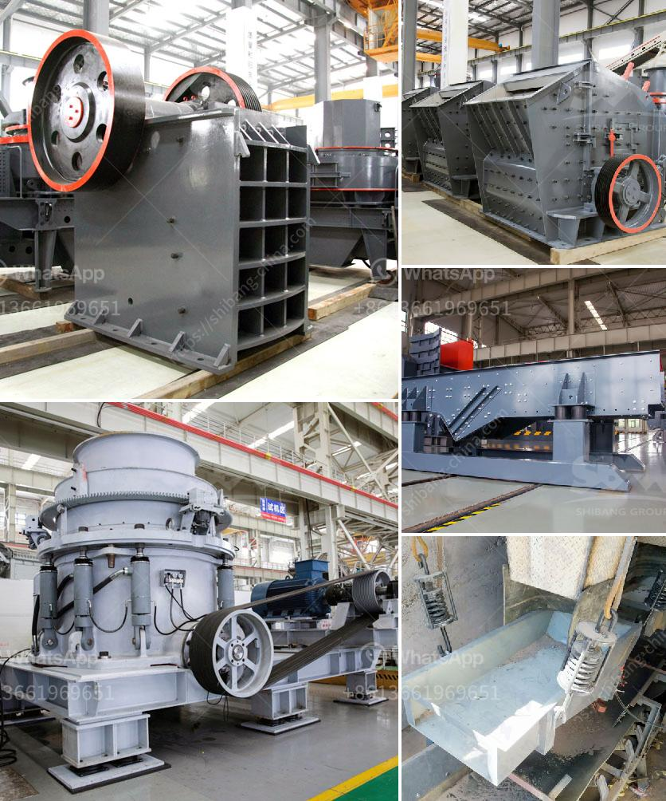

<h3>material vibrator feeder</h3>
In the world of industrial automation, material handling plays a pivotal role in achieving smooth production processes. One device that has revolutionized the industry is the material vibrator feeder. This flexible and durable tool efficiently and consistently feeds various materials, preventing blockages and improving overall productivity. In this article, we will delve into the features, benefits, and applications of the material vibrator feeder.

A material vibrator feeder is typically composed of a vibrating base with a chute or a bowl-shaped container attached to it. The vibrating base generates pulsating vibrations that directly transmit to the material in the container. This, in turn, creates a continuous flow of material through the feeder.

The feeder's settings can be adjusted, allowing precise control over the frequency and amplitude of the vibrations. This versatility enables the user to adapt the feeder to accommodate a wide range of materials and required feed rates.

1. Prevents Blockages: The vibrations produced by the feeder efficiently dislodge any potential obstructions, ensuring uninterrupted material flow.

2. Ensures Consistency: The precise control settings of the feeder guarantee an accurate and consistent flow rate, enabling downstream processes to operate seamlessly.

3. Improved Efficiency: Material vibrator feeders facilitate efficient handling by reducing labor requirements and enhancing production rates, resulting in overall cost savings.

1. Pharmaceutical: In pharmaceutical manufacturing, the feeder is commonly employed to accurately dispense powders, granules, or tablets for packaging or production purposes.

2. Mining and Quarrying: Vibrator feeders effectively segregate and transport materials like coal, gravel, or minerals, enhancing overall efficiency in the mining and quarrying sectors.

3. Food and Beverage: Food processing facilities utilize vibrator feeders to control the flow of ingredients, such as grains, spices, or liquids, during mixing or packaging operations.

4. Automotive and Manufacturing: Vibrator feeders are used in assembly lines to supply parts, ensuring a consistent and timely flow of components for seamless production.

The material vibrator feeder has become an indispensable tool in modern industrial automation. Its ability to prevent blockages, ensure consistency, and improve overall efficiency makes it valuable across numerous sectors. Incorporating this reliable equipment allows businesses to achieve higher productivity levels, while maintaining continuous material flow and enhancing overall operational effectiveness.
<h3>Contact us</h3><ul><li><strong>Whatsapp:&nbsp;<a href="https://wa.me/8613661969651">+8613661969651</a></strong></li><li><a href="https://swt.shibang-china.com/?git&amp;zhl&amp;material vibrator feeder"><strong>Online Service(chat now)</strong></a></li></ul><h3>Related</h3><ul><li><a href='construction material recycling technology.md'>construction material recycling technology</a></li><li><a href='small mobile diesel engine double rolls crusher.md'>small mobile diesel engine double rolls crusher</a></li><li><a href='conveyor belt manufacturer in indonesia and philippines.md'>conveyor belt manufacturer in indonesia and philippines</a></li><li><a href='hard rock crusher.md'>hard rock crusher</a></li><li><a href='want to buy stone crusher in canada.md'>want to buy stone crusher in canada</a></li></ul>