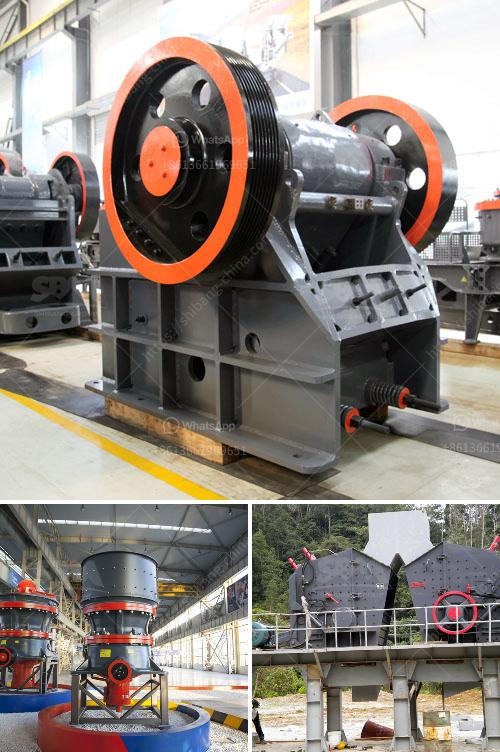

<h3>materials used in mining gold and diamond</h3>
Mining for gold and diamonds is an intricate and complex process that requires the use of various materials to extract these precious minerals from the earth. These materials play a critical role in the process, ensuring the efficiency and safety of mining operations.

To extract gold, a commonly used material is cyanide. This chemical compound helps dissolve gold from its ore, allowing for easy extraction. However, the use of cyanide has become a topic of controversy due to its potential environmental impact. Mining companies have implemented strict protocols to handle and store cyanide safely to avoid any potential harm to the environment.

Another material often used in gold mining is mercury. Mercury forms an amalgam with gold, allowing for the easier separation of gold from other materials. However, mercury is highly toxic and poses significant health risks if not handled properly. Many countries have restricted or banned the use of mercury in gold mining due to environmental concerns and the potential harm to workers.

In diamond mining, heavy equipment and machinery are utilized in the extraction process. Excavators, trucks, and drills are some of the primary materials used. These machines help remove large quantities of soil and rock to expose the diamond-bearing ore. In addition, explosives are used to assist in the excavation process, enabling efficient removal of overburden.

To process diamond-bearing ore, crushers and mills are utilized. These machines crush the ore into smaller particles for further processing. Once the ore is reduced in size, various techniques are used to separate the diamonds from the ore, such as high-density separators and diamond grease tables.

It is important to note that mining companies are continually investing in research and development to find more sustainable and environmentally friendly alternatives to the materials currently used. This includes exploring less harmful chemicals for gold extraction and improving the efficiency of diamond recovery methods.

In conclusion, the mining of gold and diamonds involves the use of various materials to extract these valuable minerals. While some of these materials, such as cyanide and mercury, have raised concerns due to their potential environmental and health impacts, mining companies are actively working to develop safer and more sustainable alternatives. The responsible use of these materials is crucial to ensure the longevity and sustainability of the mining industry.
<h3>Contact us</h3><ul><li><strong>Whatsapp:&nbsp;<a href="https://wa.me/8613661969651">+8613661969651</a></strong></li><li><a href="https://swt.shibang-china.com/?git&amp;zhl&amp;materials used in mining gold and diamond"><strong>Online Service(chat now)</strong></a></li></ul><h3>Related</h3><ul><li><a href='calcium carbonate plants in china.md'>calcium carbonate plants in china</a></li><li><a href='how much is jaw crusher.md'>how much is jaw crusher</a></li><li><a href='roller crusher for coal.md'>roller crusher for coal</a></li><li><a href='impact crusher philippines.md'>impact crusher philippines</a></li><li><a href='complete stone quarry plant.md'>complete stone quarry plant</a></li></ul>