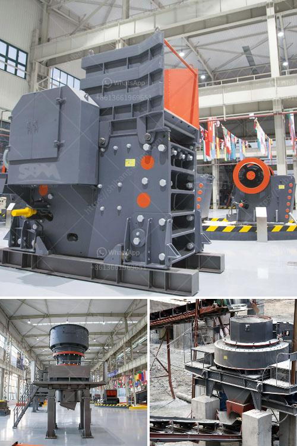

<h3>metal conveyor belts in plates</h3>
Metal conveyor belts in plates are widely used in various industries for transportation and material handling purposes. These belts are made of metal plates that are interlinked together to form a continuous loop. They offer several advantages over traditional conveyor belts, making them an ideal choice for many applications.

One of the major advantages of metal conveyor belts in plates is their strength and durability. These belts are manufactured using high-quality materials such as stainless steel, which provides excellent resistance to corrosion, temperature, and wear. This makes them suitable for handling heavy loads and working in extreme conditions. Metal conveyor belts in plates are capable of withstanding high tensions and pressures, ensuring reliable and long-lasting performance.

Another key advantage of metal conveyor belts in plates is their flexibility. The interlinking of metal plates allows the belt to move in different directions, making it adaptable to various layouts and conveyor systems. This flexibility enables efficient transportation of materials around corners, inclines, and declines, maximizing space utilization in the production facility. Metal conveyor belts in plates can be customized to fit specific conveyor requirements, offering versatility and versatility to different industries.

Metal conveyor belts in plates also provide better hygiene and cleanliness compared to traditional conveyor systems. The open structure of the interlinked plates allows for easy cleaning and sanitation, reducing the risk of contamination in industries such as food processing and pharmaceuticals. This feature is particularly crucial in industries where hygiene and cleanliness are of utmost importance.

One of the unique features of metal conveyor belts in plates is their ability to handle high-temperature applications. They can withstand extreme temperatures, making them suitable for industries such as foundries, heat treatment plants, and glass manufacturing. The heat resistance of these belts ensures that they maintain their structural integrity even when exposed to intense heat, preventing any damage or deformation.

Metal conveyor belts in plates also offer superior airflow, making them suitable for applications where air or liquid needs to pass through the conveyor system. The open structure of the interlinked plates allows for efficient ventilation or drainage, depending on the application requirements. This airflow feature is beneficial in industries such as food processing, where proper ventilation is crucial for maintaining product quality and freshness.

In conclusion, metal conveyor belts in plates offer numerous advantages that make them a preferred choice in various industries. Their strength, durability, flexibility, cleanliness, and high-temperature resistance make them ideal for heavy-duty applications. They ensure smooth and reliable transportation of materials, optimizing productivity and efficiency in production facilities. With their ability to handle different layouts and provide excellent airflow, metal conveyor belts in plates are a versatile solution for many material handling challenges.
<h3>Contact us</h3><ul><li><strong>Whatsapp:&nbsp;<a href="https://wa.me/8613661969651">+8613661969651</a></strong></li><li><a href="https://swt.shibang-china.com/?git&amp;zhl&amp;metal conveyor belts in plates"><strong>Online Service(chat now)</strong></a></li></ul><h3>Related</h3><ul><li><a href='trapezium mill south africa.md'>trapezium mill south africa</a></li><li><a href='quartz plant in india.md'>quartz plant in india</a></li><li><a href='marble crusher in china.md'>marble crusher in china</a></li><li><a href='types of ball mills.md'>types of ball mills</a></li><li><a href='crusher on rent basis in nigeria.md'>crusher on rent basis in nigeria</a></li></ul>