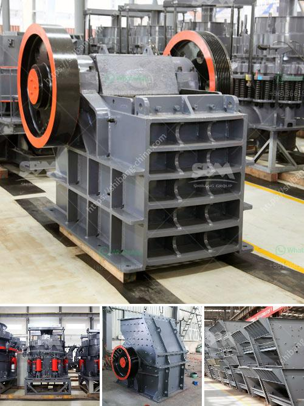

<h3>metal conveyor belts malaysia</h3>
In the dynamically evolving industrial landscape of Malaysia, the demand for efficient material handling solutions is on the rise. As the manufacturing sector expands, businesses are constantly seeking innovative ways to streamline their production processes. One such solution that has gained widespread popularity is the use of metal conveyor belts.

Metal conveyor belts, also known as wire mesh belts, are made from interlinked metal wires. They offer numerous advantages over traditional conveyor belts, making them a preferred choice across various industries. One of the key benefits of metal conveyor belts is their exceptional durability. They are designed to withstand heavy loads and harsh operating conditions, ensuring uninterrupted performance even in the harshest industrial environments.

Additionally, metal conveyor belts provide improved hygiene and product safety. With superior cleanability, these belts are suitable for industries that require strict adherence to hygiene and food safety standards, such as the food processing and pharmaceutical sectors. The open construction of the belts allows for efficient cleaning and minimizes the risk of product contamination.

In Malaysia, the mining industry has found metal conveyor belts to be highly effective in transporting raw materials. These belts are specifically designed to handle abrasive materials, ensuring a smooth and efficient material handling process. The durability and resistance to wear and tear provided by metal conveyor belts make them ideal for the demanding requirements of the mining industry.

Furthermore, metal conveyor belts offer exceptional flexibility and customization options. They can be tailored to fit unique specifications and requirements, ensuring optimal performance and efficiency for each application. This versatility has attracted various industries in Malaysia, including automotive, electronics, and packaging, among others.

In conclusion, metal conveyor belts have emerged as a game-changer for the industrial sector in Malaysia. Their durability, cleanliness, and customizability make them a preferred choice for businesses seeking efficient material handling solutions. As the manufacturing landscape evolves, the adoption of metal conveyor belts will continue to grow, driving operational excellence and boosting the overall productivity and competitiveness of Malaysian industries.
<h3>Contact us</h3><ul><li><strong>Whatsapp:&nbsp;<a href="https://wa.me/8613661969651">+8613661969651</a></strong></li><li><a href="https://swt.shibang-china.com/?git&amp;zhl&amp;metal conveyor belts malaysia"><strong>Online Service(chat now)</strong></a></li></ul><h3>Related</h3><ul><li><a href='calcium carbonate grinder mill.md'>calcium carbonate grinder mill</a></li><li><a href='machines used stone crusher vancouver.md'>machines used stone crusher vancouver</a></li><li><a href='300tpd cement plant price.md'>300tpd cement plant price</a></li><li><a href='transport system in a mineral crusher.md'>transport system in a mineral crusher</a></li><li><a href='roller crusher cad detail drawing.md'>roller crusher cad detail drawing</a></li></ul>