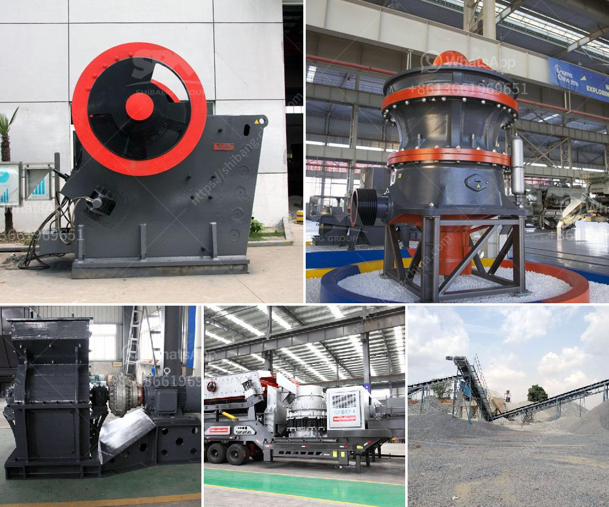

<h3>methods of hammer mill</h3>
A hammer mill is a versatile machine that is used to shred or crush materials into smaller pieces. It consists of a high-speed rotor with hammers that grind the material until it is small enough to pass through a screen. This article will discuss the various methods of hammer mill operation.

Gravity Discharge Hammer Mills: In these hammer mills, the material is discharged through gravity. The hammers are located on the rotor, which revolves at high speed. As the material enters the mill, it is impacted by the hammers and shredded into smaller particles. The shredded material then passes through a screen and is discharged through a chute.

Pneumatic Discharge Hammer Mills: These hammer mills operate on the same principles as gravity discharge mills. However, instead of the material being discharged through gravity, it is pneumatically transported. In this method, the shredded material is blown through a discharge tube using a fan or blower. This allows for greater control over the discharge location and can be beneficial for certain applications.

Interchangeable Screens: One of the key features of a hammer mill is its ability to change screen sizes to accommodate different materials and desired particle sizes. Hammer mills come with a variety of screen sizes that can be easily interchanged, allowing for flexibility in the final product. Finer screens can be used for materials that require a finer grind, while coarser screens can be used for larger particles.

Adjustable Speed: Hammer mills can operate at different speeds depending on the desired outcome. The speed at which the rotor spins can affect the amount of material processed and the fineness of the resulting product. Hammer mills typically come with variable speed controls, allowing operators to adjust the speed to achieve the desired outcome.

Batch vs. Continuous Operation: Hammer mills can be operated in both batch and continuous modes. In batch operation, the material is loaded into the mill, processed, and then discharged before the next batch is loaded. This can be helpful for testing or processing smaller quantities of material. In continuous operation, the material is continuously fed into the mill, processed, and discharged without interruption. Continuous operation is often used for large-scale production where a steady supply of processed material is required.

Conclusion: Hammer mills are versatile machines that can be used for a wide range of applications. They offer numerous advantages including the ability to process a variety of materials, easily interchangeable screens for different particle sizes, adjustable speed, and both batch and continuous operation options. Whether it is for grinding grains, crushing rocks, or shredding wood, a hammer mill provides an efficient and effective solution.
<h3>Contact us</h3><ul><li><strong>Whatsapp:&nbsp;<a href="https://wa.me/8613661969651">+8613661969651</a></strong></li><li><a href="https://swt.shibang-china.com/?git&amp;zhl&amp;methods of hammer mill"><strong>Online Service(chat now)</strong></a></li></ul><h3>Related</h3><ul><li><a href='sand making machine in south africa.md'>sand making machine in south africa</a></li><li><a href='iron jaw crusher with output of mm.md'>iron jaw crusher with output of mm</a></li><li><a href='ball mill for grinding metal.md'>ball mill for grinding metal</a></li><li><a href='stone crushet 10 tons.md'>stone crushet 10 tons</a></li><li><a href='gold mining equipment nevada oregon used rock crushers.md'>gold mining equipment nevada oregon used rock crushers</a></li></ul>