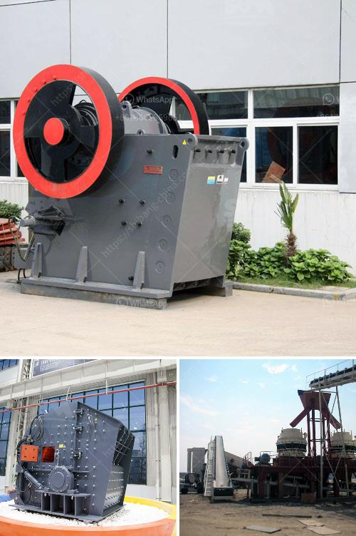

<h3>mica crushing processing in nigeria</h3>
Mica is a mineral found in abundance in Nigeria. It is predominantly used as a raw material in the production of cosmetics, paint, rubber, and electrical insulators. Mica is also used as a filler material in the manufacturing of plastics and ceramics.

The process of mica crushing involves multiple stages. The first stage begins with the extraction of raw mica ore from the ground. The ore is then transported to a nearby processing plant where it undergoes crushing, grinding, and screening to obtain mica flakes.

Crushing is the primary stage in the process of mica processing. It involves breaking the large mica ore into smaller pieces suitable for further processing. After crushing, the ore is sent to the grinding mill for grinding.

In the grinding mill, the mica ore is ground into a powder form. This powder is then sieved to obtain different sizes of mica flakes. The sieved mica flakes are further classified based on their size and other properties. The classified mica flakes are then stored in separate bins for packaging and distribution.

Nigeria has abundant reserves of mica, making it a significant player in the global mica market. The country's mica deposits are mainly found in the northern part of the country, particularly in the states of Niger, Kaduna, and Plateau.

However, despite the availability of mica resources, Nigeria still imports a significant amount of mica to meet its domestic demand. This is primarily due to the lack of modern processing facilities and technology in the country.

Investing in modern mica processing plants in Nigeria would help to reduce the country's import dependency and also create employment opportunities for the local population. Additionally, it would contribute to the growth of the country's economy.

Furthermore, the establishment of mica processing plants in Nigeria would also help to increase the value of the mineral. Currently, raw mica ore is exported to other countries where it is processed before being sold in the market at a higher price. By processing mica locally, Nigeria would be able to add value to the mineral and increase its revenue from the export of processed mica products.

In conclusion, mica crushing and processing is an important industrial activity in Nigeria. Given Nigeria's abundant mica resources, investing in modern mica processing plants would help to reduce import dependency and increase the value of the mineral. This, in turn, would contribute to the growth of Nigeria's economy and create employment opportunities for the local population.
<h3>Contact us</h3><ul><li><strong>Whatsapp:&nbsp;<a href="https://wa.me/8613661969651">+8613661969651</a></strong></li><li><a href="https://swt.shibang-china.com/?git&amp;zhl&amp;mica crushing processing in nigeria"><strong>Online Service(chat now)</strong></a></li></ul><h3>Related</h3><ul><li><a href='stone crusher and quarry plant in galway ireland.md'>stone crusher and quarry plant in galway ireland</a></li><li><a href='roller mill cement price.md'>roller mill cement price</a></li><li><a href='vrm cement grinding.md'>vrm cement grinding</a></li><li><a href='mineral grinding corporation.md'>mineral grinding corporation</a></li><li><a href='used crusher for sale in tanzania.md'>used crusher for sale in tanzania</a></li></ul>