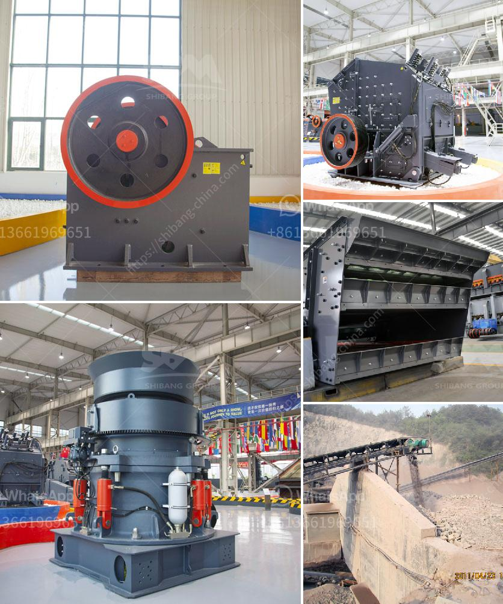

<h3>mica processing plant per ton</h3>
Mica is a versatile mineral that is widely used in various industries due to its unique properties. From the electronics industry to cosmetics, mica finds applications in a range of products. As the demand for mica continues to rise, so does the need for efficient processing plants that can extract this mineral in large quantities.

A mica processing plant plays a crucial role in extracting mica ore from the earth and transforming it into usable products. These plants are equipped with advanced machinery and technology that enables efficient extraction. However, the cost of operating a mica processing plant per ton can vary depending on several factors.

Firstly, the grade and quality of the mica ore directly affect the overall processing cost. Higher-grade mica ore requires less processing steps and produces a higher yield of usable products. On the other hand, lower-grade mica ore may require additional processing steps to obtain the desired quality, thereby increasing the cost per ton.

Secondly, the scale of the processing plant can significantly impact the cost per ton of mica processed. Larger plants often benefit from economies of scale, meaning that the cost per ton decreases as the production volume increases. This is because a larger plant can process more mica ore in a given timeframe, spreading the fixed costs over a greater quantity.

Additionally, the location of the processing plant can affect the cost per ton. Establishing a plant near the source of raw materials reduces transportation costs, which can contribute to a lower overall cost per ton of processed mica.

Furthermore, technological advancements in the processing industry can drive down the cost per ton by improving efficiency and productivity. Advanced machinery and automation can increase the processing capacity, reducing labor requirements and operating costs.

In conclusion, the cost of operating a mica processing plant per ton can vary depending on factors such as the grade of mica ore, the scale of the plant, its location, and the level of technological advancements. However, with proper planning and utilization of modern technologies, it is possible to achieve cost-effective mica processing, meeting the growing demand for this versatile mineral in various industries.
<h3>Contact us</h3><ul><li><strong>Whatsapp:&nbsp;<a href="https://wa.me/8613661969651">+8613661969651</a></strong></li><li><a href="https://swt.shibang-china.com/?git&amp;zhl&amp;mica processing plant per ton"><strong>Online Service(chat now)</strong></a></li></ul><h3>Related</h3><ul><li><a href='principle of jaw crusher operation.md'>principle of jaw crusher operation</a></li><li><a href='roller mill for ares.md'>roller mill for ares</a></li><li><a href='south africa mobile rock crusher.md'>south africa mobile rock crusher</a></li><li><a href='small stone crusher machine.md'>small stone crusher machine</a></li><li><a href='conveyor for sale in malaysia.md'>conveyor for sale in malaysia</a></li></ul>