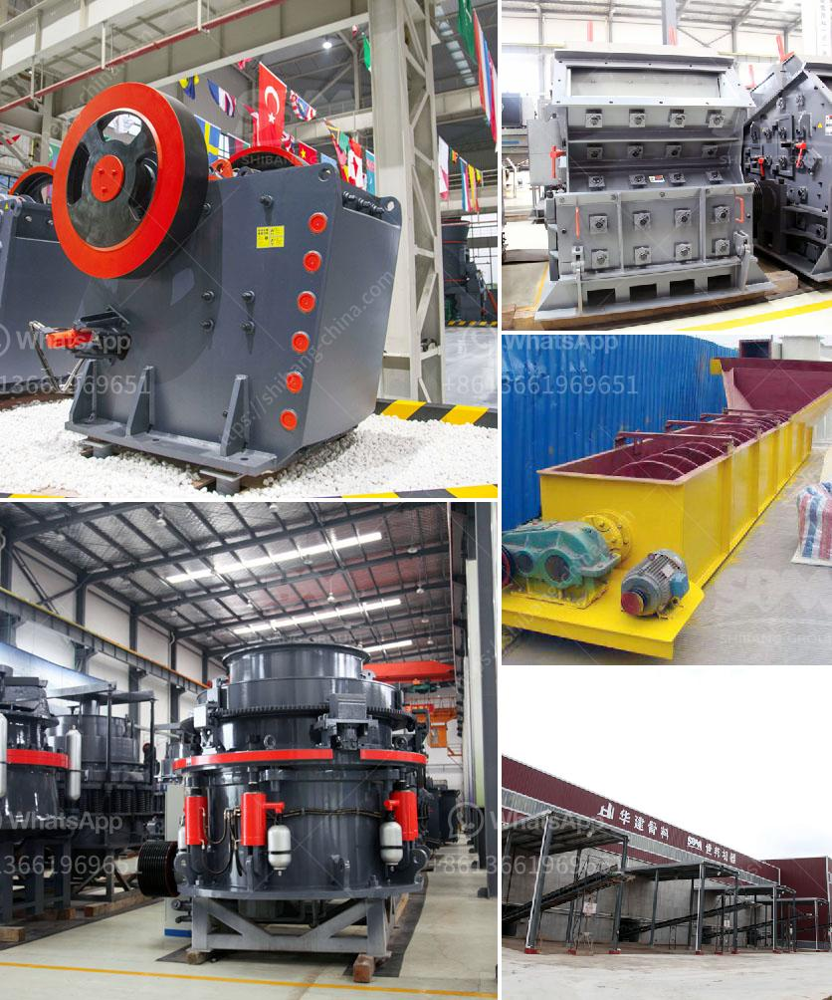

<h3>micro powder grinding mill prices</h3>
Micro powder grinding mill is a widely used milling equipment in the milling industry. It is suitable for ultra-fine powder processing of non-flammable and explosive materials with hardness less than 7 and humidity less than 6%. For example, the processing of calcium carbonate, marble, limestone, barite, talc and other materials.

The micro powder grinding mill has comprehensive mechanical crushing properties such as rolling, grinding, and impact. It can produce 325-3000 mesh powder with uniform fineness and full sieve particle size. Moreover, the equipment has high product fineness, energy saving and environmental protection, low investment cost, small footprint and other characteristics. It is an ideal equipment for grinding fine powder.

When choosing a micro powder grinding mill, customers often have doubts about its price. The price of micro powder grinding mill is affected by factors such as brand, technology, configuration, capacity, and raw materials. Different manufacturers have different quotation standards. Generally, the price of a micro powder grinding mill ranges from tens of thousands to hundreds of thousands. And the price is highly related to the production capacity and quality of the equipment.

As a well-known grinding mill manufacturer, Clirik Machinery provides various types of micro powder grinding mills, which can be customized according to customer needs. From the perspective of price, Clirik Machinery has always insisted on providing customers with cost-effective equipment. We not only consider the price, but also the quality, performance, and after-sales service to ensure that customers can purchase satisfactory grinding mill equipment.

In conclusion, the price of micro powder grinding mill is influenced by many factors. Customers should choose a reliable and reputable manufacturer with a reasonable price to purchase the equipment. Clirik Machinery is a preferred choice for many customers with its high-quality products and professional services.
<h3>Contact us</h3><ul><li><strong>Whatsapp:&nbsp;<a href="https://wa.me/8613661969651">+8613661969651</a></strong></li><li><a href="https://swt.shibang-china.com/?git&amp;zhl&amp;micro powder grinding mill prices"><strong>Online Service(chat now)</strong></a></li></ul><h3>Related</h3><ul><li><a href='italia crusher machine.md'>italia crusher machine</a></li><li><a href='crushing sale rotary drum dryer cost.md'>crushing sale rotary drum dryer cost</a></li><li><a href='crusher machine for making sand from stone.md'>crusher machine for making sand from stone</a></li><li><a href='construction of a clinker plant.md'>construction of a clinker plant</a></li><li><a href='portable stone crusher machine for sale.md'>portable stone crusher machine for sale</a></li></ul>