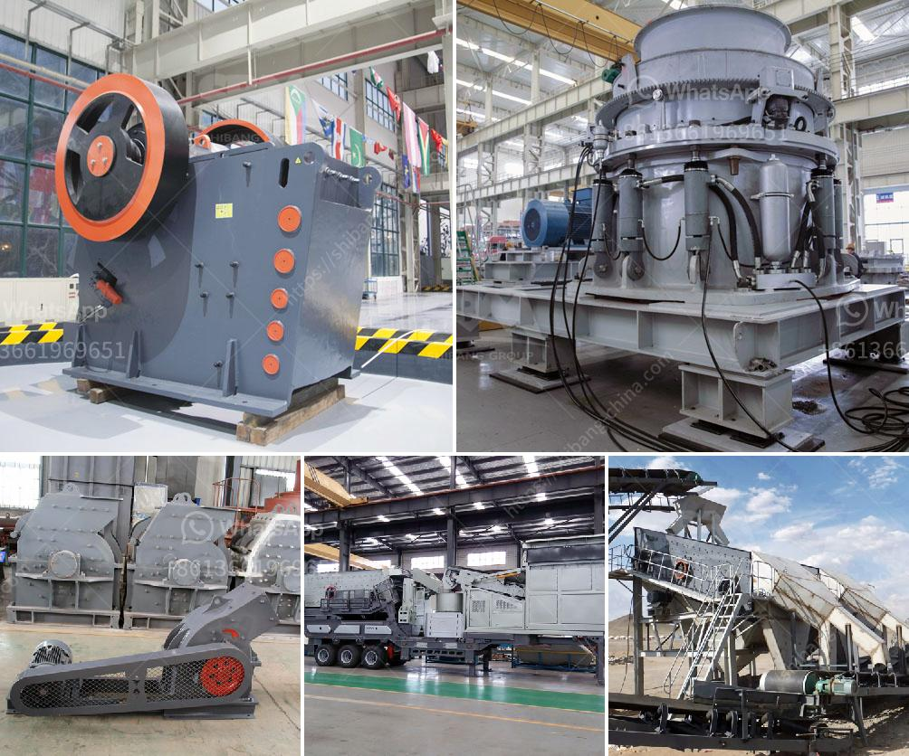

<h3>mill clay grinding in delhi</h3>
With the rapid growth and development of various industries, the demand for raw materials has witnessed a substantial increase. One such vital raw material is mill clay, which plays a significant role in the manufacturing sector, especially in the production of ceramics, refractories, and construction materials. Delhi, being a hub of industrial activity, has emerged as a prominent destination for mill clay grinding.

Mill clay, also known as ball clay or plastic clay, is a fine-grained and highly plastic sedimentary clay that is commonly used in the ceramic industry. It is derived from the weathering and decomposition of granite rocks and is rich in kaolinite, quartz, and mica minerals. Its unique properties, such as plasticity, high bonding capabilities, and low shrinkage, make it an ideal material for various applications.

Grinding mill clay involves the process of reducing the particle size of the clay to achieve the desired level of fineness. This is crucial as it determines the properties and functionalities of the clay in its subsequent application. The grinding process also helps in removing impurities and enhancing the plasticity of the clay, making it more workable and easier to shape.

Delhi has witnessed a significant rise in mill clay grinding operations due to the increasing demand for ceramics, sanitaryware, and construction materials. The city's proximity to major industrial centers and availability of skilled labor and infrastructure has attracted several grinding mill clay units to establish their presence in the region. These units employ advanced grinding techniques and machinery to ensure high-quality and consistent output.

One of the key advantages of mill clay grinding in Delhi is the ready availability of raw materials. The clay-rich regions near the city, such as Haryana and Uttar Pradesh, serve as abundant sources for mill clay extraction. This localized supply chain ensures a constant and uninterrupted flow of raw materials to the grinding mills, minimizing transportation costs and delays.

Furthermore, the presence of a well-developed transportation network in Delhi facilitates the distribution of ground mill clay to different industries and markets. This efficient logistics infrastructure ensures prompt delivery and supports the timely fulfillment of customer demands.

Delhi's mill clay grinding units also contribute to local employment opportunities. The sector requires skilled workers proficient in operating grinding machinery, quality control, and maintenance. These units provide job opportunities, particularly to the local workforce, helping in economic upliftment and reducing unemployment rates.

However, the growth of mill clay grinding in Delhi also poses environmental challenges. The grinding process generates dust and particulate matter, which can have negative impacts on air quality if not adequately controlled. It is crucial for grinding units to comply with environmental regulations and adopt measures like dust suppression systems and proper waste management practices to prevent pollution.

In conclusion, mill clay grinding in Delhi has emerged as a crucial industry, catering to the growing demand for ceramics and construction materials. The region's proximity to raw material sources, well-developed transportation network, and skilled labor availability have contributed to the sector's growth. However, it is essential for grinding units to prioritize environmental sustainability and adopt eco-friendly practices to ensure the long-term viability of the industry.
<h3>Contact us</h3><ul><li><strong>Whatsapp:&nbsp;<a href="https://wa.me/8613661969651">+8613661969651</a></strong></li><li><a href="https://swt.shibang-china.com/?git&amp;zhl&amp;mill clay grinding in delhi"><strong>Online Service(chat now)</strong></a></li></ul><h3>Related</h3><ul><li><a href='hammer mill sales kenya.md'>hammer mill sales kenya</a></li><li><a href='barite beneficiation plant.md'>barite beneficiation plant</a></li><li><a href='sayaji impact crusher specifications.md'>sayaji impact crusher specifications</a></li><li><a href='indonesia coal crusher stamler agent.md'>indonesia coal crusher stamler agent</a></li><li><a href='machinery from italy for gypsum powder production.md'>machinery from italy for gypsum powder production</a></li></ul>