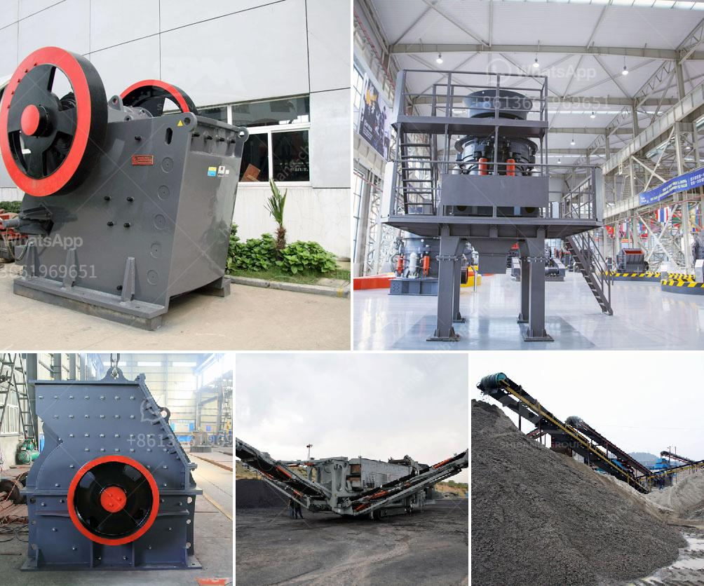

<h3>mill for gold mining operation</h3>
Gold mining has been a lucrative industry for centuries, captivating the hearts and minds of prospectors and investors alike. The process has evolved significantly over time, with advancements in technology and machinery harnessing the full potential of this precious metal. In the heart of every gold mining operation, lies the mill – a crucial component that extracts gold from its ore and transforms it into a usable state. Let's delve into the importance of mills in gold mining operations, their functions, and the advancements shaping this critical aspect of the industry.

A mill is a central facility designed to crush the extracted ore into smaller particles, which facilitates the extraction of the gold within. It is the first step in a comprehensive gold mining process, where the mined ore is subjected to various stages, including crushing, grinding, and concentrating. The mill serves as the foundation, processing the raw material for further refinement.

One of the primary functions of a gold mining mill is to crush the ore into small particles. This process breaks down the larger rocks into manageable sizes, commonly utilizing jaw crushers, impact crushers, or cone crushers. Once the ore is crushed, it undergoes grinding, either through autogenous (AG) grinding or semi-autogenous (SAG) grinding. During this stage, the ore is mixed with water or chemicals to create a slurry, which is essential for the subsequent extraction process.

Following the grinding process, the mill separates the gold-rich particles from the rest of the crushed ore. This is typically done using gravity separation techniques, where the slurry is passed through a series of concentrators, such as jigs, shaking tables, or centrifugal concentrators. Through these mechanisms, heavy gold particles are collected and separated from the lighter gangue material, ensuring efficient recovery.

Advancements in mill technology have revolutionized gold mining operations, enhancing efficiency and reducing environmental impact. The introduction of semi-autogenous grinding (SAG) mills, for example, has significantly improved the grinding process. By utilizing a mix of larger rocks and grinding media, such as steel balls, the efficiency of gold extraction has increased, lowering the need for excessive energy consumption.

Furthermore, the development of cyanide leaching has propelled the gold mining industry forward. This process involves treating the gold-rich slurry with a weak cyanide solution, enabling the extraction of gold from the ore particles. Cyanide leaching is highly efficient, allowing for the recovery of up to 98% of the gold content from the ore. However, it is crucial to employ responsible mining practices and maintain strict regulations to prevent environmental contamination.

The mill's role in gold mining operations is integral to the success of the entire operation. From crushing and grinding the ore to separating the gold particles and final extraction, the mill ensures the efficient and cost-effective recovery of this precious metal.

In conclusion, mills play a vital role in gold mining operations, serving as the beating heart of the entire process. With advancements in machinery and technology, the efficiency and sustainability of gold mining have vastly improved. As the industry continues to evolve, mills will continue to be at the forefront, unlocking the potential of precious metals and satisfying the ever-growing global demand.
<h3>Contact us</h3><ul><li><strong>Whatsapp:&nbsp;<a href="https://wa.me/8613661969651">+8613661969651</a></strong></li><li><a href="https://swt.shibang-china.com/?git&amp;zhl&amp;mill for gold mining operation"><strong>Online Service(chat now)</strong></a></li></ul><h3>Related</h3><ul><li><a href='quarry equipment for sale in south africa.md'>quarry equipment for sale in south africa</a></li><li><a href='mobile crusher machine manufacturer.md'>mobile crusher machine manufacturer</a></li><li><a href='stone crusher machine for sale tanzania.md'>stone crusher machine for sale tanzania</a></li><li><a href='small crusher malaysia.md'>small crusher malaysia</a></li><li><a href='bauxite crusher plant construction.md'>bauxite crusher plant construction</a></li></ul>