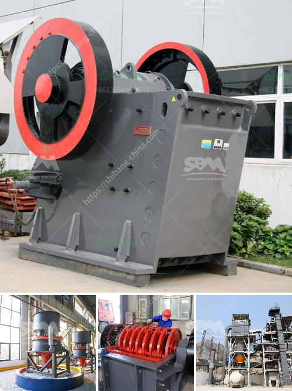

<h3>mill grinding machines for sale</h3>
Mill grinding machines are essential equipment in many industries, including manufacturing, mining, construction, and agriculture. These machines are used to crush, grind, or pulverize various materials into smaller particles, enabling them to be used in further processing or production.

One of the key advantages of mill grinding machines is their versatility. They can handle a wide range of materials, including minerals, ores, chemicals, and even food ingredients. The machine's design allows for adjustments in speed, size, and pressure, making it adaptable for different application requirements.

The primary function of a mill grinding machine is to reduce the size of a material. This is achieved by applying mechanical force through the use of grinding media such as balls, rods, or cylinders. As the material is crushed or ground, it undergoes a transformation from large particles to smaller, more manageable sizes.

There are several types of mill grinding machines available in the market. Some of the common ones include ball mills, rod mills, and hammer mills. Each type has its unique features and advantages. For example, ball mills are widely used in the mining industry due to their ability to grind materials to a very fine powder. Rod mills, on the other hand, are commonly used in manufacturing settings, where the materials need to be broken down into smaller, uniform sizes.

When purchasing a mill grinding machine, several factors need to be considered. One of the most important factors is the capacity or throughput of the machine. This refers to the amount of material the machine can process within a specified time frame. The capacity requirement will vary depending on the specific industry and application.

Another crucial factor is the power source of the machine. Mill grinding machines can be powered by electricity, diesel, or even compressed air. The choice of power source will depend on factors such as availability, cost, and environmental considerations.

Additionally, the maintenance and operating costs of the machine should be taken into account. Regular maintenance ensures optimal performance and extends the machine's lifespan. It is also important to consider the availability of spare parts and technical support when purchasing a mill grinding machine. A reputable manufacturer or distributor with an established after-sales service can help minimize downtime and ensure smooth operation.

In conclusion, mill grinding machines are essential equipment in various industries that require size reduction of materials. Their versatility, adaptability, and ability to handle a wide range of materials make them indispensable. When purchasing a mill grinding machine, factors such as capacity, power source, and maintenance should be carefully considered to ensure optimal performance and long-term value.
<h3>Contact us</h3><ul><li><strong>Whatsapp:&nbsp;<a href="https://wa.me/8613661969651">+8613661969651</a></strong></li><li><a href="https://swt.shibang-china.com/?git&amp;zhl&amp;mill grinding machines for sale"><strong>Online Service(chat now)</strong></a></li></ul><h3>Related</h3><ul><li><a href='diamants usine de lavage mobiles.md'>diamants usine de lavage mobiles</a></li><li><a href='bauxite crusher manufacturer in china mill gold.md'>bauxite crusher manufacturer in china mill gold</a></li><li><a href='stone crushing equipment price in nigeria.md'>stone crushing equipment price in nigeria</a></li><li><a href='used cement plant for sale in south africa.md'>used cement plant for sale in south africa</a></li><li><a href='best mills for barite.md'>best mills for barite</a></li></ul>