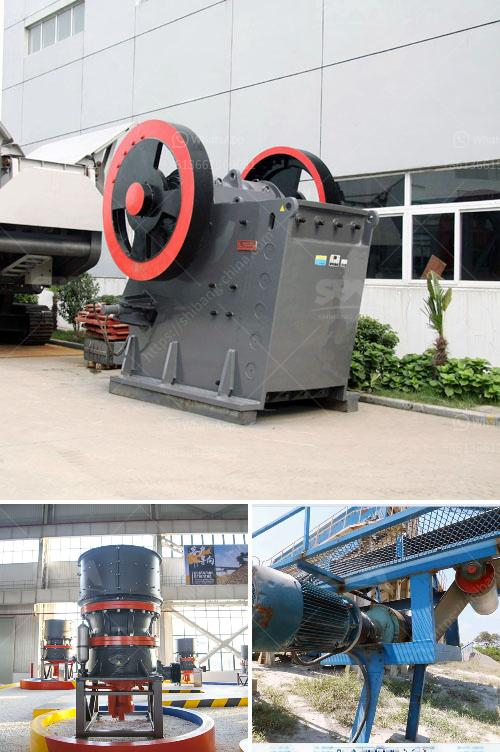

<h3>mills price of hammer mills</h3>
Hammer mills have been a staple in various industries for centuries, but their popularity has skyrocketed in recent years. These powerful machines are used to crush and grind different materials, making them essential in a wide range of applications. From crushing grains for animal feed to grinding minerals for mineral processing, hammer mills offer versatility and efficiency. However, when it comes to the pricing of these machines, several factors need to be considered.

One of the primary factors that affect the price of hammer mills is the size and capacity of the machine. Smaller mills designed for small-scale operations or home use typically have lower prices, while larger industrial-scale mills with higher capacities will come at a higher cost. The size and capacity of the hammer mill are determined by the production requirements of the user, and it is essential to choose a mill that best suits the specific needs.

Another factor that influences the price is the materials and construction of the hammer mill. Mills made from higher quality materials and with robust construction will generally have a higher price tag. These high-quality materials ensure the durability and longevity of the machine, reducing maintenance costs and ensuring reliable performance over an extended period.

The brand reputation and manufacturer also play a significant role in the pricing of hammer mills. Well-known brands with a reputation for producing high-quality machinery often come at a premium price. However, it is crucial to consider the long-term benefits of investing in a reputable brand, as they typically offer better warranties, customer support, and after-sales service.

Furthermore, additional features and customization options can also affect the price of hammer mills. Mills with advanced features such as digital controls, variable speed motors, and automated operation are generally more expensive than basic models. Customization options, such as screens with different hole sizes or specific inlet and outlet configurations, may also add to the overall cost.

In conclusion, the price of hammer mills can vary significantly depending on various factors. These include the size, capacity, materials used, brand reputation, and additional features. It is crucial for buyers to determine their specific requirements and budget constraints to select the right mill that will provide the best value for their investment. By considering these factors, individuals and businesses can find the perfect hammer mill to optimize their processes and achieve efficient and cost-effective operations.
<h3>Contact us</h3><ul><li><strong>Whatsapp:&nbsp;<a href="https://wa.me/8613661969651">+8613661969651</a></strong></li><li><a href="https://swt.shibang-china.com/?git&amp;zhl&amp;mills price of hammer mills"><strong>Online Service(chat now)</strong></a></li></ul><h3>Related</h3><ul><li><a href='part of ball mills.md'>part of ball mills</a></li><li><a href='crushing plant for aggregate india.md'>crushing plant for aggregate india</a></li><li><a href='barite beneficiation plant.md'>barite beneficiation plant</a></li><li><a href='ball mill in malaysia.md'>ball mill in malaysia</a></li><li><a href='singapore handheld concrete crusher.md'>singapore handheld concrete crusher</a></li></ul>