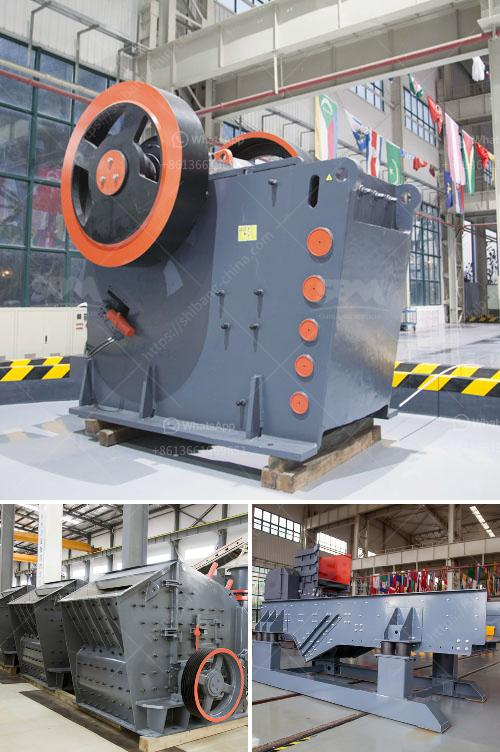

<h3>mineral cribado cantera planta trituradora</h3>
The mineral screening quarry crushing plant, also known as trituradora planta, is an essential piece of equipment for the mining industry. It offers a cost-effective way for businesses to efficiently crush and screen a variety of minerals and stones for different applications. This article will explore the importance and benefits of having a mineral screening quarry crushing plant in your mining operation.

One of the primary advantages of having a mineral screening quarry crushing plant is its ability to efficiently process minerals. The plant comes equipped with heavy-duty machinery such as crushers and screens that can break down large rocks into smaller, more manageable sizes. This process is crucial for various mining operations as it enables the extraction of valuable minerals from the initial rock mass.

Another benefit of the mineral screening quarry crushing plant is its versatility. The plant can be customized to process different types of minerals, including limestone, granite, marble, and more. This flexibility allows mining companies to meet the specific requirements of their projects and efficiently adapt to different geological conditions. Moreover, the plant can be easily transported to different locations, making it a viable option for mobile mining operations.

In addition to its ability to crush and screen minerals, the mineral screening quarry crushing plant offers several other advantages. For instance, the plant promotes environmental sustainability. It uses sophisticated technology to reduce dust and noise emissions, minimizing the plant's impact on the surrounding environment. This is particularly important in areas where mining operations must comply with strict environmental regulations.

Furthermore, the plant contributes to increased productivity and cost-efficiency. By efficiently processing minerals, the plant reduces the need for manual labor, saving time and resources. The advanced technology embedded in the plant maximizes the extraction of valuable minerals while minimizing operational costs. This ultimately leads to improved profitability for mining companies.

The plant's design is also an essential aspect to consider. It is built with durable materials and components that can withstand harsh operating conditions. This ensures longevity and reduces the need for frequent maintenance and replacement of parts. The plant is also easy to operate, with user-friendly interfaces and controls that streamline the crushing and screening process.

To sum up, the mineral screening quarry crushing plant is a valuable asset for mining companies. Its ability to efficiently process minerals, its versatility, and its contribution to environmental sustainability, productivity, and cost-efficiency make it an essential piece of equipment. Investing in a high-quality plant will undoubtedly enhance mining operations and lead to improved results.
<h3>Contact us</h3><ul><li><strong>Whatsapp:&nbsp;<a href="https://wa.me/8613661969651">+8613661969651</a></strong></li><li><a href="https://swt.shibang-china.com/?git&amp;zhl&amp;mineral cribado cantera planta trituradora"><strong>Online Service(chat now)</strong></a></li></ul><h3>Related</h3><ul><li><a href='steed conveyor belting.md'>steed conveyor belting</a></li><li><a href='stone quarry business proposal.md'>stone quarry business proposal</a></li><li><a href='crushed sand manufacturing.md'>crushed sand manufacturing</a></li><li><a href='crushed stone plant peru.md'>crushed stone plant peru</a></li><li><a href='crushing aggregates companies in philippines.md'>crushing aggregates companies in philippines</a></li></ul>