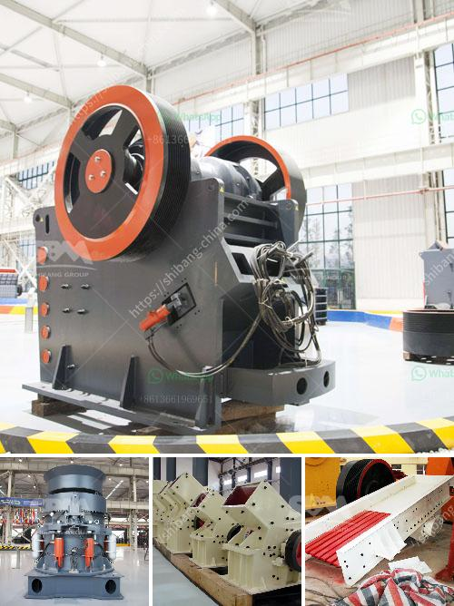

<h3>mineral grinding corporation</h3>
Mineral Grinding Corporation (MGC) is a renowned manufacturing company that specializes in the production of various types of industrial minerals. With a strong presence in the international market, MGC has been providing top-notch quality minerals to a wide range of industries for over four decades.

Established in 1976, MGC has consistently strived to fulfill the diverse requirements of its valued customers. The company's state-of-the-art manufacturing facility is equipped with advanced machinery and technology, ensuring the production of high-grade minerals that meet strict quality standards.

One of MGC's key strengths lies in its vast portfolio of industrial minerals. The company offers a wide range of products, including talc, clay, calcium carbonate, dolomite, barytes, quartz, and silica. These minerals find applications in industries such as ceramics, paint, paper, plastics, rubber, pharmaceuticals, cosmetics, and agriculture.

Each mineral produced by MGC undergoes a stringent quality control process to ensure its purity, chemical composition, and physical properties. The company follows international guidelines and industry standards to guarantee the highest quality products. MGC's commitment to quality has earned the trust and loyalty of its customers worldwide.

Apart from its excellent product quality, MGC also offers exceptional customer service. The company's experienced team of professionals works closely with customers to understand their specific requirements and provide tailored solutions. MGC's customer-centric approach, coupled with its extensive product knowledge, has solidified its position as a preferred supplier in the minerals industry.

Moreover, MGC places great importance on sustainable practices and environmental responsibility. The company's manufacturing processes adhere to strict environmental regulations, ensuring minimal impact on the environment. MGC is committed to reducing its carbon footprint and actively seeks innovative ways to optimize resource utilization and minimize waste generation.

In addition to its commitment to quality and sustainability, MGC also prioritizes research and development. The company continuously invests in exploring innovative techniques and technologies to improve its manufacturing processes and develop new products. MGC's focus on innovation has helped it maintain a competitive edge in the dynamic minerals industry.

MGC's success can also be attributed to its strong global presence. The company has a strong distribution network spanning across various continents, enabling it to serve customers worldwide efficiently. Through its strategic alliances and partnerships, MGC has successfully established itself as a reliable supplier on the global stage.

Looking ahead, Mineral Grinding Corporation is poised for further growth and expansion. The company aims to tap into new markets, expand its product range, and strengthen its customer relationships. MGC plans to leverage technological advancements and digital platforms to enhance its operations and deliver greater value to its customers.

In conclusion, Mineral Grinding Corporation stands out as a leading manufacturer and supplier of industrial minerals. Its commitment to quality, sustainability, customer satisfaction, and innovation has earned the company its reputable position in the global minerals industry. With a strong emphasis on continuous improvement and a customer-centric approach, MGC is determined to lead the way in providing high-quality minerals for diverse industries worldwide.
<h3>Contact us</h3><ul><li><strong>Whatsapp:&nbsp;<a href="https://wa.me/8613661969651">+8613661969651</a></strong></li><li><a href="https://swt.shibang-china.com/?git&amp;zhl&amp;mineral grinding corporation"><strong>Online Service(chat now)</strong></a></li></ul><h3>Related</h3><ul><li><a href='gold stamp mills in zimbabwe.md'>gold stamp mills in zimbabwe</a></li><li><a href='calcium carbonate powder mill price.md'>calcium carbonate powder mill price</a></li><li><a href='super fine powder grinder.md'>super fine powder grinder</a></li><li><a href='quartz grinding machines.md'>quartz grinding machines</a></li><li><a href='crusher equipment manufacturer.md'>crusher equipment manufacturer</a></li></ul>