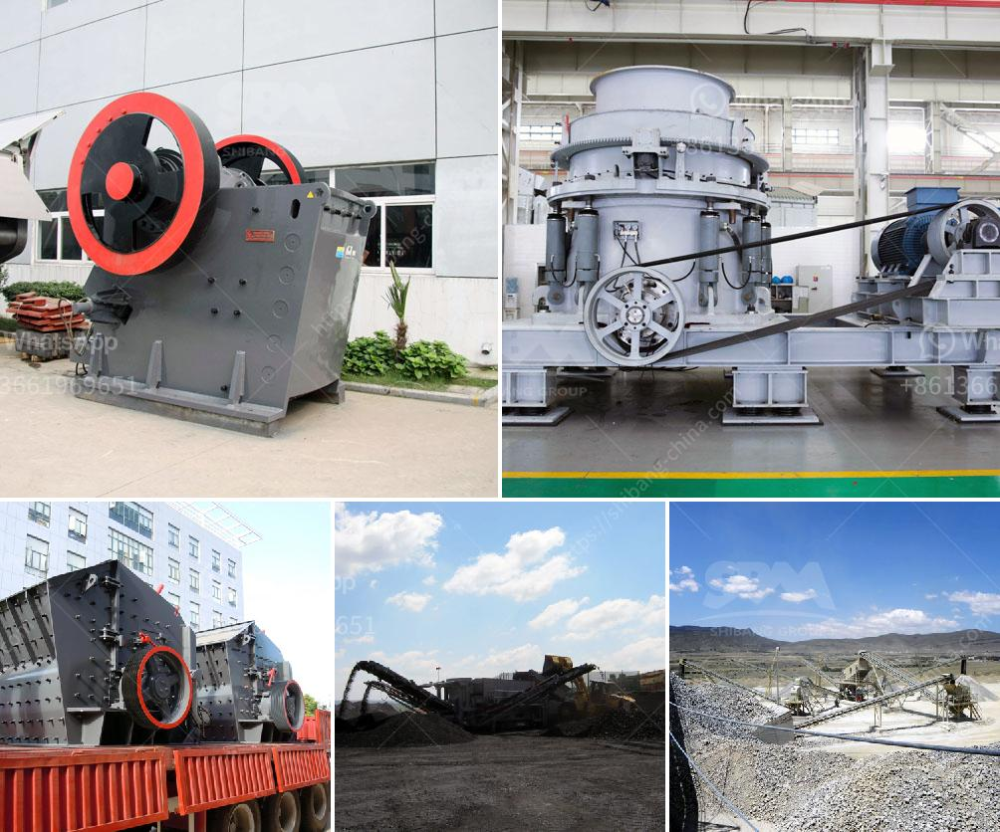

<h3>mini cement plant tons per day</h3>
A mini cement plant refers to a small-scale cement manufacturing facility that produces clinker, cement, and other related materials on a smaller scale. Typically, a mini cement plant can produce around 20 tons of cement per day, depending on the capacity and quality of raw materials used.

The increasing demand for cement in the construction industry has propelled the growth of mini cement plants. These plants are not only cost-effective but also provide employment in remote areas. They play a crucial role in meeting the local construction needs, especially in developing countries.

One of the key advantages of a mini cement plant is its small-sized structure, which makes it suitable for smaller construction projects or areas with limited space. It can be set up in rural areas, where the transportation cost of cement from larger manufacturing plants is high. This not only reduces the cost of transportation but also reduces the carbon footprint associated with long-distance transportation.

Another advantage of mini cement plants is their versatility in using different raw materials. These plants can use limestone, clay, iron ore, and other materials available locally. This reduces the dependency on imported raw materials, thereby contributing to the local economy.

Mini cement plants are also known for their low energy consumption. The technology used in these plants has evolved over the years, resulting in energy-efficient processes and reduced carbon emissions. This aligns with the global goals of sustainable development and environmental protection.

Additionally, mini cement plants have a shorter gestation period compared to larger cement manufacturing facilities. They can be set up relatively quickly, enabling a faster response to market demand. This flexibility is particularly beneficial in an ever-changing construction industry, where quick adaptation to market dynamics is essential.

Furthermore, the operation and maintenance of mini cement plants require minimal technical expertise. The simplicity of the processes involved makes it easier for small entrepreneurs to enter the cement manufacturing industry. This promotes entrepreneurship and economic growth by creating job opportunities and encouraging investment in local communities.

In conclusion, mini cement plants with a capacity of producing 20 tons of cement per day have emerged as a viable option for meeting the construction needs of local communities. Their small size, versatility in raw material usage, low energy consumption, and ease of operation and maintenance make them an attractive proposition. They contribute to creating sustainable development, reducing carbon emissions, and providing local employment opportunities. As the demand for cement continues to grow, mini cement plants are poised to play a significant role in the cement manufacturing landscape.
<h3>Contact us</h3><ul><li><strong>Whatsapp:&nbsp;<a href="https://wa.me/8613661969651">+8613661969651</a></strong></li><li><a href="https://swt.shibang-china.com/?git&amp;zhl&amp;mini cement plant tons per day"><strong>Online Service(chat now)</strong></a></li></ul><h3>Related</h3><ul><li><a href='calcium carbonate for ball mill.md'>calcium carbonate for ball mill</a></li><li><a href='crush rock industries nigeria.md'>crush rock industries nigeria</a></li><li><a href='calcium carbonate manufacturing machinery.md'>calcium carbonate manufacturing machinery</a></li><li><a href='crusher plant in construction.md'>crusher plant in construction</a></li><li><a href='used cement mills for sale in india.md'>used cement mills for sale in india</a></li></ul>