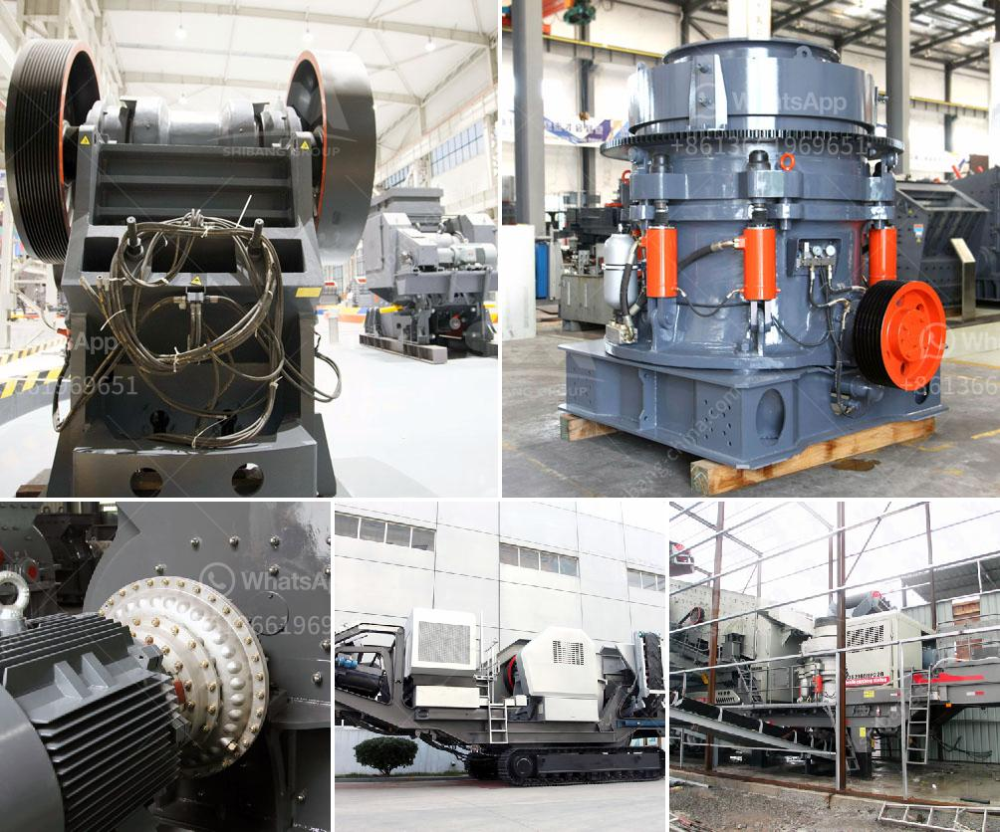

<h3>mini copper ore extraction plant</h3>
The extraction of copper ore is a vital process that fuels the global economy. However, large-scale mining operations often come with significant environmental and social impacts. In recent years, there has been a growing interest in developing smaller, more sustainable mining practices that minimize these adverse effects. One such solution is the establishment of mini copper ore extraction plants.

A mini copper ore extraction plant is a small-scale mining operation that utilizes underground mining methods to extract copper ore. This type of mining is considered less harmful to the environment and safer for miners compared to open-pit or large-scale mining operations. It also has the potential to provide significant socio-economic benefits to local communities.

One of the main advantages of a mini copper ore extraction plant is its smaller ecological footprint. Unlike large-scale mining operations that require extensive land clearance, mini plants can operate within a smaller area. This reduces deforestation and habitat destruction, helping to preserve biodiversity in the region. Additionally, the use of underground mining methods minimizes the disturbance to the surface landscape, further reducing the environmental impact.

Not only is a mini copper ore extraction plant better for the environment, but it also offers numerous benefits to the local community. Firstly, it creates job opportunities for local residents, contributing to poverty reduction and sustainable development. These jobs can range from mining and extraction roles to support services like logistics, maintenance, and administration.

Moreover, mini plants can foster the growth of local businesses and suppliers. They often require inputs, such as equipment, machinery, and consumables, which can be sourced locally. This boosts the local economy by creating a demand that local businesses can cater to, spurring economic development in the region.

Furthermore, a mini copper ore extraction plant can promote social well-being and improved standards of living. By providing stable employment opportunities, it reduces dependency on subsistence agriculture or informal activities. Workers can earn a steady income, enabling them to access better healthcare, education, and housing for themselves and their families.

Another advantage of mini plants is the potential for community involvement and stakeholder engagement. Since these operations are smaller in scale, it is easier for local communities to have a voice in decision-making processes. This builds stronger relationships between the mining company and the community, leading to more sustainable practices and better social outcomes.

It is important to note that the implementation of a mini copper ore extraction plant should be accompanied by responsible mining practices. This includes adhering to strict environmental regulations, mitigating negative impacts on air and water quality, and ensuring the safe disposal of mining waste.

In conclusion, the establishment of mini copper ore extraction plants offers a sustainable solution with numerous benefits. These smaller-scale operations reduce environmental degradation, provide local employment opportunities, support local businesses, and contribute to the overall social and economic development of communities. By adopting responsible mining practices, the mining industry can effectively extract copper ore while minimizing adverse effects on the environment and ensuring the well-being of local communities.
<h3>Contact us</h3><ul><li><strong>Whatsapp:&nbsp;<a href="https://wa.me/8613661969651">+8613661969651</a></strong></li><li><a href="https://swt.shibang-china.com/?git&amp;zhl&amp;mini copper ore extraction plant"><strong>Online Service(chat now)</strong></a></li></ul><h3>Related</h3><ul><li><a href='slag grinding problems.md'>slag grinding problems</a></li><li><a href='used crushing quarry plant in south africa.md'>used crushing quarry plant in south africa</a></li><li><a href='ball mill zenit crusher china.md'>ball mill zenit crusher china</a></li><li><a href='limestone washing and classifi ion.md'>limestone washing and classifi ion</a></li><li><a href='manufacturer of ultrafine machine india.md'>manufacturer of ultrafine machine india</a></li></ul>