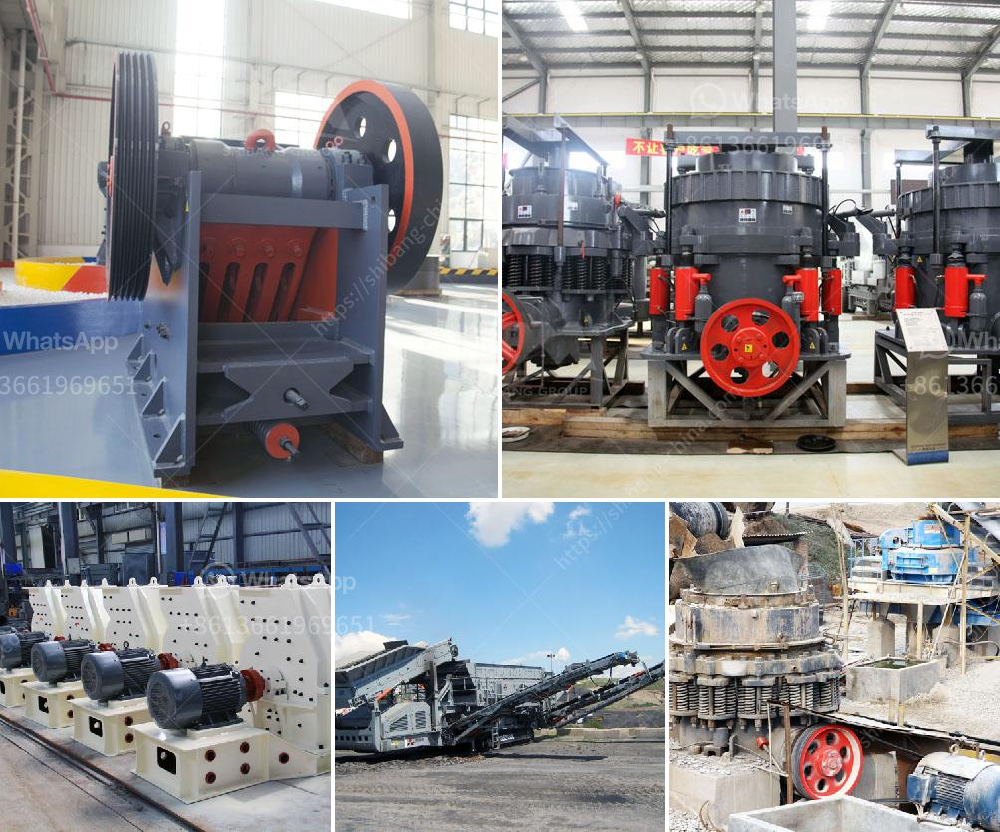

<h3>mini crusher for sale</h3>
Are you in need of a reliable and efficient crushing solution for your small-scale construction or demolition projects? Look no further than the mini crusher for sale, a portable and compact machine designed to deliver high performance crushing capabilities in tight spaces.

The mini crusher, also known as a small jaw crusher or portable jaw crusher, is widely used in various industries, such as construction, mining, metallurgy, and water conservancy. Users can quickly crush stones and boulders to different sizes, making them suitable for diversified needs.

One of the key advantages of the mini crusher is its small size. With dimensions ranging from just a few meters long to half the size of a standard shipping container, this compact machine can easily access narrow or restricted job sites. Whether navigating confined urban areas or maneuvering through rugged terrains, the mini crusher provides unparalleled accessibility and mobility.

Despite its small size, the mini crusher boasts exceptional performance. Equipped with a powerful diesel engine or electric motor, it efficiently reduces large rocks into aggregate materials. The mini crusher features a jaw opening of around 400mm x 170mm, allowing it to handle various materials with ease.

The versatility of the mini crusher further adds to its value. It can crush different types of materials, including concrete, bricks, asphalt, natural stones, and more. This makes it ideal for recycling applications or small-scale construction projects where different materials need to be crushed on-site.

Additionally, the mini crusher offers ease of operation and low maintenance requirements. Its user-friendly controls and simple design make it suitable for operators of all skill levels, while its robust construction ensures durability and longevity, even in demanding working conditions.

If you are looking to improve productivity, efficiency, and cost-effectiveness on your job site, investing in a mini crusher for sale is a smart choice. Its compact size, excellent performance, versatility, and ease of use make it a valuable asset for any construction or demolition project. Don't let the size fool you – this small machine packs a powerful punch!
<h3>Contact us</h3><ul><li><strong>Whatsapp:&nbsp;<a href="https://wa.me/8613661969651">+8613661969651</a></strong></li><li><a href="https://swt.shibang-china.com/?git&amp;zhl&amp;mini crusher for sale"><strong>Online Service(chat now)</strong></a></li></ul><h3>Related</h3><ul><li><a href='japan crusher equipment.md'>japan crusher equipment</a></li><li><a href='portable limestone jaw crusher for hire in south africa.md'>portable limestone jaw crusher for hire in south africa</a></li><li><a href='mobile crusher supplier.md'>mobile crusher supplier</a></li><li><a href='500 ton hour coal crusher and screen.md'>500 ton hour coal crusher and screen</a></li><li><a href='gold refining equipment machine plant.md'>gold refining equipment machine plant</a></li></ul>