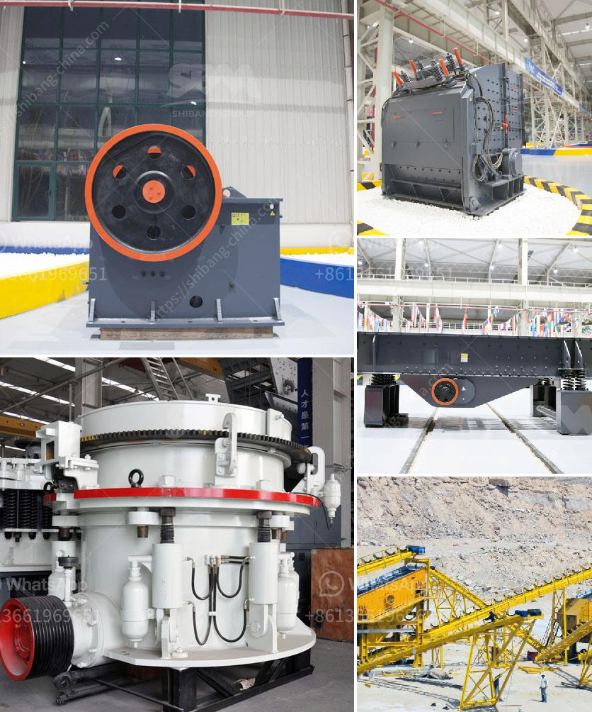

<h3>mini stone crushers for small scale mining</h3>
Many people understand the significance of extracting valuable minerals or other geological materials from the earth in order to contribute to the economic growth and development of a region. However, mining operations are not always large-scale projects. In fact, many mining activities are carried out by individuals or small groups of miners who operate in remote areas with limited resources.

For such small-scale mining operations, mini stone crushers are ideal. They are designed and manufactured to reduce the size of stones and rocks with lesser effort and low cost. These machines are usually powered by electricity and are often automated, reducing the need for manual labor.

The mini stone crusher is widely used in mining, building materials, chemical industry, metallurgy, and so on. It is suitable for primary and secondary crushing of all kinds of minerals and rocks with compressive strength less than 320 MPa.

2. High-quality end product: The crusher machine is equipped with a vibrating screen, which enables the end products to be sorted based on their size. Additionally, the mini stone crusher machine has a simple structure and is easy to operate.

3. Easy maintenance: A single machine saves energy by 15%-30% and the system saves energy by over 40%, allowing for easy maintenance.

4. Long service life: The machine is made with high-quality steel to ensure its stability and durability.

Mini stone crushers have been widely used in many sectors, such as mining, construction, metallurgy, chemistry, and more. To adapt to the demands of the market, a variety of mini stone crushers have been designed. Some of the most common types of mini stone crushers include jaw crushers, impact crushers, and cone crushers.

The jaw crusher is widely used in mining, building materials, chemical industry, metallurgy, and so on. It is suitable for primary and secondary crushing all kinds of minerals and rocks with compressive strength less than 320 MPa. In jaw crushers, the movement of the jaw can be quite small, since complete crushing is not performed in one stroke.

Impact crushers involve the use of impact rather than pressure to crush material. The material is contained within a cage, with an opening on the bottom, end, or side of the desired size to allow pulverized material to escape. This type of crusher is usually used for soft and non-abrasive materials.

A cone crusher is similar in operation to a gyratory crusher, with less steepness in the crushing chamber and more of a parallel zone between crushing zones. The cone crusher breaks rocks by squeezing the rock between an eccentrically gyrating spindle, which is covered by a wear-resistant mantle, and the enclosing concave hopper, covered by a manganese concave or a bowl liner.

In conclusion, mini stone crushers for small scale mining project play a significant role for the development of local economies by offering an efficient tool for the extraction of minerals. They are ideal for both onsite crushing and demolition jobs, as well as road repair and construction. The hardworking individuals or small groups of miners can now access better equipment that reduces the need for manual labor and delivers high-quality end products. Investing in a mini stone crusher can help improve mining activities and boost production efficiency.
<h3>Contact us</h3><ul><li><strong>Whatsapp:&nbsp;<a href="https://wa.me/8613661969651">+8613661969651</a></strong></li><li><a href="https://swt.shibang-china.com/?git&amp;zhl&amp;mini stone crushers for small scale mining"><strong>Online Service(chat now)</strong></a></li></ul><h3>Related</h3><ul><li><a href='ball mill prices and for sale ghana.md'>ball mill prices and for sale ghana</a></li><li><a href='china jaw crusher pe 150 250 in philippines.md'>china jaw crusher pe 150 250 in philippines</a></li><li><a href='stone crushet 10 tons.md'>stone crushet 10 tons</a></li><li><a href='marble crusher in china.md'>marble crusher in china</a></li><li><a href='small cement grinding plant.md'>small cement grinding plant</a></li></ul>