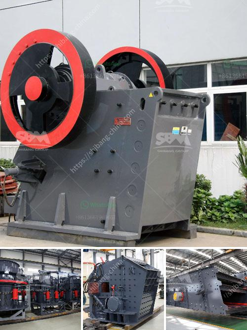

<h3>mining equipment for hire zimbabwe</h3>
Affordable and reliable mining equipment for hire is a key ingredient in the success of any mining operation. In Zimbabwe, mining equipment plays a vital role in the mining industry. Zimbabwe is renowned for its abundant mineral resources, mainly including gold, nickel, copper, chromium, and coal. Therefore, mining plays a significant role in the Zimbabwean economy. 

However, not all mining companies in Zimbabwe have the financial capacity to purchase their own mining equipment due to the high costs involved. That's where mining equipment for hire comes into play. Numerous mining equipment hire companies in Zimbabwe offer a variety of mining equipment, ranging from excavators and crushers to concentrators and beyond.

One major advantage of mining equipment for hire in Zimbabwe is its flexibility. With a variety of equipment available, companies can adjust their mining operations based on the specific needs of each project. For example, if a mining company needs to increase production capacity temporarily for a specific project, they can easily hire additional mining equipment for that period. Once the project is completed, they can return the equipment without worrying about long-term financial commitments.

Mining equipment for hire in Zimbabwe also offers cost-saving benefits. Rather than investing capital to purchase expensive equipment, mining companies can simply hire the necessary equipment when needed. This eliminates the need for costly maintenance, repairs, and storage facilities. Instead, the mining equipment rental company takes care of these responsibilities, allowing organizations to focus on their core mining activities.

Furthermore, by hiring mining equipment, companies can access the latest technologies in the industry without incurring significant expenses. Mining equipment hire companies in Zimbabwe regularly update their inventory, ensuring that their clients have access to state-of-the-art equipment. This enables mining companies to improve their operational efficiencies, enhance productivity, and maximize their output.

Importantly, mining equipment for hire in Zimbabwe also comes with skilled operators. Mining equipment rental companies employ experienced and well-trained operators who are familiar with the industry's best practices. These operators are equipped with the expertise to operate the equipment efficiently, reducing the risk of accidents and enhancing overall productivity.

To maximize the benefits of mining equipment for hire in Zimbabwe, mining companies need to approach reputable rental companies. It's essential to conduct thorough research and choose a company that has a proven track record, reliable equipment, and competitive rental rates. The rental company should also provide adequate support and maintenance services to ensure smooth operations.

In conclusion, mining equipment for hire plays a crucial role in the success of mining operations in Zimbabwe. It offers flexibility, cost savings, access to the latest technologies, and skilled operators. By opting for mining equipment rental, mining companies can focus on their core activities, adapt to changing project requirements, and improve their overall productivity.
<h3>Contact us</h3><ul><li><strong>Whatsapp:&nbsp;<a href="https://wa.me/8613661969651">+8613661969651</a></strong></li><li><a href="https://swt.shibang-china.com/?git&amp;zhl&amp;mining equipment for hire zimbabwe"><strong>Online Service(chat now)</strong></a></li></ul><h3>Related</h3><ul><li><a href='conveyor belt laying procedure.md'>conveyor belt laying procedure</a></li><li><a href='ball mill for grinding metal.md'>ball mill for grinding metal</a></li><li><a href='used crushing quarry plant in south africa.md'>used crushing quarry plant in south africa</a></li><li><a href='kenya electrical jaw crusher 32 x 58.md'>kenya electrical jaw crusher 32 x 58</a></li><li><a href='equipment required for alluvial gold mining.md'>equipment required for alluvial gold mining</a></li></ul>