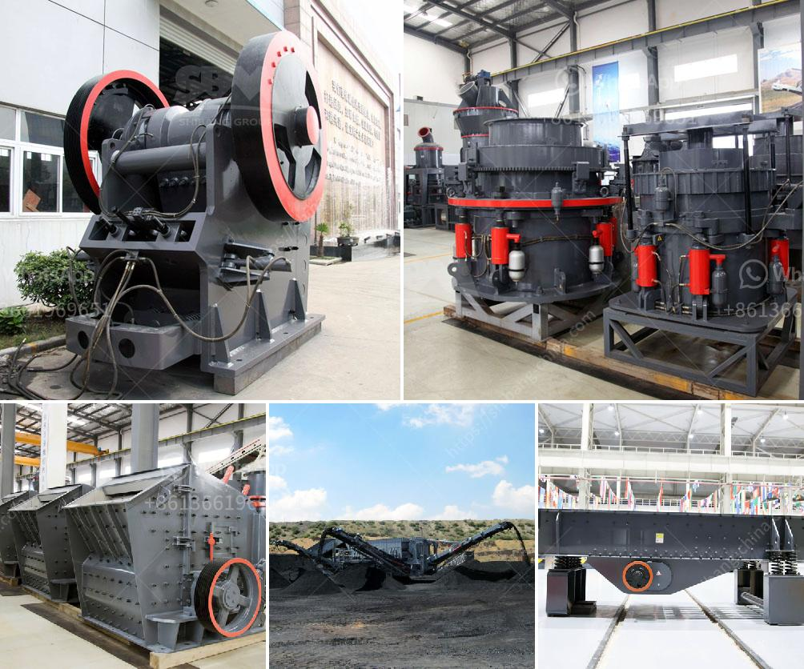

<h3>mining equipment for sale harare zimbabwe</h3>
Zimbabwe is a landlocked country in southern Africa that has been blessed with an abundance of mineral resources. For decades, mining has been a significant contributor to the country's economy, serving as a pillar of growth and job creation. Consequently, the need for mining equipment has surged, leading to a burgeoning market for mining equipment for sale in Harare, Zimbabwe.

When it comes to mining equipment, Harare has established itself as a hub for both local and international manufacturers and suppliers. Various types of mining equipment can be found for sale in the city, catering to the diverse needs of miners in the region. These equipment ranges from basic tools to state-of-the-art machinery, designed to extract, process, and transport minerals efficiently.

One of the most common types of mining equipment for sale in Harare is heavy machinery. These robust machines are designed to handle the demanding conditions of mining operations, such as excavating and transporting large quantities of soil and rocks. Examples include bulldozers, excavators, and dump trucks, which are essential for moving earth and minerals to processing sites. Additionally, drilling equipment, both manual and mechanized, is crucial for exploration and extraction processes.

Apart from heavy machinery, there is an array of specialized equipment available in Harare that caters to specific mining needs. This includes crushers, flotation machines, magnetic separators, and centrifugal concentrators, which aid in the processing and extraction of minerals. Moreover, personal protective equipment (PPE) plays a vital role in ensuring miners' safety and is readily available for purchase in the market.

For those seeking mining equipment in Harare, several factors should be considered. Firstly, it is essential to identify reputable suppliers with a proven track record of providing high-quality equipment. Engaging with trusted dealers helps ensure the reliability and durability of the equipment purchased. Moreover, it is crucial to assess the compatibility of the equipment with the specific mining requirements to optimize efficiency and maximize output.

Furthermore, buyers should consider after-sales support and warranties offered by the suppliers. Timely maintenance and repairs are imperative for mining equipment, as they undergo harsh operating conditions. Adequate training and technical support should also be provided to the mining personnel to operate the equipment safely and effectively.

In conclusion, the market for mining equipment for sale in Harare, Zimbabwe is thriving due to the country's rich mineral resources. As the demand for mining continues to grow, suitable equipment becomes indispensable for efficient and productive operations. By considering factors such as supplier reputation, equipment compatibility, and after-sales support, miners can make informed decisions and acquire the necessary tools and machinery to fuel their operations' success.
<h3>Contact us</h3><ul><li><strong>Whatsapp:&nbsp;<a href="https://wa.me/8613661969651">+8613661969651</a></strong></li><li><a href="https://swt.shibang-china.com/?git&amp;zhl&amp;mining equipment for sale harare zimbabwe"><strong>Online Service(chat now)</strong></a></li></ul><h3>Related</h3><ul><li><a href='best mill for wet grinding of calcium carbonate.md'>best mill for wet grinding of calcium carbonate</a></li><li><a href='5hp industrial crusher mill.md'>5hp industrial crusher mill</a></li><li><a href='cheap stone crushing plant.md'>cheap stone crushing plant</a></li><li><a href='auto cad ball mill.md'>auto cad ball mill</a></li><li><a href='prices of stone crusher.md'>prices of stone crusher</a></li></ul>