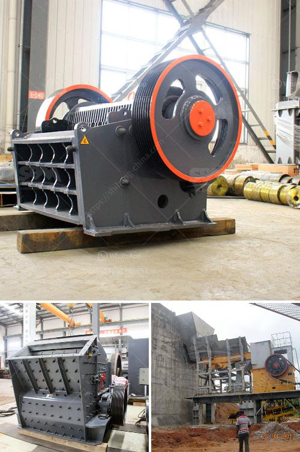

<h3>mining equipment for sale</h3>
Mining is an integral part of many industries, ranging from construction to precious metals extraction. As the demand for natural resources continues to grow, so does the need for efficient mining equipment. Whether you are an established mining company or an aspiring entrepreneur looking to enter the industry, investing in quality mining equipment is crucial for success. In this article, we will discuss the importance of choosing the right mining equipment for sale and provide some tips on making wise investments.

One of the first considerations when purchasing mining equipment is the type of mining operation you are involved in. Different types of mining, such as surface mining or underground mining, require specific equipment to ensure optimal productivity and safety. Before making a purchase, evaluate your mining needs and research the equipment suitable for your operation.

Once you have identified the type of mining equipment you require, it is essential to source from reputable sellers. Many companies specialize in mining equipment for sale, offering a wide range of options to meet various needs. When choosing a seller, look for a company with a proven track record, positive customer reviews, and a comprehensive warranty policy. This will ensure that you are purchasing equipment that is reliable, durable, and backed by solid customer support.

Consider the specific features and specifications of the mining equipment you are purchasing. Different mining equipment brands offer various features, such as increased power, improved fuel efficiency, or advanced safety features. Assess your specific requirements and compare different equipment models to find the one that best suits your needs. Don't hesitate to consult with experts or experienced mining operators for guidance in selecting the right equipment.

Ensure that any mining equipment you purchase is compliant with industry regulations and safety standards. Mining operations can be hazardous, and it is vital to prioritize the safety of your workers. Look for equipment that meets or exceeds safety standards set by regulatory authorities. Additionally, consider equipment that incorporates advanced safety features such as automatic shut-off systems, emergency stop buttons, or specialized safety training programs.

Investing in mining equipment is a substantial financial commitment. Therefore, it is essential to assess the return on investment (ROI) potential of the equipment you are considering. Evaluate factors such as the expected lifespan of the equipment, its maintenance requirements, and potential resale value. Additionally, consider the productivity gains and cost savings the equipment can provide. A comprehensive cost-benefit analysis will help you determine the long-term value of your investment.

Lastly, remember that mining equipment requires regular maintenance to ensure its optimal performance and longevity. Before making a purchase, inquire about the availability of spare parts, maintenance services, and technical support from the seller. This will help you minimize downtime and maximize the lifespan of your equipment.

In conclusion, choosing the right mining equipment for sale is crucial for the success and profitability of any mining operation. Thoroughly assess your needs, research reputable sellers, consider safety standards, evaluate ROI potential, and understand maintenance requirements. By following these guidelines, you can make informed decisions and acquire equipment that will contribute to the growth and efficiency of your mining business.
<h3>Contact us</h3><ul><li><strong>Whatsapp:&nbsp;<a href="https://wa.me/8613661969651">+8613661969651</a></strong></li><li><a href="https://swt.shibang-china.com/?git&amp;zhl&amp;mining equipment for sale"><strong>Online Service(chat now)</strong></a></li></ul><h3>Related</h3><ul><li><a href='conveyor belts company.md'>conveyor belts company</a></li><li><a href='cs cone crusher.md'>cs cone crusher</a></li><li><a href='quarry business cost in india.md'>quarry business cost in india</a></li><li><a href='cost of an industrial mill.md'>cost of an industrial mill</a></li><li><a href='lime making machine.md'>lime making machine</a></li></ul>