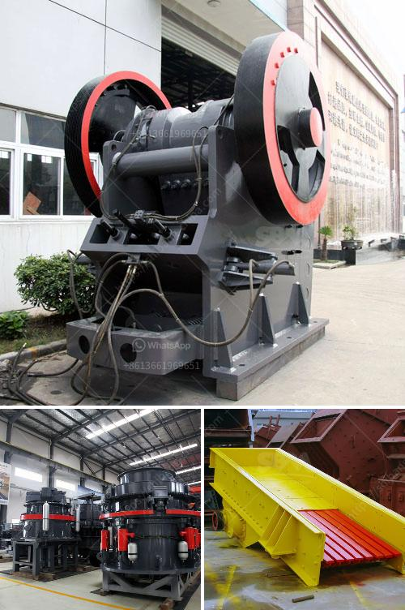

<h3>mining equipment tanzania</h3>
Artisanal and small-scale mining (ASM) plays a crucial role in Tanzania's economy. With an estimated one million people directly employed in ASM, Tanzania is one of the countries with the largest ASM sector in Africa. However, an absence of appropriate mining equipment and machinery is slowing down the progress of this sector.

ASM is largely informal and unregulated, with miners often using makeshift tools and equipment. This not only leads to low productivity but also poses numerous safety risks for the miners, jeopardizing their health and wellbeing. To overcome these challenges, there is a need to introduce high-quality mining equipment specifically designed for ASMs.

Investing in modern and efficient mining equipment can significantly improve productivity and safety standards in the ASM sector. Specialized machinery, such as excavators, bulldozers, and crushers, can enhance the extraction process and increase the yield of precious minerals, including gold, diamonds, and gemstones. Additionally, well-maintained equipment reduces the likelihood of accidents, making mining a safer profession.

The Tanzanian government, along with international organizations and mining companies, must join forces to address the lack of appropriate mining equipment. Providing access to affordable financing options for ASMs to invest in such machinery is a crucial step. Moreover, training programs should be conducted to ensure proper utilization and maintenance of the equipment.

In recent years, there have been positive efforts from both local and international players to support the ASM sector and provide better mining equipment in Tanzania. For instance, the World Bank has launched initiatives to enhance the quality of equipment used by foreign investors in ASM operations. Companies specializing in mining equipment have also started offering tailor-made solutions for the specific needs of ASMs.

The introduction of advanced mining equipment can accelerate the growth of the ASM sector in Tanzania, boosting the country's economic development. It can create job opportunities, improve livelihoods, and reduce poverty among mining communities. Moreover, a well-regulated ASM sector can contribute significantly to sustainable development, ensuring that the benefits derived from mineral resources are distributed equitably.

In conclusion, addressing the lack of appropriate mining equipment in Tanzania is of utmost importance to unleash the potential of ASM in the country. By investing in modern machinery, improving safety standards, and providing adequate training and financing options, Tanzania can foster a sustainable and inclusive mining sector that supports artisans and small-scale miners.
<h3>Contact us</h3><ul><li><strong>Whatsapp:&nbsp;<a href="https://wa.me/8613661969651">+8613661969651</a></strong></li><li><a href="https://swt.shibang-china.com/?git&amp;zhl&amp;mining equipment tanzania"><strong>Online Service(chat now)</strong></a></li></ul><h3>Related</h3><ul><li><a href='used mobile crusher in nigeria.md'>used mobile crusher in nigeria</a></li><li><a href='jaw crusher baxter.md'>jaw crusher baxter</a></li><li><a href='hydrated lime powder making machine from germany.md'>hydrated lime powder making machine from germany</a></li><li><a href='mobile crushing price uk.md'>mobile crushing price uk</a></li><li><a href='roller mill for mantles.md'>roller mill for mantles</a></li></ul>