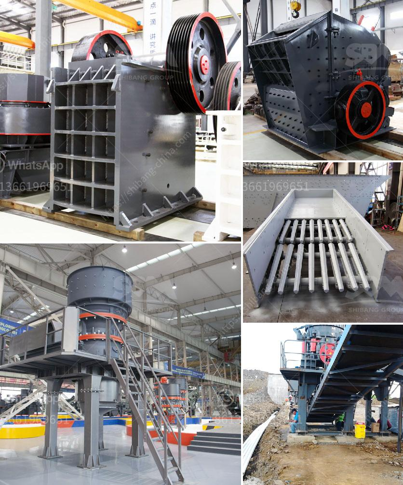

<h3>mining equipment used during gold rush</h3>
During the famous Gold Rush in the mid-1800s, miners flocked to California in search of their fortunes. These determined individuals utilized a variety of specialized tools and equipment to extract gold from the land, leading to the birth of a booming industry. Let’s explore some of the mining equipment that played a crucial role during this historical period.

One of the most well-known tools used by gold miners during the Gold Rush was the gold pan. This simple instrument allowed miners to sift through sediment and uncover any gold nuggets or flakes. The pan was often made of metal or wood, with shallow sides and a wide base. Miners would submerge the pan in a body of water, often a river or stream, and gently shake it back and forth to separate the heavy gold particles from the lighter sediment.

Another essential tool used in gold mining was the sluice box. This wooden long and narrow contraption consisted of riffles or obstructions on the bottom to catch the heavier gold, while allowing the lighter sediments to wash away. Miners would pour water into the sluice box, creating a current that carried sediment and gold particles. By carefully shaking the sluice box or allowing water to flow through it, miners could recover more gold than with a simple gold pan.

As gold deposits became deeper and harder to reach, miners turned to more complex equipment, such as the rocker box and the gold dredge. A rocker box, also known as a cradle, was a wooden contraption that mimicked the rocking motion of a cradle to separate gold from gravel and soil. The gold dredge, on the other hand, was a floating machine that completely revolutionized gold mining. It dug up vast amounts of gold-bearing material through the use of a suction mechanism and a long tube with a sluice box attached. This allowed miners to extract gold from riverbeds and other underwater locations with incredible efficiency.

The mining equipment used during the Gold Rush played a crucial role in mining operations, allowing miners to recover more gold in less time. From simple tools like the gold pan to more complex machinery like the rocker box and gold dredge, each piece of equipment contributed to the extraction of this precious metal. Today, these tools serve as a testament to the perseverance and ingenuity of those who took part in the fascinating period that was the California Gold Rush.
<h3>Contact us</h3><ul><li><strong>Whatsapp:&nbsp;<a href="https://wa.me/8613661969651">+8613661969651</a></strong></li><li><a href="https://swt.shibang-china.com/?git&amp;zhl&amp;mining equipment used during gold rush"><strong>Online Service(chat now)</strong></a></li></ul><h3>Related</h3><ul><li><a href='cost to setup cement plant industry.md'>cost to setup cement plant industry</a></li><li><a href='dolomite crusher manufacturing plant.md'>dolomite crusher manufacturing plant</a></li><li><a href='crusher machine for sale in ethiopia.md'>crusher machine for sale in ethiopia</a></li><li><a href='how much is jaw crusher.md'>how much is jaw crusher</a></li><li><a href='automatic rolling mill manufacturer liberia.md'>automatic rolling mill manufacturer liberia</a></li></ul>