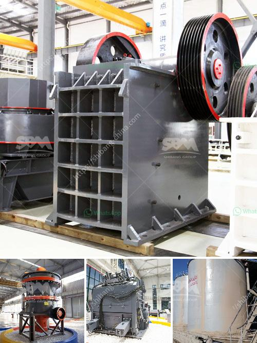

<h3>mining jaw crusher pe</h3>
The mining industry relies heavily on jaw crushers to break down large rocks into manageable sizes for further processing. These machines are popular because of their durability, efficiency, and versatility. Among the various jaw crushers in the market, the PE series jaw crusher is widely used for crushing materials of various hardnesses such as rocks, ores, and minerals. In this article, we will explore the key features of the PE jaw crusher and its applications in the mining industry.

The PE jaw crusher is a primary piece of equipment used in quarry production lines, ore crushing plants, and powder production lines. It employs a compressive force to crush materials to a size that is suitable for subsequent processing. Jaw crushers can be used in mining, metallurgical industry, construction, road and railway building, water conservancy, chemistry, etc.

One of the key features of the PE jaw crusher is its ability to crush large rocks with a compressive strength of up to 320MPa. This high level of compression ensures that the rocks are sufficiently broken down to pass through the narrow opening at the bottom of the crusher chamber. The large feed opening of the jaw crusher also enhances its processing capacity, allowing it to handle large quantities of material efficiently.

Another advantage of the PE jaw crusher is its simple structure, which makes maintenance and operation convenient. The jaw crusher consists of a fixed jaw plate and a movable jaw plate. When the motor drives the V-belt and the grooved wheel, the movable jaw reciprocates, thereby crushing the materials against the fixed jaw plate. This simple mechanism not only reduces the downtime for maintenance and repair but also minimizes the risk of mechanical failure during operation.

Additionally, the PE jaw crusher has an adjustable discharge port, which allows users to control the size of the final product. By adjusting the gap between the two jaw plates, users can regulate the size of the crushed material according to their specific requirements. This versatility is particularly useful in the mining industry where different sizes of materials are often required for various applications.

In conclusion, the PE jaw crusher is a reliable and versatile piece of equipment that is well-suited for various mining applications. Its ability to crush large rocks with a high compression strength ensures efficient reduction of size, while its simple structure enhances maintenance and operation convenience. Furthermore, the adjustable discharge port allows users to control the size of the final product to meet their specific needs. By investing in a PE jaw crusher, mining companies can improve their productivity, reduce costs, and ensure the smooth operation of their crushing processes.
<h3>Contact us</h3><ul><li><strong>Whatsapp:&nbsp;<a href="https://wa.me/8613661969651">+8613661969651</a></strong></li><li><a href="https://swt.shibang-china.com/?git&amp;zhl&amp;mining jaw crusher pe"><strong>Online Service(chat now)</strong></a></li></ul><h3>Related</h3><ul><li><a href='industrial vibrating screen price.md'>industrial vibrating screen price</a></li><li><a href='grinding mill for limestone italy.md'>grinding mill for limestone italy</a></li><li><a href='crusher and screening plants for sale.md'>crusher and screening plants for sale</a></li><li><a href='sand and gravel separator machine for sale philippines.md'>sand and gravel separator machine for sale philippines</a></li><li><a href='crushing plants for sale.md'>crushing plants for sale</a></li></ul>