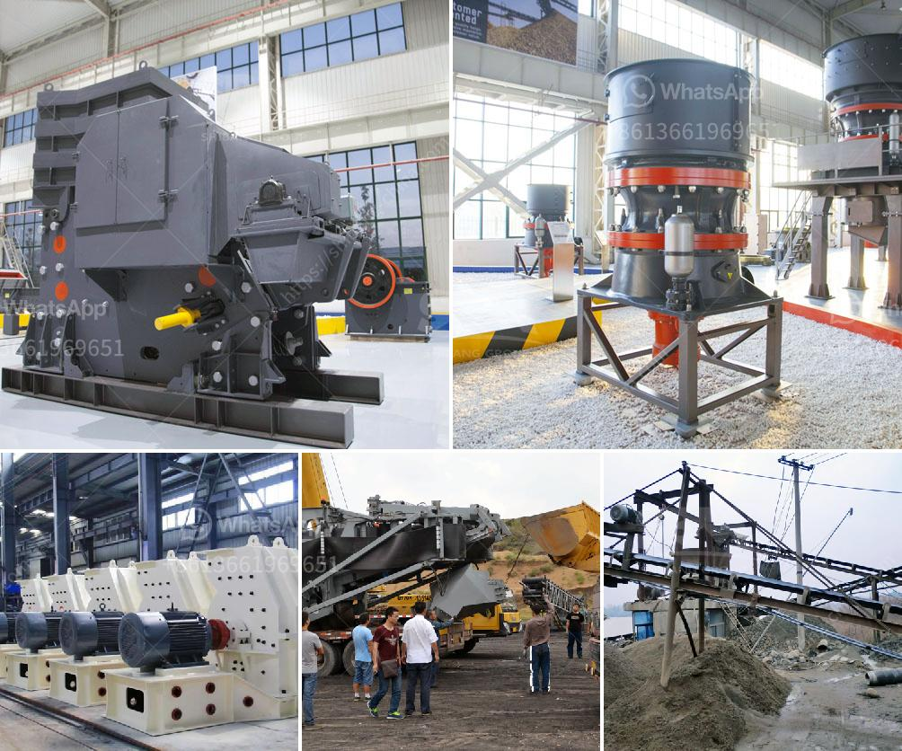

<h3>mining quarry equipment for sale sri lanka</h3>
Sri Lanka is a small country in South Asia which is renowned for its exotic beaches, mesmerizing wildlife, and lush greenery. However, the country is also known for its mining and quarrying activities. It is one of the key contributors to Sri Lanka's GDP, with a considerable share in the overall economic growth.

Mining and quarrying have been a part of Sri Lanka's history for centuries, dating back to the time of ancient kings. Today, Sri Lanka still operates many quarries and mines, producing a variety of minerals, including gemstones, graphite, limestone, and silica sand. These minerals play a significant role in various industries, such as construction, manufacturing, and jewelry production.

To carry out efficient mining and quarrying operations, specialized equipment is required. There are several types of mining and quarrying equipment available in the market today, catering to different requirements and applications. Let's take a closer look at some of the essential equipment used in Sri Lanka's mining and quarrying industry:

1. Excavators: Excavators are heavy machinery used for digging and moving earth or other materials. They are commonly used in mining and quarrying operations to excavate materials, such as limestone or graphite, from the earth's surface.

2. Crushers and Screens: Crushers are used to break down larger rocks into smaller, more manageable sizes. They are crucial in the processing and production of various minerals. Screens, on the other hand, separate the crushed materials into different sizes or grades.

3. Dump Trucks: These heavy-duty vehicles are used to transport materials from the mining or quarrying site to the processing or manufacturing plant. Dump trucks are designed to handle large loads and traverse challenging terrains.

4. Drilling Equipment: Drilling equipment is essential in the exploration and extraction of minerals. It is used to create holes in the ground to access the minerals. Different types of drills, such as rotary drills or diamond core drills, are used based on the type of material being extracted.

5. Crushing Plants: Crushing plants consist of a range of equipment, such as crushers, screens, and conveyors, that work together to process the extracted materials. They are designed to crush and screen the raw materials to produce the desired size and quality of crushed materials.

With the increasing demand for minerals both locally and globally, the mining and quarrying industry in Sri Lanka is expected to continue its growth trajectory. As a result, the demand for mining and quarrying equipment is also rising. Many companies in Sri Lanka offer a wide range of specialized equipment for mining and quarrying operations.

When considering mining quarry equipment for sale in Sri Lanka, it is essential to choose equipment that meets industry standards and is reliable, efficient, and cost-effective. Additionally, it is crucial to assess the after-sales service provided by the equipment supplier, including maintenance and repair services.

In conclusion, mining and quarrying play a vital role in Sri Lanka's economy. To ensure efficient and productive operations, appropriate mining quarry equipment is necessary. By investing in the right equipment and partnering with reliable suppliers, mining and quarrying companies in Sri Lanka can maximize their output and contribute to the country's economic growth.
<h3>Contact us</h3><ul><li><strong>Whatsapp:&nbsp;<a href="https://wa.me/8613661969651">+8613661969651</a></strong></li><li><a href="https://swt.shibang-china.com/?git&amp;zhl&amp;mining quarry equipment for sale sri lanka"><strong>Online Service(chat now)</strong></a></li></ul><h3>Related</h3><ul><li><a href='machines used stone crusher vancouver.md'>machines used stone crusher vancouver</a></li><li><a href='buy crushing and screening plant manufacture turkey.md'>buy crushing and screening plant manufacture turkey</a></li><li><a href='how to acid washing silica sand.md'>how to acid washing silica sand</a></li><li><a href='mobile crusher triman.md'>mobile crusher triman</a></li><li><a href='mining equipment tanzania.md'>mining equipment tanzania</a></li></ul>