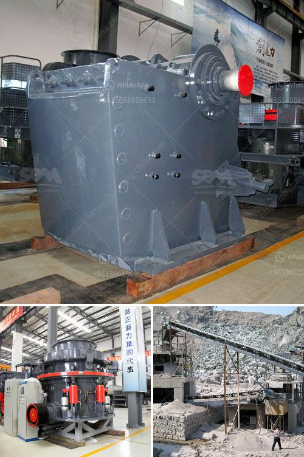

<h3>minister of gold mining ghana</h3>
Ghana, located in West Africa, is renowned for its rich mineral resources, particularly gold. With a long history of gold mining, the country has established itself as a major player in the global gold industry. To ensure the sustainable development of this sector, the role of the Minister of Gold Mining becomes crucial in sustaining economic growth, promoting responsible mining practices, and protecting the environment. This article explores the responsibilities and significance of the Minister of Gold Mining in Ghana's development.

The Minister of Gold Mining in Ghana holds a critical position in overseeing and regulating the gold mining industry. The key responsibilities of this role include formulating policies, setting regulations, granting mining licenses, monitoring operations, and fostering sustainable development. It is the minister's duty to strike a balance between encouraging foreign investment and ensuring that the interests of local communities are protected.

One of the essential tasks of the Minister of Gold Mining is to minimize the environmental impact of mining activities. Gold mining, although contributing significantly to Ghana's economy, poses environmental challenges such as deforestation, water pollution, and erosion. The minister needs to enforce responsible mining practices, including reforestation initiatives and strict waste management regulations. By doing so, the minister plays a crucial role in preserving Ghana's biodiversity and ensuring the sustainable use of natural resources.

The Minister of Gold Mining plays a pivotal role in promoting economic growth and development in Ghana. The gold mining sector contributes significantly to the country's foreign exchange earnings, employment opportunities, and GDP. The minister must attract foreign direct investment (FDI) and foster partnerships to enhance mining infrastructure, technology, and skills training. This not only helps develop the gold mining sector but also boosts related industries such as manufacturing and services, creating a ripple effect across the economy.

Mining activities can have social implications, particularly on the affected communities. The Minister of Gold Mining in Ghana must prioritize the well-being of local communities by ensuring fair compensation, job creation, and local procurement opportunities. Additionally, the minister should collaborate with mining companies and stakeholders to implement corporate social responsibility (CSR) initiatives that aim to improve education, healthcare, infrastructure, and livelihoods in mining communities. Such efforts are vital in building trust and fostering harmonious relationships between mining companies and local citizens.

Illegal mining, or "galamsey," poses a significant threat to Ghana's gold mining sector. The Minister of Gold Mining must work closely with security forces to combat this illegal activity. Through implementing stringent measures, such as increasing surveillance, enforcing penalties, and promoting formalization schemes, the minister can protect legitimate mining operations, safeguard the environment, and generate revenue for the country.

In conclusion, the Minister of Gold Mining in Ghana holds a critical position in overseeing the country's gold mining sector. By promoting responsible mining practices, fostering economic growth, ensuring social responsibility, and curbing illegal activities, the minister plays a pivotal role in sustaining Ghana's development. It is essential for the minister to strike a balance between attracting foreign investment and protecting the environment while ensuring the fair distribution of benefits to local communities. Through effective management, the minister can contribute to Ghana's long-term growth and position the country as a responsible and sustainable player in the global gold mining industry.
<h3>Contact us</h3><ul><li><strong>Whatsapp:&nbsp;<a href="https://wa.me/8613661969651">+8613661969651</a></strong></li><li><a href="https://swt.shibang-china.com/?git&amp;zhl&amp;minister of gold mining ghana"><strong>Online Service(chat now)</strong></a></li></ul><h3>Related</h3><ul><li><a href='impact crusher in egypt.md'>impact crusher in egypt</a></li><li><a href='plant making bricks from marble.md'>plant making bricks from marble</a></li><li><a href='small scale gypsum powder production line.md'>small scale gypsum powder production line</a></li><li><a href='ball mill ball feeders.md'>ball mill ball feeders</a></li><li><a href='calcium carbonate limestone machine.md'>calcium carbonate limestone machine</a></li></ul>